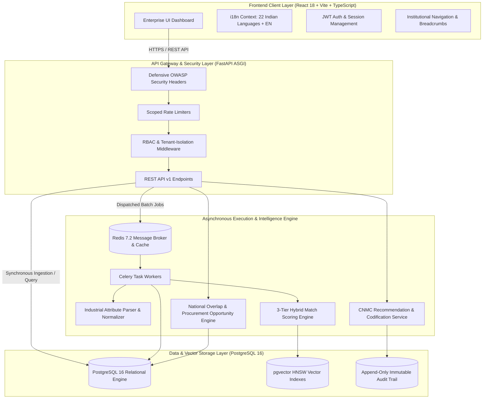
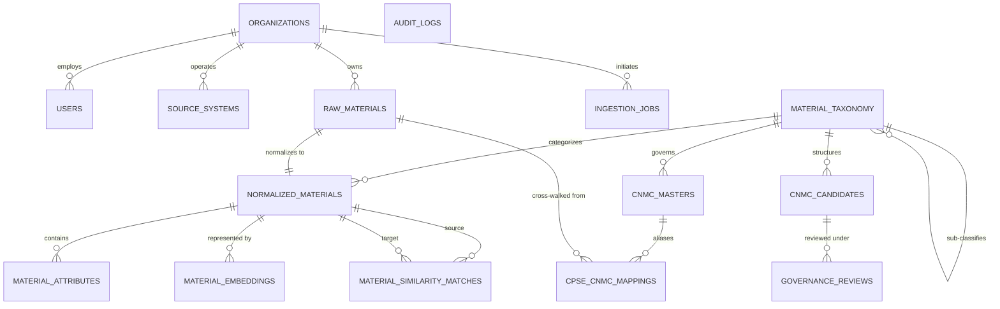

# National Unified Material Master Framework

> **One Nation – One Common Material Code**  
> *An enterprise-grade, AI-assisted data harmonization, deduplication, cataloging, and cross-enterprise procurement intelligence platform for Central Public Sector Enterprises (CPSEs).*

[](https://fastapi.tiangolo.com)
[](https://www.python.org)
[](https://react.dev)
[](https://www.typescriptlang.org)
[](https://github.com/pgvector/pgvector)
[](https://redis.io)
[](https://docs.celeryq.dev)
[](https://www.docker.com)
[](frontend/src/i18n)
[](LICENSE)

---

## Overview

In the Indian public enterprise landscape, hundreds of Central Public Sector Enterprises (CPSEs) across power, hydrocarbons, mining, metallurgy, defense, and infrastructure operate massive industrial inventory catalogs. Over decades, these enterprises have implemented isolated Enterprise Resource Planning (ERP) instances—such as SAP S/4HANA, SAP ECC, Oracle E-Business Suite, and custom legacy systems—each utilizing divergent material numbering conventions, non-standard naming syntax, and unstructured specification descriptions.

The **National Unified Material Master Framework** bridges this fragmentation. It is an intelligent data standardization, semantic understanding, multi-tier deduplication, and catalog governance platform operating alongside enterprise ERPs. Without requiring disruptive alterations to native ERP item codes, the platform ingests heterogeneous catalog records, extracts granular engineering attributes, discovers duplicate and functionally interchangeable items across public enterprises, maps legacy codes to canonical **Common National Material Codes (CNMC)**, and surfaces cross-CPSE procurement synergies.

The platform combines a modern asynchronous **FastAPI** backend, **PostgreSQL 16** with high-dimensional vector similarity (`pgvector`), distributed **Celery** batch workers, **Redis** caching, and a responsive **React 18** Single Page Application supporting **all 22 Eighth Schedule official Indian languages plus English**.

---

## Why This Platform?

| Challenge in Disparate CPSE Systems | Platform Solution |
|---|---|
| **Syntactic & Description Inconsistencies**<br>Same engineering item described with non-standard abbreviations, missing units, or flipped token orders (e.g., `HEX BOLT M16X50 SS304` vs. `STAINLESS STEEL HEXAGON HEAD BOLT 16MM DIA 50MM LENGTH`). | **Rule & NLP-Driven Normalization**<br>Automated parsing cleans syntax, extracts numerical parameters with standard metric units (UOM), and maps items to a 4-tier standardized engineering taxonomy. |
| **Siloed Catalog Duplication**<br>Enterprises independently purchase identical or equivalent spares at divergent rates without visibility into inter-enterprise inventory. | **3-Tier Hybrid Matching Engine**<br>Evaluates deterministic attribute signatures, fuzzy token similarity, and 768-dimensional semantic embeddings to uncover exact, near, and functional duplicates. |
| **Disruptive ERP Code Migration Risks**<br>Modifying legacy primary keys in live production SAP or Oracle databases risks breaking active supply chains and plant logistics. | **Non-Destructive Cross-Walk Mapping**<br>Maintains native CPSE material codes intact while establishing bi-directional aliases to standardized national CNMC master codes. |
| **Lack of Cross-CPSE Procurement Intelligence**<br>Procurement teams lack visibility into consolidated demand volumes and price variances across public enterprises. | **National Analytics & Opportunity Engine**<br>Computes dynamic N×N cross-CPSE overlap matrices, surfaces bulk purchasing aggregation opportunities, and prioritizes catalog rationalization. |
| **Unaccountable Black-Box Automation**<br>Automated AI systems cannot be deployed in government procurement without explicit review trails. | **Human-in-the-Loop Governance & Audit**<br>Transparent match explanations with attribute diffs, strict role-based access control (RBAC), and append-only cryptographic audit logging. |

---

## Key Features

### 1. Multi-Format Catalog Ingestion Pipeline
- **Streaming Parsers:** Ingests large-scale CSV and OpenXML Excel (`.xlsx`) catalog files with low memory footprint.
- **Smart Column Mapping:** Automatic header detection with semantic mapping recommendations for legacy catalog formats.
- **Deduplication Safeguards:** Pre-computes SHA-256 hashes to block duplicate file ingestion jobs.
- **Dual Processing Modes:** Sub-250 row jobs execute synchronously with instant feedback; high-volume datasets are dispatched to background Celery workers.

### 2. Industrial Attribute Extraction & Normalization
- **Rule-Based Engineering Parsers:** Identifies physical attributes (nominal diameter, length, pressure class, material grade, thread pitch, UOM).
- **Standards Equivalence Engine:** Cross-references international and Indian industrial engineering standards (e.g., `IS 1363`, `ISO 4016`, `DIN 933`, `ASTM A216 WCB`, `ASME B16.34`).
- **Canonical Descriptions:** Automatically synthesizes standard engineering titles from normalized attributes.

### 3. 3-Tier Hybrid Matching Engine
- **Tier 1 (Deterministic / Attribute Matching):** Evaluates physical attributes, normalized dimensions, material metallurgy, and part numbers.
- **Tier 2 (Token & Lexical Similarity):** Leverages token sort ratio, Levenshtein distance, and n-gram overlap.
- **Tier 3 (Semantic Embeddings with pgvector):** Generates dense vector representations with cosine distance querying over HNSW indexes in PostgreSQL.
- **Dynamic Weighting:** Automatically adjusts scoring weights when semantic vector embeddings are active or in fallback mode.
- **Candidate Categorization:** Classifies matches into `EXACT_DUPLICATE`, `NEAR_DUPLICATE`, and `FUNCTIONALLY_EQUIVALENT`.

### 4. Explainable Match Cards & Specification Diffs
- **Granular Score Breakdown:** Surfaces individual confidence scores for lexical, vector, and attribute signals.
- **Attribute Diff Matrix:** Visual side-by-side comparison of mechanical, dimensional, and metallurgical attributes.
- **Deterministic Explanations:** Clear, auditable rationales explaining why two items were paired.

### 5. Prototype CNMC Recommendation & Human Governance
- **Automated CNMC Recommendation:** Proposes standardized 14-character alphanumeric codes based on taxonomy hierarchy and attributes.
- **Four-Eyes Governance Workflow:** Dedicated review queue allowing authorized reviewers to `APPROVE`, `REJECT`, or `MODIFY` candidate codes.
- **Mandatory Justification:** Mandatory justification comments logged for all rejections or modifications.
- **Active Cross-Walk Directory:** Creates bi-directional cross-walk bindings between enterprise material codes and national CNMCs.

### 6. National Material Intelligence & Analytics
- **Macro National KPIs:** Total managed records, deduplication rates, catalog rationalization velocity, and standardization progress.
- **Dynamic N×N Overlap Matrix:** Quantifies catalog overlap and duplicate density across participating CPSE organizations.
- **Demand Aggregation Insights:** Highlights high-impact procurement opportunities across enterprises.
- **Rationalization Priority Engine:** Deterministically scores clusters based on duplicate count, member organizations, and confidence.

### 7. Comprehensive Multilingual Support (i18n)
- **23 Locales Supported:** Native localization for **all 22 Eighth Schedule Indian languages** (Assamese, Bengali, Bodo, Dogri, Gujarati, Hindi, Kannada, Kashmiri, Konkani, Maithili, Malayalam, Manipuri, Marathi, Nepali, Odia, Punjabi, Sanskrit, Santhali, Sindhi, Tamil, Telugu, Urdu) and **English**.
- **Instant Switching:** Client-side zero-latency language switching with persistent locale caching.

---

## User Roles & Access Control

The platform enforces strict server-side Role-Based Access Control (RBAC) with tenant isolation:

| Role | Target Persona | Scope & Permissions | Key Capabilities |
|---|---|---|---|
| **`NATIONAL_MASTER_ADMIN`** | Central Standardization Authority / Ministry Administrator | **Global Platform Scope** | Full administrative access, system health monitoring, cross-CPSE global analytics, CNMC catalog oversight, user and organization administration. |
| **`DOMAIN_REVIEWER`** | Senior Domain Engineer / Standardization Committee | **National Technical Scope** | Access to governance review queue, authority to `APPROVE`, `REJECT`, or `MODIFY` CNMC candidate proposals with mandatory justification logs. |
| **`CPSE_MATERIAL_MANAGER`** | Enterprise Inventory Manager (e.g., IOCL, ONGC, NTPC) | **Tenant-Scoped** (Single CPSE) | Catalog file upload, column mapping discovery, triggering candidate matching, creating CNMC candidate proposals, and managing local cross-walk records. |
| **`AUDITOR`** | Compliance & Oversight Officer / Vigilance Authority | **Global Read-Only** | Read-only inspection of cross-CPSE mappings, candidate workflows, analytics dashboards, and tamper-proof append-only audit trails. |

---

## Platform Architecture



---

## Technology Stack

### Backend Infrastructure
| Component | Technology | Version | Purpose |
|---|---|---|---|
| **API Framework** | FastAPI | `^0.111.0` | High-performance asynchronous REST API Gateway |
| **ASGI Web Server** | Uvicorn | `^0.30.0` | Production ASGI web server |
| **Data Validation** | Pydantic v2 | `^2.7.0` | Schema validation and serialization |
| **ORM & Database Client** | SQLAlchemy (AsyncIO) + asyncpg | `^2.0.30` | Asynchronous relational data access |
| **Database Engine** | PostgreSQL | `16` | ACID-compliant relational data store |
| **Vector Engine** | `pgvector` | `^0.3.0` | High-dimensional HNSW vector similarity search |
| **Task Queue & Worker** | Celery | `^5.4.0` | Asynchronous distributed batch processing |
| **Message Broker & Cache** | Redis | `7.2` | Job brokering, caching, and rate limiting |
| **Authentication & Tokens** | PyJWT + Passlib (bcrypt) | `^2.8.0` | JWT HS256 authentication and password hashing |
| **Structured Logging** | Loguru | `^0.7.2` | Contextual structured JSON logging |
| **Testing Framework** | Pytest + pytest-asyncio + httpx | `^8.2.2` | Comprehensive test suite |

### Frontend Infrastructure
| Component | Technology | Version | Purpose |
|---|---|---|---|
| **Core Framework** | React | `^18.3.1` | Declarative component-based user interface |
| **Build Tool** | Vite | `^5.3.1` | Ultra-fast development and optimized production bundling |
| **Language** | TypeScript | `^5.5.2` | Strict type safety and maintainability |
| **Styling** | Tailwind CSS | `^3.4.4` | Modern enterprise utility-first design system |
| **Icons** | Lucide React | `^0.395.0` | Consistent iconography |
| **Testing** | Vitest + React Testing Library | `^1.6.0` | Fast unit and integration testing |

---

## Core Modules

```
CSPES/
├── backend/
│   ├── app/
│   │   ├── api/v1/endpoints/     # REST Endpoints (auth, ingestion, matching, cnmc, governance, analytics, health)
│   │   ├── core/                 # Config, security, database session, middleware, exception handlers
│   │   ├── models/               # SQLAlchemy models (organizations, users, materials, cnmc, governance, audit)
│   │   ├── schemas/              # Pydantic request/response validation schemas
│   │   ├── services/
│   │   │   ├── analytics/        # National dashboard, duplicate clusters, cross-CPSE matrix, procurement engine
│   │   │   ├── auth/             # User authentication, token management, and demo seeding
│   │   │   ├── cnmc/             # Codification logic, recommendation engine, format validators
│   │   │   ├── governance/       # Review workflows and immutable audit logging
│   │   │   ├── matching/         # Deterministic, lexical, and vector embedding similarity engine
│   │   │   ├── attribute_extractor.py # Industrial attribute regex and rule parser
│   │   │   ├── erp_adapter.py    # Enterprise ERP integration and export adapters
│   │   │   ├── file_parser.py    # CSV and OpenXML Excel streaming parsers
│   │   │   ├── ingestion_engine.py # Two-phase raw and normalized ingestion pipeline
│   │   │   └── normalization.py  # Text normalization and standard description generation
│   │   └── workers/              # Celery task definitions
│   ├── scripts/                  # Repeatable seed scripts
│   ├── tests/                    # Pytest test suites (unit, integration, security, RBAC, e2e)
│   ├── requirements.txt          # Python dependencies
│   └── Dockerfile                # Backend container definition
├── frontend/
│   ├── src/
│   │   ├── app/                  # Main App shell and route dispatcher
│   │   ├── components/
│   │   │   ├── analytics/        # National analytics views, overlap matrix, procurement cards
│   │   │   ├── auth/             # Login page and credential helpers
│   │   │   ├── cnmc/             # Recommendation workspace, review queue, CPSE mappings
│   │   │   ├── common/           # ErrorBoundary, LanguageSelector, StatusBadge
│   │   │   ├── dashboard/        # Macro National Dashboard
│   │   │   ├── ingestion/        # Multi-CPSE file upload and column mapping interface
│   │   │   ├── layout/           # Institutional Header, Sidebar, Footer
│   │   │   ├── legal/            # Privacy Policy, Terms of Use, Accessibility, Help & Support
│   │   │   └── ui/               # Reusable Button, Card, Modal, Input components
│   │   ├── context/              # Auth and Navigation React contexts
│   │   ├── i18n/                 # Localization engine and 23 language translation files
│   │   ├── services/             # API client integration functions
│   │   └── styles/               # CSS styles and Tailwind setup
│   ├── tests/                    # Vitest UI and routing tests
│   ├── package.json              # Node.js dependencies and scripts
│   └── Dockerfile                # Frontend multi-stage NGINX container definition
├── demo-data/                    # Sample demonstration datasets (CSV / XLSX)
├── docs/                         # Architecture, security, and requirement specifications
├── docker-compose.yml            # Multi-container orchestration specification
├── .env.example                  # Environment configuration template
└── README.md                     # Project documentation
```

---

## Multilingual Support

The frontend contains a full-featured internationalization engine covering **all 22 Eighth Schedule official languages of India** alongside English:

| Code | Language | Native Script Name | Code | Language | Native Script Name |
|:---:|---|---|:---:|---|---|
| `en` | English | English | `mr` | Marathi | मराठी |
| `hi` | Hindi | हिन्दी | `ne` | Nepali | नेपाली |
| `as` | Assamese | অসমীয়া | `od` | Odia | ଓଡ଼ିଆ |
| `bn` | Bengali | বাংলা | `pa` | Punjabi | ਪੰਜਾਬੀ |
| `brx`| Bodo | बड़ो | `sa` | Sanskrit | संस्कृतम् |
| `doi`| Dogri | डोगरी | `sat`| Santhali | ᱥᱟᱱᱛᱟᱲᱤ |
| `gu` | Gujarati | ગુજરાતી | `sd` | Sindhi | سنڌي |
| `kn` | Kannada | ಕನ್ನಡ | `ta` | Tamil | தமிழ் |
| `kok`| Konkani | कोंकणी | `te` | Telugu | తెలుగు |
| `ks` | Kashmiri | कॉशुर | `ur` | Urdu | اُردُو |
| `mai`| Maithili | मैथिली | `ml` | Malayalam | മലയാളം |
| `mni`| Manipuri | মৈতৈলোন্ | | | |

Translations are modularly organized in `frontend/src/i18n/locales/` and cover all core views, tables, actions, headers, and institutional footer disclosures.

---

## Getting Started

### Prerequisites
- **Docker & Docker Compose** (Recommended for containerized deployment)
- **Node.js** (v18.0+ or v20.0+) and **npm**
- **Python** (v3.11+ or v3.12+)
- **PostgreSQL 16** with `pgvector` extension (if running locally without Docker)
- **Redis 7.2+** (if running locally without Docker)

---

### Method 1: Running with Docker Compose (Recommended)

The easiest way to run the entire multi-service stack (Frontend, Backend, Celery Worker, PostgreSQL with `pgvector`, and Redis):

```bash
# 1. Clone the repository
git clone https://github.com/<your-org>/CSPES.git
cd CSPES

# 2. Configure environment variables
cp .env.example .env

# 3. Build and launch all containers
docker compose up --build
```

#### Running Services:
| Service | Access URL | Description |
|---|---|---|
| **Frontend Web App** | [http://localhost:3000](http://localhost:3000) | React 18 Single Page Application |
| **Backend API Gateway** | [http://localhost:8000](http://localhost:8000) | FastAPI ASGI Service |
| **Interactive API Docs (Swagger)** | [http://localhost:8000/docs](http://localhost:8000/docs) | OpenAPI interactive documentation |
| **Alternative API Docs (ReDoc)** | [http://localhost:8000/redoc](http://localhost:8000/redoc) | ReDoc API specifications |
| **Health Check Probe** | [http://localhost:8000/api/v1/health](http://localhost:8000/api/v1/health) | System health & readiness status |

---

### Method 2: Running Locally for Development

#### 1. Backend Setup

```bash
cd backend

# Create and activate virtual environment
python -m venv .venv
# On Windows:
.venv\Scripts\activate
# On Linux/macOS:
# source .venv/bin/activate

# Install dependencies
pip install -r requirements.txt

# Seed initial demonstration data (CPSE organizations, taxonomies, demo materials, and user accounts)
python scripts/seed_demo_data.py

# Launch FastAPI development server
uvicorn app.main:app --host 0.0.0.0 --port 8000 --reload
```

#### 2. Background Celery Worker (Optional for large batch jobs)

```bash
cd backend
# Ensure virtual environment is activated
celery -A app.core.celery_app worker --loglevel=info --concurrency=2
```

#### 3. Frontend Setup

```bash
cd frontend

# Install Node dependencies
npm install

# Start Vite development server
npm run dev
```
The frontend will be available at [http://localhost:5173](http://localhost:5173) (or `http://localhost:3000` depending on port availability).

---

## Demonstration Credentials

The platform includes pre-configured demonstration personas representing each tier of the governance model:

| Role | Email | Password | Organization | Scope / Purpose |
|---|---|---|---|---|
| **National Master Admin** | `national_admin@gov.in` | `DemoAdmin@2026` | *National Scope* | Full governance, cross-CPSE master oversight, and system analytics. |
| **Domain Reviewer** | `domain_reviewer@gov.in` | `DemoReviewer@2026` | *National Scope* | Human-in-the-loop review queue (`APPROVE` / `REJECT` / `MODIFY`). |
| **CPSE Material Manager** | `cpse_manager@gov.in` | `DemoManager@2026` | `IOCL` (IndianOil) | Ingestion, attribute mapping, candidate matching for Indian Oil Corp. |
| **CPSE Material Manager** | `cpse_manager_b@sih.demo` | `DemoManager@2026` | `ONGC` | Ingestion and candidate matching for ONGC. |
| **National Auditor** | `auditor@gov.in` | `DemoAuditor@2026` | *National Scope* | Read-only compliance inspection across all mappings and audit trails. |

---

## Testing & Quality Assurance

The codebase includes comprehensive automated test suites for both frontend and backend.

### Backend Test Suite (Pytest)
```bash
cd backend
pytest -v
```

The backend test suite covers:
- **`test_auth_rbac.py`**: Token validation, password hashing, RBAC permissions, and horizontal tenant isolation.
- **`test_ingestion_pipeline.py`**: CSV/XLSX stream parsing, column mapping discovery, and SHA-256 duplicate protection.
- **`test_material_matching.py`**: Deterministic matcher, lexical similarity, and vector similarity engines.
- **`test_cnmc_governance.py`**: Recommendation generation, candidate lifecycle, review validations, and four-eyes review constraints.
- **`test_national_analytics.py`**: KPI aggregation, N×N overlap matrix calculations, duplicate clusters, and procurement opportunities.
- **`test_security_audit_hardening.py`**: OWASP headers, IDOR defenses, SQL injection prevention, and path traversal guards.
- **`test_failure_recovery.py`**: Celery worker offline fallback to safe direct processing, transaction rollback resilience.
- **`test_e2e_integration_pipeline.py`**: Complete ingestion-to-mapping pipeline verification.

### Frontend Test Suite (Vitest)
```bash
cd frontend
npm test
```

The frontend test suite covers:
- **`App.test.tsx`**: Tab switching, authentication states, navigation workflows, and review modals.
- **`I18n.test.tsx`**: Dynamic language switching across Indian languages, fallback handling, and translation keys.
- **`LegalRoutes.test.tsx`**: Public accessibility of institutional policy pages (Privacy Policy, Terms of Use, Accessibility, Help).

---

## API Overview

All API endpoints are versioned under `/api/v1` (with root fallbacks for convenience):

```
Authentication & Access Control
  POST   /api/v1/auth/login                       # Authenticate user and issue JWT token pair
  GET    /api/v1/auth/me                          # Retrieve profile and RBAC role of current user

Material Ingestion Pipeline
  GET    /api/v1/ingestion/organizations          # List all registered CPSE demonstration enterprises
  POST   /api/v1/ingestion/discover               # Inspect file headers and suggest canonical mappings
  POST   /api/v1/ingestion/upload                 # Upload catalog file and initialize IngestionJob
  POST   /api/v1/ingestion/process                # Trigger row validation, normalization, and extraction
  GET    /api/v1/ingestion/{job_id}               # Query ingestion job status and progress counts
  GET    /api/v1/ingestion/{job_id}/errors        # Retrieve row-level validation error logs

Material Matching & Candidate Intelligence
  GET    /api/v1/matching/status/embeddings       # Query ML embedding provider availability and dimensions
  POST   /api/v1/matching/materials/{id}/match    # Trigger multi-signal candidate matching engine
  GET    /api/v1/matching/materials/{id}/matches  # Retrieve existing match candidates for a material
  GET    /api/v1/matching/matches/{match_id}      # Retrieve full explainable match card and attribute diff

CNMC Recommendation & Master Catalog
  POST   /api/v1/cnmc/recommend                   # Generate prototype CNMC recommendation for a material
  GET    /api/v1/cnmc/candidates                  # List CNMC candidate proposals with status filters
  GET    /api/v1/cnmc/candidates/{id}             # Get candidate details with structured explainability
  POST   /api/v1/cnmc/candidates/{id}/review      # Submit APPROVE / REJECT / MODIFY governance action
  GET    /api/v1/cnmc/mappings                    # Query active CPSE <-> CNMC cross-walk directory
  GET    /api/v1/cnmc/masters                     # Query approved prototype CNMC master records

National Material Intelligence Analytics
  GET    /api/v1/analytics/dashboard              # Retrieve macro national KPIs and progress metrics
  GET    /api/v1/analytics/duplicates             # Duplication density by match type, CPSE, and category
  GET    /api/v1/analytics/duplicates/clusters    # List granular duplicate material clusters
  GET    /api/v1/analytics/cross-cpse-overlap     # Compute dynamic N x N Cross-CPSE Overlap Matrix
  GET    /api/v1/analytics/cnmc-summary           # CNMC standardization pipeline and conversion funnel
  GET    /api/v1/analytics/procurement-opportunities # List cross-CPSE demand aggregation opportunities
  GET    /api/v1/analytics/rationalization-priorities # Retrieve ranked catalog rationalization priorities
  GET    /api/v1/analytics/categories             # Category & taxonomy breakdown statistics

System Health & Diagnostics
  GET    /api/v1/health                           # Liveness and readiness probe (DB, Redis, Celery)
```

---

## Database Architecture

The relational schema is built on **PostgreSQL 16** with strict foreign key constraints and index optimizations:



### Key Schema Entities:
- **`organizations`**: Master directory of participating CPSEs (Maharatna, Navratna, Miniratna).
- **`users`**: User identities with password hashes, status, and assigned `RoleEnum`.
- **`raw_materials`**: Exact, immutable preservation of source CPSE legacy catalog records.
- **`normalized_materials`**: Canonical descriptions, standardized UOMs, taxonomy links, and grades.
- **`material_attributes`**: Granular key-value attributes with normalized numeric values and units.
- **`material_embeddings`**: Vector embeddings for semantic similarity search (`pgvector`).
- **`material_similarity_matches`**: Pairwise match records with composite confidence scores and explanations.
- **`cnmc_candidates`**: Proposed prototype CNMC records awaiting domain review.
- **`cnmc_masters`**: Governed prototype CNMC master records.
- **`cpse_cnmc_mappings`**: Non-destructive alias cross-walk mapping table.
- **`governance_reviews`**: Decisions, timestamps, comments, and reviewer signatures.
- **`audit_logs`**: Append-only system log capturing state transitions and critical actions.

---

## Security & Governance Considerations

1. **Defense-in-Depth OWASP Security Headers:** The backend automatically injects strict HTTP headers on every response:
   - `X-Content-Type-Options: nosniff`
   - `X-Frame-Options: DENY`
   - `X-XSS-Protection: 1; mode=block`
   - `Strict-Transport-Security: max-age=31536000; includeSubDomains`
   - `Referrer-Policy: strict-origin-when-cross-origin`
   - `Content-Security-Policy: default-src 'self'; ...`
2. **Tenant Boundary Enforcement:** CPSE Material Managers cannot access, modify, or upload material catalogs for organizations other than their assigned enterprise.
3. **IDOR & Path Traversal Protections:** File uploads enforce directory confinement checks and store assets under secure UUID-prefixed basenames.
4. **Append-Only Audit Trail:** Critical operations (catalog ingestion, match creation, CNMC approvals, status changes) write immutable audit records to the `audit_logs` table.
5. **Demonstration Boundary Notice:** The CNMC codification and data mappings implemented in this platform serve as an architectural proof of concept and do not constitute statutory Government of India gazetted standards.

---

## Available Scripts

### Root Directory
- `docker compose up --build`: Build and start all 5 containers.
- `docker compose down -v`: Stop containers and purge temporary volumes.

### Backend (`/backend`)
- `uvicorn app.main:app --reload`: Start development server on port `8000`.
- `celery -A app.core.celery_app worker --loglevel=info`: Start background Celery worker.
- `python scripts/seed_demo_data.py`: Populate database with sample CPSEs, materials, and users.
- `pytest`: Run full backend test suite.

### Frontend (`/frontend`)
- `npm run dev`: Start Vite development server on port `5173` / `3000`.
- `npm run build`: Compile TypeScript and generate optimized production bundle in `dist/`.
- `npm run preview`: Preview production build locally.
- `npm test`: Execute Vitest component and integration tests.

---

## Contributing

1. **Fork the Repository** and create a feature branch (`git checkout -b feature/standardization-enhancement`).
2. **Adhere to Code Standards**:
   - Backend: Strict type annotations with Pydantic v2 and async SQLAlchemy.
   - Frontend: Strict TypeScript, modular React components, and i18n translation keys.
3. **Ensure Tests Pass**:
   - Run `pytest` in `backend/` and `npm test` in `frontend/`.
4. **Submit a Pull Request** with a detailed explanation of your changes and test coverage.

---

## License

This project is licensed under the [MIT License](LICENSE).
