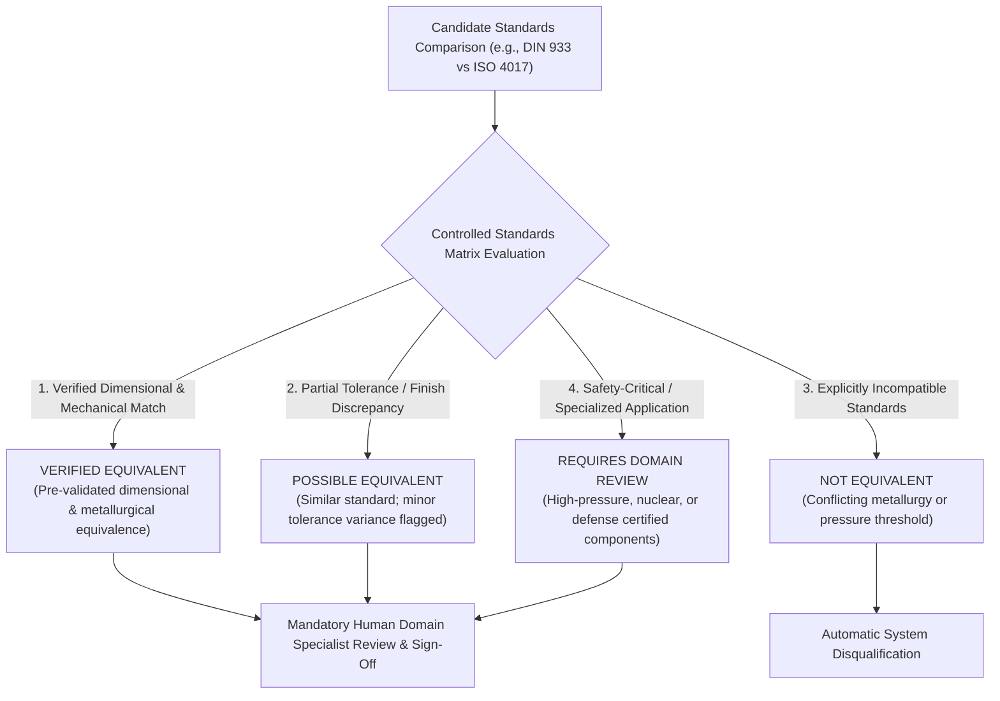
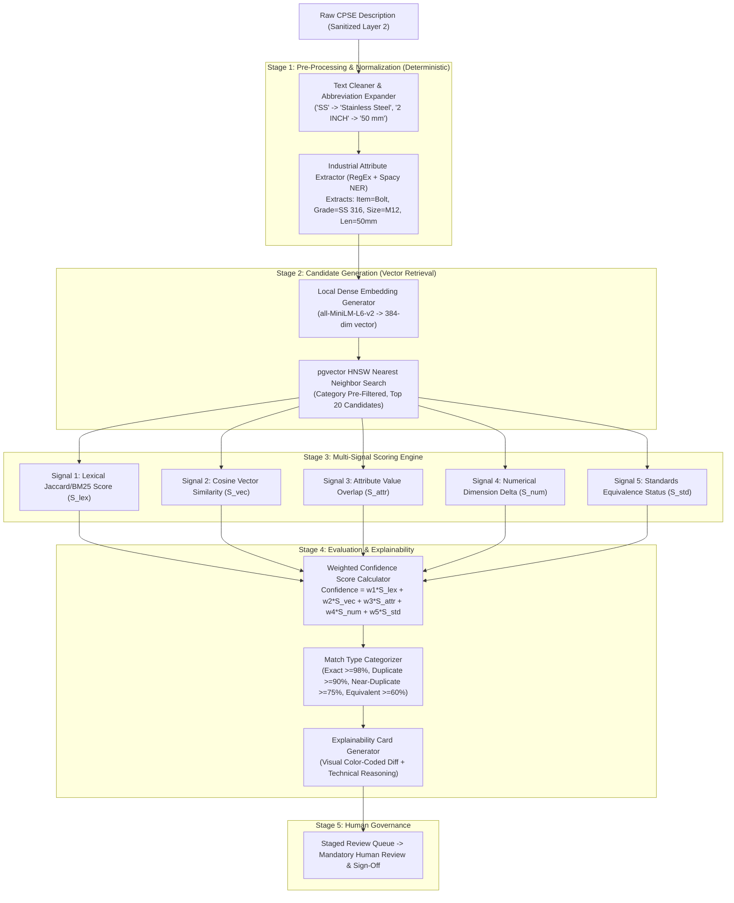

# AI & Semantic Matching Architecture (ADR-005 Approved)

**System:** AI-Powered National Unified Material Master Framework  
**Document Classification:** System Architecture (Phase 3)  
**Technology Decision:** Hybrid Local Sentence-Transformers + Deterministic Industrial NER + Controlled Standards Matrix + Pluggable LLM Adapter  
**Status:** `APPROVED`

---

## 1. Decision Record (ADR-005 Finalization)

### Selected AI Strategy: Hybrid Local NLP + Controlled Standards Matrix
- **Selected Option:** Hybrid Architecture combining:
  1. **Local Open-Source Embedding Model:** `sentence-transformers/all-MiniLM-L6-v2` (384-dim embeddings, zero cloud token costs, 100% offline hackathon execution).
  2. **Deterministic RegEx & Spacy Industrial NER:** Fast, reproducible attribute extraction for metric/imperial dimensions, metallurgy grades, and pressure ratings.
  3. **Controlled Standards Equivalence Matrix:** Multi-tier verification framework (IS $\leftrightarrow$ DIN $\leftrightarrow$ ISO $\leftrightarrow$ ASTM) enforcing mandatory human engineering sign-off for functional equivalence.
  4. **Pluggable LLM Reasoning Adapter:** Optional cloud adapter (Google Gemini / OpenAI) for natural language reasoning on ambiguous edge cases.

---

## 2. Controlled Engineering Standards Relationship Model

To prevent catastrophic industrial failures, the platform does **not** assume automatic interchangeability based solely on superficial standard names. The standards matrix enforces a 4-tier categorization:

### Standards Classification Definitions:
1. **`VERIFIED EQUIVALENT`:** Dimensions, thread pitch, property classes, and metallurgy are proven interchangeable across standards (e.g., DIN 933 $\leftrightarrow$ ISO 4017 for standard hex screws). *Requires standard human validation.*
2. **`POSSIBLE EQUIVALENT`:** Materials share general engineering function but have minor coating, thread tolerance, or dimensional discrepancies that may affect specific assemblies. *Requires domain specialist justification.*
3. **`NOT EQUIVALENT`:** Incompatible standards with conflicting chemical compositions, yield strengths, or pressure ratings (e.g., Class 150 vs. Class 300). *System automatically suppresses merge.*
4. **`REQUIRES DOMAIN REVIEW`:** High-risk or statutory equipment (e.g., boiler tubes, explosive atmosphere switchgear) where regulatory certifications prohibit automatic substitution. *Requires formal engineering authorization.*

---

## 3. End-to-End AI Matching Pipeline

---

## 4. Multi-Signal Scoring Mathematical Model & Performance Targets

$$\text{Composite Confidence Score } (C) = 0.15 S_{\text{lex}} + 0.25 S_{\text{vec}} + 0.30 S_{\text{attr}} + 0.15 S_{\text{num}} + 0.15 S_{\text{std}}$$

*Performance Note:* Embedding generation time (target: $< 25\text{ ms}$ on CPU per item) and similarity search latency (target: $< 100\text{ ms}$ on HNSW index) are **illustrative performance targets**. Actual production latency requires formal benchmark validation across target CPU/GPU infrastructure and dataset scale.
