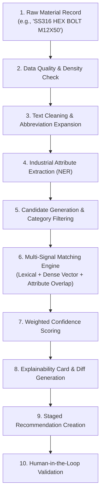

# AI Recommendation & Explainability Lifecycle

**System:** AI-Powered National Unified Material Master Framework  
**Document Classification:** Product & System Design (Phase 2)  
**Status:** `PROPOSED — NOT YET APPROVED`

---

## 1. The Explainable AI Principle

In government public sector enterprises and heavy engineering operations, machine learning systems must never function as opaque "black boxes". A recommendation without clear, auditable reasoning cannot be safely trusted by domain engineers or statutory auditors.

Every recommendation produced by the platform must provide **Granular Explainability**, dissecting the composite confidence score into clear, measurable technical signals.



---

## 2. Step-by-Step AI Recommendation Process

### Step 1: Input Data Ingestion
- Ingests raw descriptive strings, local codes, unit of measurement, and any available ERP metadata fields.

### Step 2: Data Quality & Density Check
- Evaluates whether the description contains sufficient technical information (e.g., character length, presence of numeric dimensions or standard codes).
- If information density is below threshold (e.g., *"MISC BOLT"*), the system flags the record for manual attribute enrichment before AI matching.

### Step 3: Text Cleaning & Abbreviation Expansion
- Standardizes uppercase/lowercase tokens, removes non-alphanumeric noise, and maps domain-specific CPSE abbreviations via an industrial synonym dictionary:
  - *"SS"* / *"S.S."* / *"INOX"* $\rightarrow$ *"Stainless Steel"*
  - *"NB"* / *"N.B."* $\rightarrow$ *"Nominal Bore"*
  - *"CL"* / *"CLS"* / *"#"* $\rightarrow$ *"Class (Pressure Rating)"*

### Step 4: Industrial Attribute Extraction (NER & Tokenizer)
- Deconstructs unstructured text into structured key-value attribute schemas:
  - `item_type`: "Bolt"
  - `head_type`: "Hexagonal"
  - `material_grade`: "SS 316"
  - `thread_size`: "M12" (Diameter: 12 mm)
  - `length`: "50 mm"
  - `standard_compliance`: "IS 1364 / DIN 933"

### Step 5: Candidate Generation & Category Filtering
- Uses fast approximate nearest neighbor (ANN) vector search and category pre-filtering to identify the top $K$ ($K=10$ to $20$) candidate records from the national repository, reducing compute load from $O(N^2)$ to $O(K)$.

### Step 6: Multi-Signal Matching Engine
Computes independent similarity metrics across multiple orthogonal dimensions:
1. **Lexical / Token Overlap Score ($S_{\text{lex}}$):** Token-level Jaccard / BM25 score.
2. **Dense Semantic Embedding Score ($S_{\text{vec}}$):** Cosine similarity between dense contextual embeddings.
3. **Exact Attribute Overlap Score ($S_{\text{attr}}$):** Ratio of matching extracted key-value pairs (e.g., matching diameter, length, grade).
4. **Tolerance & Numerical Dimension Score ($S_{\text{num}}$):** Proximity of numeric engineering values.
5. **Standards Cross-Reference Compatibility ($S_{\text{std}}$):** Lookup in standard equivalence matrix (e.g., DIN $\leftrightarrow$ ISO $\leftrightarrow$ IS).

### Step 7: Weighted Confidence Calculation
- Combines individual signals into a composite confidence score:
  $$\text{Confidence} = w_1 S_{\text{lex}} + w_2 S_{\text{vec}} + w_3 S_{\text{attr}} + w_4 S_{\text{num}} + w_5 S_{\text{std}}$$
- Assigns match category:
  - $\ge 98\%$ $\rightarrow$ **EXACT MATCH**
  - $90\% - 97\%$ $\rightarrow$ **DUPLICATE**
  - $75\% - 89\%$ $\rightarrow$ **NEAR-DUPLICATE**
  - $60\% - 74\%$ $\rightarrow$ **FUNCTIONALLY EQUIVALENT**
  - $< 60\%$ $\rightarrow$ **LOW CONFIDENCE / REJECT**

### Step 8: Explainability Card & Diff Generation
- Automatically generates human-readable explanations and visual diff maps for the reviewer:
  - **Identical Features (Green):** e.g., Diameter ($12\text{ mm}$), Grade (SS 316), Thread Pitch ($1.75\text{ mm}$).
  - **Minor Variances (Amber):** e.g., Coating (Zinc Plated vs. Galvanized).
  - **Major Conflicts (Red):** e.g., Pressure Rating ($150\text{ Class}$ vs. $300\text{ Class}$).

### Step 9: Staged Recommendation Creation
- Bundles the match pair, confidence score, explainability breakdown, and recommended CNMC mapping into a formal `MatchProposal` stored in the governance database.

### Step 10: Human-in-the-Loop Validation
- The proposal appears in the appropriate Reviewer Queue based on category and risk level. The human engineer reviews the explanation card and signs off.

---

## 3. Explainability Card Specification

When a human reviewer views an AI recommendation, the UI renders an Explainability Card detailing the exact reasoning breakdown:

```text
+-------------------------------------------------------------------------------+
| AI RECOMMENDATION EXPLAINABILITY CARD                                         |
+-------------------------------------------------------------------------------+
| Match Type: DUPLICATE (Confidence: 94.2%)                                     |
| Recommended CNMC: IN-IND-MECH-BLT-00492                                       |
+-------------------------------------------------------------------------------+
| SIGNAL BREAKDOWN:                                                             |
| - Semantic Description Similarity:  96.0% (Strong contextual alignment)       |
| - Attribute Value Overlap:         100.0% (All 4 extracted specs match)       |
| - Engineering Standard Match:       90.0% (IS 1364 equivalent to DIN 933)     |
| - Dimension Numerical Variance:      0.0% (Zero dimensional deviation)        |
+-------------------------------------------------------------------------------+
| ATTRIBUTE COMPARISON DIFF:                                                    |
| [✓ MATCH] Material Grade:   SS 316               | SS 316                     |
| [✓ MATCH] Thread Diameter:  12 mm (M12)          | 12 mm (M12)                |
| [✓ MATCH] Length:           50 mm                | 50 mm                      |
| [! DIFF]  Surface Finish:   Bright Finish        | Natural Pickled            |
+-------------------------------------------------------------------------------+
| AI CONCLUSION:                                                                |
| "Items are physical duplicates with identical dimensions and metallurgy.      |
| Minor surface finish wording difference does not affect interchangeability."  |
+-------------------------------------------------------------------------------+
```
