# Analytics Architecture & Macro Intelligence Engine

## 1. System Overview
The **National Material Intelligence Analytics Engine** provides high-level aggregation, cross-enterprise catalog overlap calculation, standardization pipeline funnel metrics, and deterministic procurement opportunity identification for the **Smart India Hackathon (SIH) 2026** *AI-Powered National Unified Material Master Framework*.

```mermaid
flowchart TD
    subgraph Data Tier ["Layer 1 (CPSE Local) & Layer 2/3 (Normalized & Governed)"]
        A[Organizations / CPSEs]
        B[Normalized Materials]
        C[Duplicate Matches & Clusters]
        D[CNMC Candidates]
        E[CNMC Master Records]
        F[CPSE ↔ CNMC Mappings]
    end

    subgraph Service Tier ["Analytical Intelligence Services (Read-Only)"]
        G[NationalDashboardService]
        H[DuplicateAnalyticsService]
        I[CrossCPSEAnalyticsService]
        J[CNMCAnalyticsService]
        K[ProcurementOpportunityService]
        L[RationalizationPriorityService]
        M[CategoryAnalyticsService]
    end

    subgraph API Tier ["RESTful API Endpoints (/api/v1/analytics/*)"]
        N["/dashboard/national"]
        O["/duplicates"]
        P["/matrix/cross-cpse"]
        Q["/standardization/cnmc"]
        R["/procurement/opportunities"]
        S["/rationalization/priorities"]
        T["/categories"]
    end

    subgraph Presentation Tier ["React Enterprise UI (5 Top-Level Tabs)"]
        subgraph AnalyticsTab ["Tab 4: National Analytics (AnalyticsContainer)"]
            U[1. National Overview Dashboard]
            V[2. Duplicate Intelligence View]
            W[3. Cross-CPSE NxN Matrix]
            X[4. CNMC Standardization Funnel]
            Y[5. Procurement Opportunities]
            Z[6. Rationalization Priorities]
            AA[7. Taxonomy Breakdown]
        end
    end

    A & B & C & D & E & F --> G & H & I & J & K & L & M
    G & H & I & J & K & L & M --> N & O & P & Q & R & S & T
    N & O & P & Q & R & S & T --> U & V & W & X & Y & Z & AA
```

---

## 2. UI Layout & Navigation Architecture

The frontend application consists of:
- **TOP-LEVEL NAVIGATION TABS: 5 Tabs**
  1. `CNMC Workspace`: Interactive material recommendation generator.
  2. `Governance Queue`: Human review and candidate approval/rejection queue.
  3. `CPSE ↔ CNMC Cross-Walk`: Legacy CPSE ERP code to CNMC prototype mapping viewer.
  4. `National Analytics`: Analytical intelligence container hosting 7 sub-views.
  5. `System Status`: Architecture, runtime mode, and service connectivity status.
- **ANALYTICAL SUB-VIEWS: 7 Sub-Views** (embedded within Tab 4 `National Analytics`):
  1. `National Overview`: 10 core national macro KPIs and summary metrics.
  2. `Duplicate Intelligence`: Exact/near/functional clusters and CPSE/category densities.
  3. `Cross-CPSE Matrix`: Dynamic $N \times N$ interactive heatmap grid.
  4. `CNMC Standardization`: 5-stage conversion funnel and candidate pipeline breakdown.
  5. `Procurement Opportunities`: Categorized synergy opportunities with priority filters.
  6. `Rationalization Priorities`: Ranked priority table with deterministic scoring formulas.
  7. `Taxonomy Breakdown`: Category distribution and standardization rates.

---

## 3. Core Architectural Principles

### 3.1 Derived On-Demand Analytics (Zero Redundant State)
All analytical metrics, cross-CPSE matrices, and rationalization scores are computed on-demand from live, normalized Layer 2/Layer 3 relational data using optimized SQLAlchemy 2.0 asynchronous queries. No persistent cache tables or redundant snapshot columns are introduced, preventing stale reporting and database drift.

### 3.2 Strict Commercial Data Isolation (Layer 1 Security Boundary)
Analytics strictly operate on **technical specifications, category taxonomy, and enterprise catalog presence**. The system enforces a complete architectural airgap from confidential commercial parameters:
- ❌ No Purchase Order (PO) prices or commercial rates
- ❌ No vendor identities or supplier bidding data
- ❌ No contract numbers, delivery milestones, or warehouse bin locations

### 3.3 Non-Negotiable Governance Disclaimer
All procurement opportunities, synergy scores, and potential savings indicators are explicitly designated as:
> **"SYNTHETIC DEMONSTRATION INSIGHT — Illustrative procurement opportunity generated from demonstration dataset. Does not represent verified Government savings."**

---

## 4. Service Decomposition & Responsibilities

| Service Name | Module Location | Core Responsibility |
|---|---|---|
| `NationalDashboardService` | `app/services/analytics/national_dashboard_service.py` | Computes top 10 national KPIs, overlap rates, and macro system indicators. |
| `DuplicateAnalyticsService` | `app/services/analytics/duplicate_analytics_service.py` | Aggregates exact, near, and functional duplicate clusters and CPSE duplicate densities. |
| `CrossCPSEAnalyticsService` | `app/services/analytics/cross_cpse_analytics_service.py` | Computes dynamic $N \times N$ pairwise catalog overlap matrix and shared category lists. |
| `CNMCAnalyticsService` | `app/services/analytics/cnmc_analytics_service.py` | Calculates 5-stage conversion funnel and candidate pipeline statistics. |
| `ProcurementOpportunityService` | `app/services/analytics/procurement_opportunity_service.py` | Identifies 5 opportunity categories with multi-CPSE demand & priority ranking. |
| `RationalizationPriorityService` | `app/services/analytics/rationalization_priority_service.py` | Executes deterministic priority scoring with explainable mathematical formulas. |
| `CategoryAnalyticsService` | `app/services/analytics/category_analytics_service.py` | Provides taxonomy-level breakdown of items, masters, and overlap percentages. |
