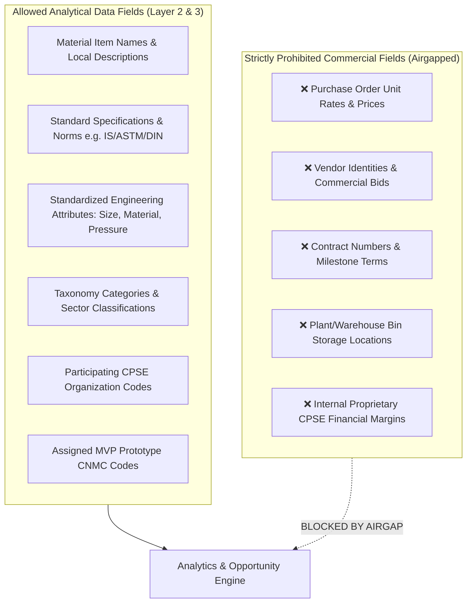

# Analytics Data Boundaries & Commercial Airgap Isolation

## 1. Governance Boundary Overview
In accordance with SIH 2026 guidelines and CPSE commercial compliance rules, the National Unified Material Master Framework maintains strict isolation between **Technical Material Master Intelligence** and **Confidential Commercial Procurement Data**.

---

## 2. Ingestion & Analytics Boundary Matrix

---

## 3. Compliance Verification
- **Audit Lineage**: All analytical aggregations operate as read-only queries against normalized technical attributes.
- **No Direct ERP Modifications**: Local CPSE ERP catalog codes and identifiers are preserved as immutable references.
- **No Price Extrapolation**: Potential savings scores represent technical demand commonality, not fiscal rate comparisons.
