# API Architecture & Endpoint Specification

**System:** AI-Powered National Unified Material Master Framework  
**Document Classification:** System Architecture (Phase 3)  
**API Specification:** RESTful OpenAPI 3.0 / JSON  
**Status:** `APPROVED`

---

## 1. API Design Principles & Versioning Strategy

1. **Protocol & Versioning:** All endpoints are served over HTTPS with URI path versioning: `/api/v1/...`.
2. **Stateless Authentication:** Every request is authenticated via Bearer JWT tokens or Secure HttpOnly session cookies.
3. **Pydantic v2 Contract Enforcement:** 100% of request bodies and response schemas are strictly validated against Pydantic models.
4. **Standard Pagination:** All list endpoints support cursor or offset-based pagination:
   - `page` (default: 1)
   - `page_size` (default: 25, max: 100)
   - `sort_by` (field name) & `sort_order` (`asc` / `desc`)
   - `q` (lexical or semantic search string)

---

## 2. Comprehensive API Domain Boundary Map

```mermaid
flowchart LR
    subgraph Client["API Consumers (Web App / ERP Adapters)"]
        SPA["React SPA"]
        ERP["CPSE ERP Connectors"]
    end

    subgraph APIRouter["FastAPI API Gateway (/api/v1)"]
        AuthAPI["/auth - Authentication & Session"]
        CPSEAPI["/cpse - Tenant Profiles"]
        IngestAPI["/ingest - Bulk Upload & Staging"]
        MatAPI["/materials - Catalog Explorer"]
        MatchAPI["/matching - AI Similarity & Diffing"]
        GovAPI["/governance - Approvals & Rejections"]
        CNMCAPI["/cnmc - National Master Codes"]
        CrossAPI["/cross-walk - Mapping Center"]
        AnalyticsAPI["/analytics - Price Variance & Overlap"]
        AuditAPI["/audit - Immutable Audit Logs"]
        ExportAPI["/integration - ERP CSV/JSON Exports"]
    end

    Client --> APIRouter
```

---

## 3. Core API Endpoint Catalog

### A. Authentication & User Management (`/api/v1/auth`, `/api/v1/users`)
| Method | Endpoint | Description | Access Role |
|---|---|---|---|
| `POST` | `/api/v1/auth/login` | Authenticate user, issue JWT token in HttpOnly cookie | Public |
| `POST` | `/api/v1/auth/refresh` | Refresh expired access token using refresh token | Authenticated |
| `POST` | `/api/v1/auth/logout` | Invalidate active user session | Authenticated |
| `GET` | `/api/v1/auth/me` | Fetch authenticated user profile and RBAC permissions | Authenticated |
| `GET` | `/api/v1/users` | List CPSE users with role filters | Admin |
| `POST` | `/api/v1/users` | Provision new enterprise user | Admin |

### B. Material Catalog & Ingestion (`/api/v1/ingest`, `/api/v1/materials`)
| Method | Endpoint | Description | Access Role |
|---|---|---|---|
| `POST` | `/api/v1/ingest/upload` | Upload raw CSV/Excel material catalog file | MM Manager |
| `POST` | `/api/v1/ingest/map-columns` | Map source columns and trigger background ingestion | MM Manager |
| `GET` | `/api/v1/ingest/jobs/{job_id}` | Check async ingestion status and parsing error logs | MM Manager |
| `GET` | `/api/v1/materials` | Faceted search across national/CPSE material catalog | All Roles |
| `GET` | `/api/v1/materials/{id}` | Retrieve 360-degree material details & extracted specs | All Roles |
| `PATCH` | `/api/v1/materials/{id}/specs` | Edit extracted technical attributes | Reviewer / MM Mgr |

### C. AI Matching & Similarity Engine (`/api/v1/matching`)
| Method | Endpoint | Description | Access Role |
|---|---|---|---|
| `POST` | `/api/v1/matching/find-candidates` | Retrieve top $K$ similar candidates for a material ID | Reviewer / MM Mgr |
| `GET` | `/api/v1/matching/proposals` | List prioritized match proposals in review queue | Reviewer / MM Mgr |
| `GET` | `/api/v1/matching/proposals/{id}` | Get side-by-side spec comparison & Explainability Card | Reviewer / MM Mgr |
| `POST` | `/api/v1/matching/batch-scan` | Trigger background cross-CPSE batch deduplication | Nat. Admin |

### D. Governance, Approvals & CNMC (`/api/v1/governance`, `/api/v1/cnmc`, `/api/v1/cross-walk`)
| Method | Endpoint | Description | Access Role |
|---|---|---|---|
| `POST` | `/api/v1/governance/approve` | Approve match proposal with mandatory justification | Reviewer / MM Mgr |
| `POST` | `/api/v1/governance/reject` | Reject match proposal with mandatory reason code | Reviewer |
| `GET` | `/api/v1/cnmc` | List National Common Material Codes with spec schemas | All Roles |
| `POST` | `/api/v1/cnmc` | Create new CNMC Master code family | Nat. Admin |
| `GET` | `/api/v1/cross-walk` | Query local CPSE code to CNMC mapping cross-walk | All Roles |
| `GET` | `/api/v1/integration/export/cross-walk` | Export approved mappings in CSV/JSON for SAP import | ERP Admin / MM Mgr |

### E. Analytics & Audit Trail (`/api/v1/analytics`, `/api/v1/audit`)
| Method | Endpoint | Description | Access Role |
|---|---|---|---|
| `GET` | `/api/v1/analytics/overview` | National executive KPIs (Rationalization rate, Counts) | All Roles |
| `GET` | `/api/v1/analytics/price-variance` | Query price distributions and variances for a CNMC | Proc. Analyst / Admin |
| `GET` | `/api/v1/analytics/surplus-overlap` | Discover cross-CPSE surplus stock opportunities | Inv. Analyst / Admin |
| `GET` | `/api/v1/audit/logs` | Query immutable audit trail by entity, actor, or date | Auditor / Admin |
| `GET` | `/api/v1/audit/dossier/{entity_id}` | Export cryptographic audit package for a material code | Auditor |
