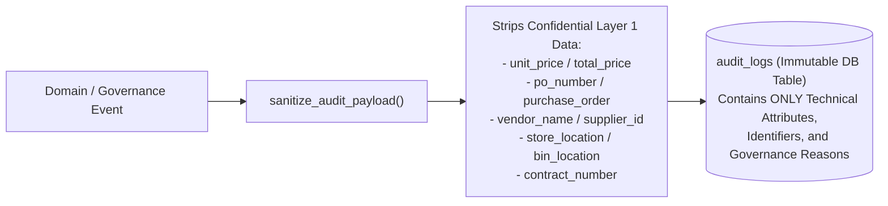

# Immutable Audit Trail Architecture

**System:** AI-Powered National Unified Material Master Framework  
**Document Classification:** Security & Compliance Architecture (Phase 8 Reference)  
**Status:** `IMPLEMENTED & UNIT TESTED`  

---

## 1. Audit Logging Principles & Scope

The platform maintains an append-oriented, tamper-evident audit trail in the `audit_logs` table. Every recommendation generation, human review decision, master catalog modification, and cross-walk mapping activation generates an immutable audit record.

### Actions Recorded:
- `CNMC_RECOMMENDATION_CREATED`: System proposed a new prototype CNMC candidate or reuse proposal.
- `CNMC_REVIEW_APPROVED`: Human reviewer accepted proposal; master catalog and mapping activated.
- `CNMC_REVIEW_REJECTED`: Human reviewer rejected proposal with mandatory justification.
- `CNMC_REVIEW_MODIFIED`: Human reviewer altered proposal parameters; original AI/system proposal snapshot preserved.
- `CNMC_MAPPING_CREATED`: Cross-walk entry created linking CPSE legacy code to CNMC.
- `CNMC_MAPPING_UPDATED`: Cross-walk entry modified or reassigned.

---

## 2. Layer 1 Sensitive Data Exclusion Guarantee

To guarantee strict compliance with enterprise confidentiality and multi-tenant security requirements, the audit logging pipeline employs automated payload sanitization:

---

## 3. History Preservation During Modifications

When a reviewer modifies a recommendation:
- `previous_state` stores the complete original AI/system recommendation (`proposed_cnmc`, `candidate_group_name`, `confidence_score`).
- `new_state` stores the final human decisions.
- `metadata_payload` captures the mandatory modification rationale.

Zero historical data is overwritten or destroyed.
