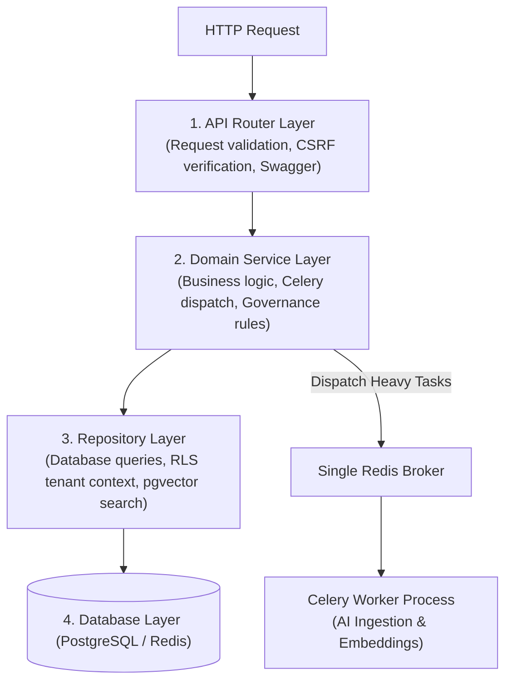

# Backend Architecture Specification (ADR-002 & ADR-006 Approved)

**System:** AI-Powered National Unified Material Master Framework  
**Document Classification:** System Architecture (Phase 3)  
**Technology Decision:** Python 3.11+ FastAPI (ASGI) + Celery Worker + SQLAlchemy + Pydantic v2  
**Status:** `APPROVED`

---

## 1. Decision Records (ADR-002 & ADR-006 Finalization)

### Selected Frameworks: FastAPI ASGI + Celery Task Worker
- **API Runtime (ADR-002):** Python 3.11+ FastAPI with Pydantic v2 for data validation and SQLAlchemy (Async) ORM.
- **Task Worker Framework (ADR-006):** Celery worker process with single Redis broker (`redis://redis:6379/0`) for long-running batch ingestion, embedding generation, and cross-CPSE similarity matrix computations.
  - *FastAPI BackgroundTasks:* Reserved strictly for non-critical, in-process tasks (e.g. flushing audit log buffers).

---

## 2. Layered Architecture & Directory Structure



### Directory Structure
```text
backend/
├── app/
│   ├── api/
│   │   ├── v1/
│   │   │   ├── router.py            # Aggregates v1 sub-routers
│   │   │   ├── endpoints/
│   │   │   │   ├── auth.py          # Login, Refresh, Me (Cookie + CSRF token)
│   │   │   │   ├── users.py         # User management
│   │   │   │   ├── cpse.py          # Tenant profiles
│   │   │   │   ├── ingestion.py     # Batch upload & Celery task trigger
│   │   │   │   ├── materials.py     # Material catalog & search
│   │   │   │   ├── matching.py      # AI similarity & deduplication
│   │   │   │   ├── governance.py    # Match approval & rejection
│   │   │   │   ├── cnmc.py          # National code management
│   │   │   │   ├── analytics.py     # Price variance & KPIs
│   │   │   │   └── audit.py         # Immutable audit trail queries
│   │   │   └── dependencies.py      # Auth dependency, CSRF guard, DB session, RLS context
│   ├── core/
│   │   ├── config.py                # Pydantic Settings (.env loader)
│   │   ├── security.py              # JWT encoding/decoding, CSRF verification, password hashing
│   │   ├── celery_app.py            # Celery instance configuration & broker settings
│   │   └── exceptions.py            # Global exception handlers & error envelopes
│   ├── services/
│   │   ├── ingestion_service.py     # File parsing (CSV/Excel) & validation
│   │   ├── normalization_service.py # NLP cleaning & unit conversion
│   │   ├── matching_service.py      # Multi-signal AI scoring & diffing
│   │   ├── governance_service.py    # CNMC assignment & mapping binding
│   │   ├── analytics_service.py     # Price variance & inventory overlap
│   │   └── audit_service.py         # Immutable audit logger
│   ├── workers/
│   │   ├── tasks.py                 # Celery task definitions (batch_ingest, batch_embed)
│   ├── ai/
│   │   ├── embedder.py              # Sentence-Transformers loader & batch embedder
│   │   ├── extractor.py             # RegEx / Spacy attribute extraction (NER)
│   │   ├── rules.py                 # Controlled standards equivalence matrix
│   │   └── explainability.py        # Explainability card generator
│   ├── db/
│   │   ├── session.py               # Async SQLAlchemy engine & session maker
│   │   ├── base.py                  # Base declarative class
│   │   └── init_db.py               # Seed data generator for SIH demo
│   ├── models/                      # SQLAlchemy ORM database models
│   └── schemas/                     # Pydantic v2 validation schemas (DTOs)
├── tests/
├── requirements.txt
└── Dockerfile
```

---

## 3. Celery Task Dispatching Pattern

```python
# Conceptual Celery Task Pattern for Ingestion & Vector Batching
@celery_app.task(bind=True, max_retries=3, default_retry_delay=10)
def process_bulk_ingestion(self, batch_id: str, cpse_id: str, file_path: str):
    try:
        # 1. Parse CSV/Excel
        # 2. Extract engineering attributes via NER
        # 3. Compute 384-dim dense embeddings in batches
        # 4. Save to PostgreSQL and update pgvector index
        # 5. Update job status to COMPLETED
        ...
    except Exception as exc:
        # Log failure, update job status to FAILED, retry if transient
        raise self.retry(exc=exc)
```
