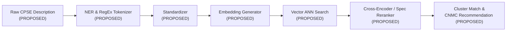

# Backend & API Architecture Audit

**System:** AI-Powered National Unified Material Master Framework  
**Scope:** Server Architecture, Controllers, Services, Business Logic, AI Pipeline & APIs  
**Audit Classification:** Phase 1 — Discovery & Baseline Audit

---

## 1. Executive Summary

An audit of the backend application code, server scripts, and API routes was conducted in `c:\Users\User\Desktop\CSPES`.

| Backend Dimension | Physical Repository State | Classification |
|---|---|---|
| **Backend Framework** | Not Present | **CONFIRMED NOT PRESENT** |
| **API Endpoints & Controllers** | Not Present | **CONFIRMED NOT PRESENT** |
| **Business Logic & Services** | Not Present | **CONFIRMED NOT PRESENT** |
| **Package Manifests (`requirements.txt`, `package.json`)** | Not Present | **CONFIRMED NOT PRESENT** |
| **Documentation & ADR Reference** | Present in `/docs` | **CURRENTLY IMPLEMENTED** |

---

## 2. API Architecture Proposals (PROPOSED — NOT YET APPROVED)

The following RESTful API catalog represents proposed architectural capabilities to be formally refined in **Phase 2 — Product & System Design**:

### A. Authentication & User Management APIs
| HTTP Method | Route Endpoint | Purpose | Architectural Status |
|---|---|---|---|
| `POST` | `/api/v1/auth/login` | Authenticate CPSE/Admin user, issue tokens | **PROPOSED — NOT YET APPROVED** |
| `POST` | `/api/v1/auth/refresh` | Rotate and issue refreshed access token | **PROPOSED — NOT YET APPROVED** |
| `GET` | `/api/v1/auth/me` | Fetch authenticated user profile & permissions | **PROPOSED — NOT YET APPROVED** |
| `GET` | `/api/v1/admin/users` | List multi-tenant users with CPSE affiliations | **PROPOSED — NOT YET APPROVED** |

### B. Material Catalog & Ingestion APIs
| HTTP Method | Route Endpoint | Purpose | Architectural Status |
|---|---|---|---|
| `GET` | `/api/v1/materials` | Paginated query of national and CPSE materials | **PROPOSED — NOT YET APPROVED** |
| `GET` | `/api/v1/materials/{id}` | Detailed view of a material & normalized specs | **PROPOSED — NOT YET APPROVED** |
| `POST` | `/api/v1/materials/ingest/bulk` | Bulk upload raw material records (CSV/Excel/JSON) | **PROPOSED — NOT YET APPROVED** |
| `GET` | `/api/v1/materials/ingest/jobs/{job_id}` | Check async ingestion status & parsing logs | **PROPOSED — NOT YET APPROVED** |
| `POST` | `/api/v1/materials/normalize` | Trigger NLP attribute extraction on text | **PROPOSED — NOT YET APPROVED** |

### C. AI Deduplication, Similarity & Matching APIs
| HTTP Method | Route Endpoint | Purpose | Architectural Status |
|---|---|---|---|
| `POST` | `/api/v1/ai/match/single` | Find duplicates & equivalents for a single material | **PROPOSED — NOT YET APPROVED** |
| `POST` | `/api/v1/ai/match/batch` | Execute cross-CPSE batch deduplication matrix | **PROPOSED — NOT YET APPROVED** |
| `GET` | `/api/v1/ai/duplicates/clusters` | Retrieve duplicate clusters with confidence scores | **PROPOSED — NOT YET APPROVED** |
| `POST` | `/api/v1/ai/recommend-cnmc` | Generate recommended Common National Material Code | **PROPOSED — NOT YET APPROVED** |

### D. Governance & Approval Workflow APIs
| HTTP Method | Route Endpoint | Purpose | Architectural Status |
|---|---|---|---|
| `GET` | `/api/v1/governance/proposals` | List pending CNMC mappings awaiting human validation | **PROPOSED — NOT YET APPROVED** |
| `POST` | `/api/v1/governance/approve` | Approve material merge/mapping to CNMC with audit note | **PROPOSED — NOT YET APPROVED** |
| `POST` | `/api/v1/governance/reject` | Reject match proposal with mandatory justification | **PROPOSED — NOT YET APPROVED** |
| `GET` | `/api/v1/governance/audit-trail` | Query complete audit history by material ID or user | **PROPOSED — NOT YET APPROVED** |

### E. Analytics & ERP Integration APIs
| HTTP Method | Route Endpoint | Purpose | Architectural Status |
|---|---|---|---|
| `GET` | `/api/v1/analytics/summary` | Enterprise summary KPIs (Duplication %, Value) | **PROPOSED — NOT YET APPROVED** |
| `GET` | `/api/v1/analytics/price-variance` | Comparative price analysis across CPSEs | **PROPOSED — NOT YET APPROVED** |
| `GET` | `/api/v1/integration/sap/export` | Export approved CNMC mappings for SAP ERP import | **PROPOSED — NOT YET APPROVED** |

---

## 3. AI/ML Processing Pipeline (PROPOSED — NOT YET APPROVED)

---

## 4. Technology Decisions Pending

- **Backend Framework:** **FUTURE PHASE DECISION REQUIRED** (`ADR-002`: Python FastAPI vs. Node.js NestJS).
- **AI Embedding Strategy:** **FUTURE PHASE DECISION REQUIRED** (`ADR-005`: Sentence-Transformers vs. Cloud LLM).
- **Task Queue / Worker System:** **FUTURE PHASE DECISION REQUIRED** (`ADR-006`: Celery + Redis vs. FastAPI BackgroundTasks).
