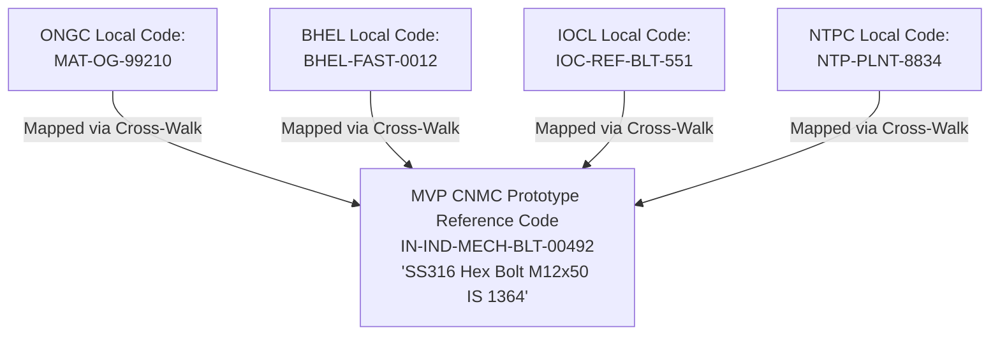

# Common National Material Code (CNMC) Conceptual Design

**System:** AI-Powered National Unified Material Master Framework  
**Document Classification:** Product & System Design (Phase 2 / Phase 3 Reference)  
**Status:** `APPROVED (MVP PROTOTYPE SPECIFICATION)`

---

## 1. What is the Common National Material Code (CNMC)?

The **Common National Material Code (CNMC)** is the sovereign, standardized national reference identifier established to unify disparate material codifications across all Indian Central Public Sector Enterprises (CPSEs).

A single CNMC represents a unique, canonical material entity with defined chemical, physical, dimensional, and performance specifications. It serves as the single "source of truth" to which hundreds of legacy, proprietary CPSE internal item codes can be mapped.

---

## 2. MVP Prototype Specification vs. National Governance Ratification

> **IMPORTANT GOVERNANCE NOTICE:**  
> The structured codification format utilized in this project (`IN-IND-MECH-BLT-00492`) is an **"MVP CNMC Prototype Reference Format"** engineered to demonstrate taxonomy-based hierarchical codification and cross-walk capabilities during the SIH 2026 evaluation.  
> Formal national adoption across all Indian public sector enterprises will require sovereign **Department of Public Enterprises (DPE) / Line Ministry policy ratification**, comprehensive multi-CPSE stakeholder consultation, standards validation (BIS), and formal national data governance committee authorization.

---

## 3. Core Governance Rules of the CNMC Model

### 3.1 Creation Triggers
- **When is a CNMC Created?**
  1. When a new harmonized material cluster is approved during cross-CPSE deduplication and no existing CNMC matches the canonical specifications.
  2. When a CPSE introduces an entirely novel standard material that has been validated by a National Domain Authority.
- **Who Can Authorize Creation?**
  - National Platform Administrator in consultation with National Domain Reviewers.

### 3.2 Relationship Cardinality
- **1-to-Many Mapping ($1 : N$):** A single CNMC maps to multiple local CPSE material codes (e.g., 10 different CPSE codes for the same M12x50 bolt all map to 1 CNMC).
- **Strict Canonical Definition:** A local CPSE code can only have **ONE active primary mapping** to a CNMC at any given time.

### 3.3 Revision & Correction Governance
- **Can mappings be corrected?** Yes. If a historical mapping is discovered to be inaccurate (e.g., upon deeper metallurgical testing), an authorized Reviewer can reassign the CPSE code to the correct CNMC.
- **Lineage & Deprecation Handling:**
  - Previous mappings are never deleted. They are transitioned to status `DEPRECATED` with an effective end timestamp.
  - The new mapping is created with status `ACTIVE` and an effective start timestamp.
  - The complete change rationale is permanently recorded in the immutable audit log.
