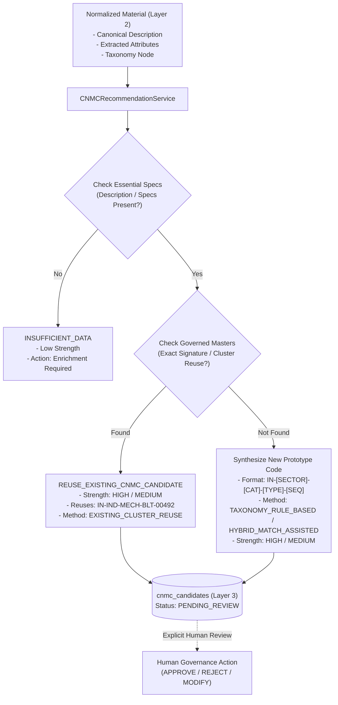

# Common National Material Code (CNMC) Recommendation Engine

**System:** AI-Powered National Unified Material Master Framework  
**Document Classification:** System Architecture & Methodology (Phase 8 Reference)  
**Status:** `IMPLEMENTED & UNIT TESTED`  
**Format Version:** `MVP_CNMC_V1`  

---

## 1. Executive Summary & Governance Boundary

The **CNMC Recommendation Engine** provides deterministic, taxonomy-driven, and match-assisted candidate codification for cross-CPSE material clusters.

> [!IMPORTANT]
> **CRITICAL GOVERNANCE BOUNDARY:**  
> All Common National Material Codes generated in this system represent the **"MVP Prototype CNMC Reference Format"** (e.g., `IN-IND-MECH-BLT-00492`) engineered exclusively for SIH 2026 demonstration, prototype evaluation, and application-level material governance testing.  
> The system strictly avoids claiming official Government of India, DPE, or statutory national standard approval.

---

## 2. Recommendation Flow & Architecture



---

## 3. Reuse vs. New Candidate Logic

### 3.1 Existing Governed CNMC Reuse (`REUSE_EXISTING_CNMC_CANDIDATE`)
Before synthesizing a new code, the engine inspects:
1. **Active Cross-Walk Clusters:** If the source material shares high similarity ($\ge 0.70$ composite confidence, exact dimensional compatibility) with a peer material already bound to an active `CNMCMaster` record.
2. **Canonical Title & Spec Template Alignment:** If an active `CNMCMaster` already exists with an identical canonical specification.

When reuse is detected:
- The existing code is recommended (e.g. `IN-IND-MECH-BLT-00492`).
- Generation method is flagged as `EXISTING_CLUSTER_REUSE`.
- The candidate remains strictly in `PENDING_REVIEW` until an authorized domain reviewer signs off.

### 3.2 New Candidate Generation (`NEW_CNMC_CANDIDATE`)
If no governed master is compatible, a deterministic prototype code is synthesized:
- **Format:** `[COUNTRY]-[SECTOR]-[CATEGORY]-[TYPE]-[SEQUENCE]`
  - `COUNTRY`: `IN` (India)
  - `SECTOR`: `IND` (Industrial), `POW` (Power), `PET` (Petroleum), `MIN` (Mining)
  - `CATEGORY`: `MECH` (Mechanical), `PIPG` (Piping), `ELEC` (Electrical), `INST` (Instrumentation)
  - `TYPE`: `BLT` (Bolt), `NUT` (Nut), `VLV` (Valve), `PIPE` (Pipe), `FLG` (Flange), `BRG` (Bearing)
  - `SEQUENCE`: Deterministic 5-digit sequence hash derived from the canonical attribute signature.

---

## 4. Explainability Card Structure (`CNMCRecommendationExplanation`)

Every generated recommendation produces a structured explainability card with machine-readable fields:

```json
{
  "outcome": "NEW_CNMC_CANDIDATE",
  "recommendation_strength": "HIGH",
  "generation_method": "TAXONOMY_RULE_BASED",
  "format_version": "MVP_CNMC_V1",
  "recommendation_reason": "Generated new prototype CNMC candidate 'IN-IND-MECH-BLT-00492' derived from sector 'IND', category 'MECH', and type 'BLT'.",
  "taxonomy_signals": {
    "sector": "IND",
    "category": "MECH",
    "material_type": "BLT",
    "taxonomy_path": "Industrial / Mechanical / Fasteners / Bolts"
  },
  "matching_signals": {
    "top_match_type": "EXACT_MATCH_CANDIDATE",
    "composite_confidence": 0.98
  },
  "warnings": [
    "Prototype recommendation generated within SIH 2026 MVP demonstration governance workflow."
  ],
  "missing_information": [],
  "match_evidence_score": 0.98,
  "governance_notice": "Recommended within the SIH MVP demonstration governance workflow. Does not constitute official Government of India national standard approval."
}
```

---

## 5. Confidence Terminology & Honesty Rules

- **No Misleading ML Scores:** Deterministic taxonomy logic is explicitly labeled `TAXONOMY_RULE_BASED` with `recommendation_strength` (`HIGH`, `MEDIUM`, `LOW`).
- **Match Evidence Scores:** When similarity matches contribute, the score is labeled `match_evidence_score` rather than generic "AI confidence".
- **Zero Auto-Approval:** Recommendations are never written directly into `cnmc_master`. They are proposed into `cnmc_candidates` with status `PENDING_REVIEW`.
