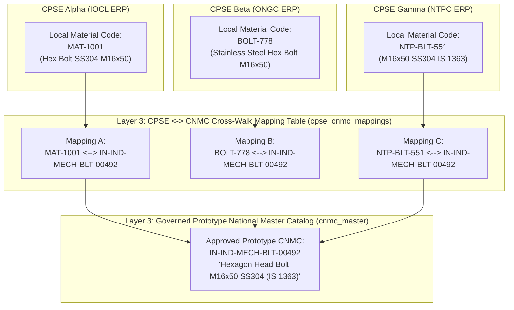

# CPSE ↔ CNMC Cross-Walk Mapping Architecture

**System:** AI-Powered National Unified Material Master Framework  
**Document Classification:** Data Architecture (Phase 8 Reference)  
**Status:** `IMPLEMENTED & UNIT TESTED`  

---

## 1. Cross-Walk Concept & Legacy Code Preservation

The National Unified Material Master Framework operates on a strict **Non-Destructive Coexistence Principle**:

### Key Principles:
1. **Zero Overwriting of Source ERP Codes:** Legacy material codes (`MAT-1001`, `BOLT-778`) are permanently preserved in Layer 1 and are never overwritten.
2. **Cardinality:** 1 CNMC maps to $N$ CPSE local material codes ($1 : N$). A single local material code possesses at most one active primary mapping to a CNMC.
3. **Traceability:** Each mapping record tracks `raw_material_id`, `normalized_material_id`, `organization_id`, `local_material_code`, `mapping_type`, `approved_by`, and effective date timestamps.

---

## 2. Mapping Types & Lifecycle

| Mapping Type | Description |
|---|---|
| `DIRECT_MATCH` | Canonical specification and attribute signature are structurally identical. |
| `NORMALIZED_MATCH` | Standardized engineering terms match following unit and standard conversion. |
| `FUNCTIONAL_EQUIVALENCE` | Materials differ in minor vendor branding but are functionally interchangeable based on engineering standards. |
| `MANUAL_MAPPING` | Established or overridden directly by a human domain reviewer. |

### Lifecycle States:
- `ACTIVE`: Approved, verified cross-walk binding in effect.
- `UNDER_REVIEW`: Re-evaluated due to updated specification or standard revision.
- `DEPRECATED`: Replaced by a newer CNMC version; historical lineage retained.
