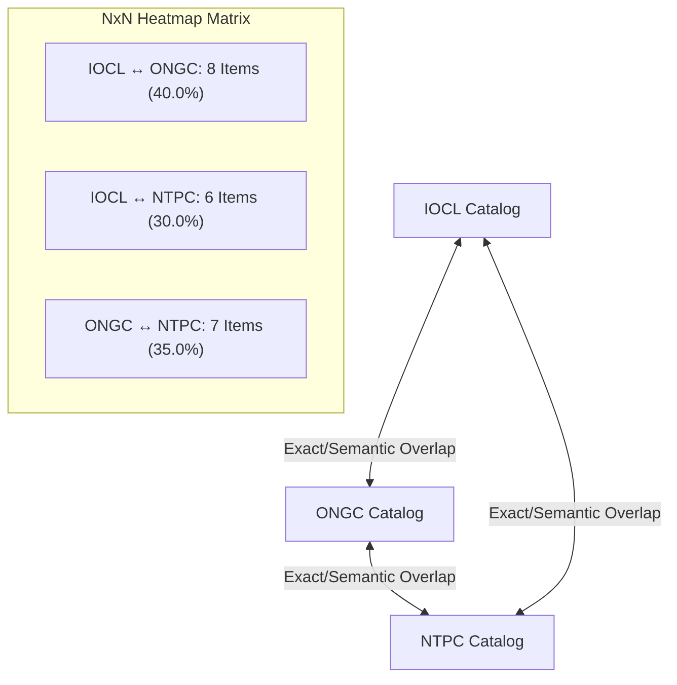

# Dynamic Cross-CPSE Overlap Matrix & Pairwise Analytics

## 1. Overview
The **Cross-CPSE Overlap Engine** calculates dynamic $N \times N$ matrix correlations across all active public sector enterprises. It enables procurement policymakers and CPSE materials managers to identify common catalog footprints and joint aggregation potential.

---

## 2. Dynamic $N \times N$ Matrix Architecture

Given $N$ participating CPSEs: $\{E_1, E_2, \dots, E_N\}$:
- Each row $i$ represents enterprise $E_i$
- Each column $j$ represents enterprise $E_j$
- For $i = j$ (diagonal), cell value is 0 (self-comparison excluded)
- For $i \neq j$, cell value $C_{i,j}$ represents the count of distinct normalized material concepts shared between $E_i$ and $E_j$.
- Overlap Percentage $P_{i,j}$ is defined as:
$$P_{i,j} = \frac{C_{i,j}}{\text{Total Materials in } E_i} \times 100\%$$

---

## 3. Pairwise Category Drilldown
For any selected pair $(E_i, E_j)$, the engine returns:
- Shared material count and overlap percentage
- Top overlapping taxonomy categories (e.g., Mechanical Fasteners, Valves, Electrical Cables)
- Active CNMC standardization status of overlapping lines
- Preservation of local ERP item numbers for both participating enterprises.
