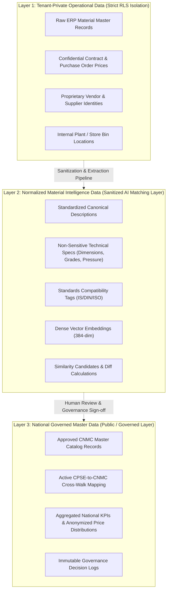

# Cross-CPSE Data Access & Sharing Architecture

**System:** AI-Powered National Unified Material Master Framework  
**Document Classification:** System Architecture (Phase 3)  
**Security Boundary:** Multi-Tenant Isolation & Sanitized Intelligence Sharing  
**Status:** `APPROVED`

---

## 1. Multi-Tier Data Classification Architecture

To resolve the tension between strict multi-tenant enterprise confidentiality and cross-CPSE deduplication intelligence, data within the platform is segmented into three distinct operational layers:

---

## 2. Detailed Layer Specifications & Data Sanitization

### Layer 1: Tenant-Private Operational Data
- **Data Elements:** Raw ERP source records, proprietary vendor codes, contract pricing, PO numbers, plant store locations, internal departmental tags.
- **Access Rule:** Strictly restricted to authenticated users belonging to the specific CPSE owning the record.
- **Database Enforcement:** PostgreSQL Row-Level Security (RLS) dynamically filters queries based on the authenticated session's `cpse_id`.
- **Cross-CPSE Exposure:** **Zero.** These records are never exposed to peer CPSEs or unauthorized national reviewers.

### Layer 2: Normalized Material Intelligence Data (Sanitized Matching Tier)
- **Data Elements:** Cleaned descriptions, extracted engineering attributes (Diameter, Length, Material Grade, Pressure Rating), normalized SI units, dense vector embeddings, candidate match proposals.
- **Sanitization Pipeline:** During NLP normalization, all proprietary vendor identities and contract prices are stripped. Only physical, chemical, and engineering attributes are retained.
- **Access Rule:** 
  - **AI Similarity Engine:** Queries normalized attributes and vector embeddings across all CPSEs to discover cross-enterprise duplicate clusters.
  - **Domain / Technical Reviewers:** Can inspect sanitized side-by-side specification diffs of Candidate A (CPSE 1) vs. Candidate B (CPSE 2) to evaluate functional interchangeability.
- **Cross-CPSE Exposure:** Masked engineering attributes only. Peer CPSE identity can be masked or unmasked based on national governance policy; proprietary contract data remains strictly omitted.

### Layer 3: National Governed Master Data (Governed & Public Tier)
- **Data Elements:** Approved Common National Material Codes (CNMC), canonical specification templates, active CPSE-to-CNMC cross-walk mappings, immutable audit logs, macro-level rationalization metrics.
- **Price Information Policy:** Pricing analytics are rendered strictly as **anonymized statistical distributions** (Minimum, Maximum, Average, Median) across identical CNMCs to identify market dispersion without exposing bilateral contract terms.
- **Access Rule:** Accessible to National Administrators, CPSE Executives, Procurement Analysts, and Statutory Compliance Auditors.

---

## 3. Role-Based Data Access Control Matrix

| System Persona | Layer 1: Tenant-Private Data | Layer 2: Sanitized Intelligence | Layer 3: Governed Master Data |
|---|---|---|---|
| **National Administrator** | ❌ (Cannot view raw private records) | ✅ (Full view for governance) | ✅ (Full governance access) |
| **CPSE Administrator** | ✅ (Own CPSE only via RLS) | ✅ (Own CPSE + Masked Matches) | ✅ (Full view) |
| **Material Master Manager** | ✅ (Own CPSE only via RLS) | ✅ (Own CPSE + Masked Matches) | ✅ (Full view & Export) |
| **Domain / Tech Reviewer** | ❌ (No raw vendor/pricing access) | ✅ (Full spec diffing for review) | ✅ (Full view & Sign-off) |
| **Procurement Analyst** | ❌ (Own CPSE raw data only) | ❌ (Aggregated views only) | ✅ (Anonymized Price Distributions) |
| **Inventory Analyst** | ❌ (Own CPSE raw data only) | ✅ (Surplus stock spec matching) | ✅ (Surplus availability view) |
| **Statutory Auditor** | ✅ (Audited CPSE scope) | ✅ (Full audit lineage) | ✅ (Immutable audit logs & dossiers) |
| **AI Matching Engine** | ❌ (Excluded from private fields) | ✅ (Full vector & spec search) | ✅ (Reads approved CNMC catalog) |
