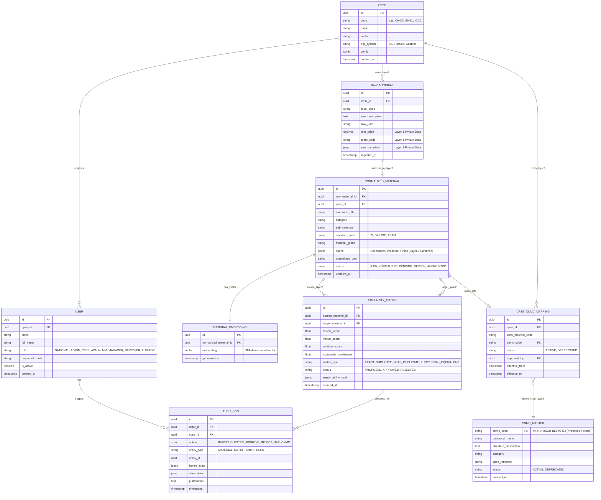

# Database & Storage Architecture (ADR-003 & ADR-004 Approved)

**System:** AI-Powered National Unified Material Master Framework  
**Document Classification:** System Architecture (Phase 3)  
**Technology Decision:** PostgreSQL 16+ with `pgvector` Extension + Shared Schema with Row-Level Security (RLS)  
**Status:** `APPROVED`

---

## 1. Decision Records (ADR-003 & ADR-004 Finalization)

### Selected Database Engine: PostgreSQL 16+ with `pgvector`
- **Primary Database (ADR-003):** PostgreSQL 16+ utilizing a **Shared Schema with Row-Level Security (RLS)** and `cpse_id` tenant isolation.
  - *Data Isolation Model:* Strict multi-tenant boundaries on Layer 1 private operational data via RLS, while enabling cross-CPSE deduplication and aggregate analytics on sanitized Layer 2 and Layer 3 data structures.
- **Vector Search Engine (ADR-004):** **`pgvector` Extension** with HNSW (Hierarchical Navigable Small World) index.
  - *Rationale:* Eliminates dual-database synchronization lag, provides ACID transactional consistency between material metadata and vector embeddings, and simplifies local Docker Compose deployment for SIH evaluation.

---

## 2. Multi-Tier Data Model & Entity Relationships (ERD)



---

## 3. Data Tier Segregation & Row-Level Security (RLS)

1. **Layer 1: Private Operational Isolation:**
   - The `raw_material` table is strictly protected by PostgreSQL Row-Level Security:
     ```sql
     ALTER TABLE raw_material ENABLE ROW LEVEL SECURITY;
     CREATE POLICY cpse_raw_tenant_isolation ON raw_material
     FOR ALL USING (cpse_id = NULLIF(current_setting('app.current_cpse_id', true), '')::uuid);
     ```
2. **Layer 2: Sanitized Intelligence Access:**
   - The `normalized_material` and `material_embedding` tables omit private vendor and raw pricing attributes. They are queried by the background AI matching worker across CPSE boundaries to discover duplicate candidates without exposing proprietary procurement contracts.
3. **Layer 3: Governed Master Integrity:**
   - The `audit_log` table is append-only. Database triggers revoke `UPDATE` and `DELETE` operations, guaranteeing non-repudiation.

---

## 4. Vector Search Performance Targets

```sql
-- Enable vector extension
CREATE EXTENSION IF NOT EXISTS vector;

-- Create HNSW Index on dense embeddings
CREATE INDEX idx_material_embedding_hnsw 
ON material_embedding 
USING hnsw (embedding vector_cosine_ops)
WITH (m = 16, ef_construction = 64);
```

*Performance Note:* Target candidate retrieval latency is $\le 100\text{ ms}$ on indexed 384-dimensional embeddings. Actual performance is subject to hardware specifications, index build parameters ($M, \text{ef\_construction}$), and dataset benchmark validation.
