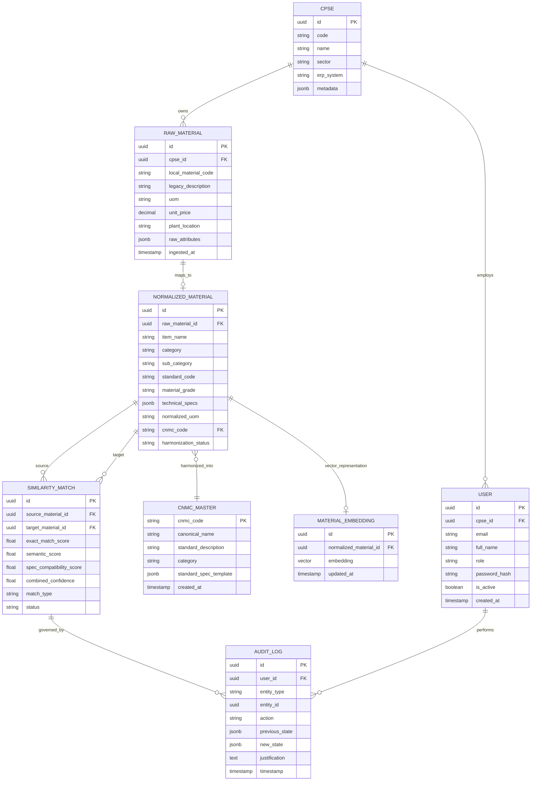

# Database & Data Model Audit

**System:** AI-Powered National Unified Material Master Framework  
**Scope:** Schemas, Relational Models, Vector Embeddings, Migration Layer & Data Integrity  
**Audit Classification:** Phase 1 — Discovery & Baseline Audit

---

## 1. Executive Summary

An audit of the database configurations, migrations, schema files, and data storage drivers in `c:\Users\User\Desktop\CSPES` was conducted.

| Database Dimension | Physical Repository State | Classification |
|---|---|---|
| **Active DB Instances** | Not Present | **CONFIRMED NOT PRESENT** |
| **Migration Scripts (`alembic`, `prisma`)** | Not Present | **CONFIRMED NOT PRESENT** |
| **Schema Definitions & ORM Models** | Not Present | **CONFIRMED NOT PRESENT** |
| **Documentation & ADR Reference** | Present in `/docs` | **CURRENTLY IMPLEMENTED** |

---

## 2. Relational & Vector Schema Blueprint (PROPOSED — NOT YET APPROVED)

The following schema architecture is proposed for review and formal validation in **Phase 2 — Product & System Design**:

---

## 3. Technology Decisions Pending

- **Primary Database & Multi-Tenancy:** **FUTURE PHASE DECISION REQUIRED** (`ADR-003`: PostgreSQL 16+ with Row-Level Security vs. Multi-schema).
- **Vector Search Engine:** **FUTURE PHASE DECISION REQUIRED** (`ADR-004`: PostgreSQL `pgvector` extension vs. Standalone Qdrant / FAISS).
- **ORM / Migration Tooling:** **FUTURE PHASE DECISION REQUIRED** (SQLAlchemy + Alembic vs. Prisma ORM).
