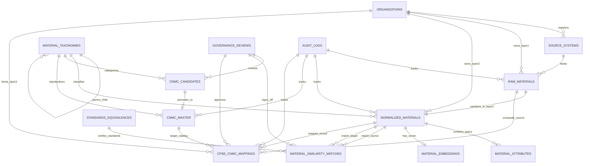
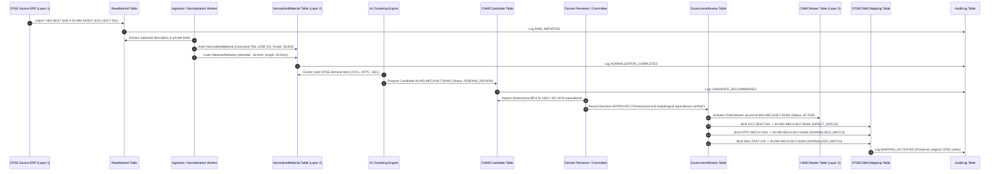

# Database Entity Relationships & Structural Flow

**System:** AI-Powered National Unified Material Master Framework (SIH 2026)  
**Document Classification:** Data Architecture (Phase 5)  
**Status:** `ACTIVE / AUDITED`

---

## 1. Complete Entity-Relationship Diagram (ERD)

---

## 2. Complete Demonstration Data Flow: CPSE $\rightarrow$ CNMC

---

## 3. Key Relational Safeguards

1. **Original CPSE Material Code Integrity:** `cpse_cnmc_mappings` retains `local_material_code` explicitly alongside foreign key references to `raw_materials.id` and `cnmc_master.id`. No database trigger or update ever alters `raw_materials.material_code`.
2. **Restricted Deletions:** `ON DELETE RESTRICT` on `organizations`, `raw_materials`, and `cnmc_master` prevents cascading accidental deletions of foundational master data.
3. **Cascading Attributes:** `ON DELETE CASCADE` is permitted only on child spec attributes (`material_attributes`) and vector embeddings (`material_embeddings`) when a normalized material is purged.
