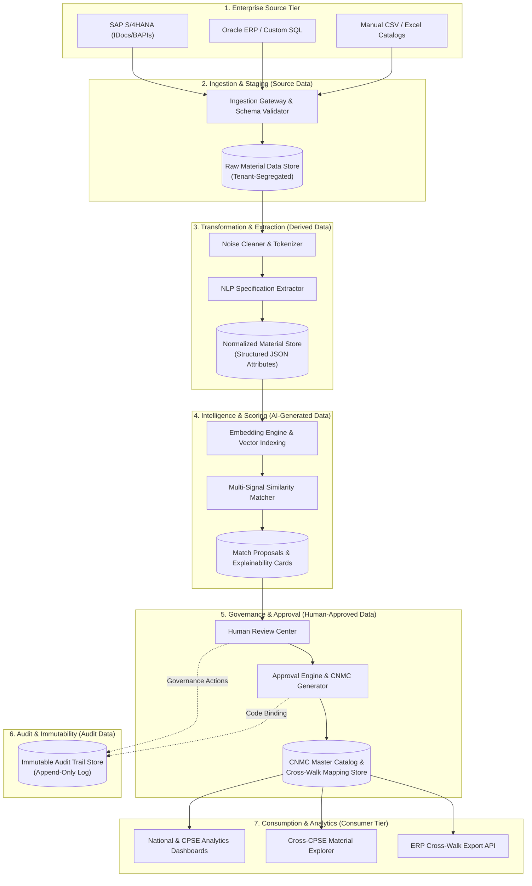

# Conceptual Data Flow Architecture

**System:** AI-Powered National Unified Material Master Framework  
**Document Classification:** Product & System Design (Phase 2)  
**Status:** `PROPOSED — NOT YET APPROVED`

---

## 1. End-to-End Conceptual Data Pipeline

The data flow spans source data ingestion, transformation, AI enrichment, governance validation, and downstream analytics consumption.

---

## 2. Data Classification by Tier

| Data Layer Category | Data Elements Included | Mutability & Persistence | Security & Privacy Scope |
|---|---|---|---|
| **A. Source Data** | Raw CPSE Material Codes, Raw Legacy Descriptions, Local UOM, Raw Pricing, Plant IDs. | Read-only once ingested; immutable historical source record. | Strictly isolated per CPSE tenant (`cpse_id`). Confidential. |
| **B. Derived Data** | Cleaned Text, Extracted Specification Attributes (Grade, Dimensions, Pressure), Normalized UOM. | Re-generable via deterministic NLP tokenizers; modifiable by authorized domain reviewers. | Shared within CPSE; masked across CPSEs during harmonization. |
| **C. AI-Generated Data** | Dense Vector Embeddings, Lexical Scores, Semantic Scores, Match Proposals, Explainability Diff Cards. | Ephemeral / Re-computable upon model update or parameter tuning. | System-level intermediate data; unmasked for review workflows. |
| **D. Human-Approved Data** | Approved Match Pairs, Assigned CNMC Codes, Active Cross-Walk Mappings, Canonical Descriptions. | Version-controlled; updates create new active records while deprecating old ones. | Public / Cross-CPSE National Master Catalog. |
| **E. Immutable Audit Data** | User IDs, Timestamps, Action Verbs, Before/After JSON Snapshots, Mandatory Written Justifications. | **Strictly Append-Only.** No `UPDATE` or `DELETE` operations permitted. | Governed read access for Auditors and Administrators. |
