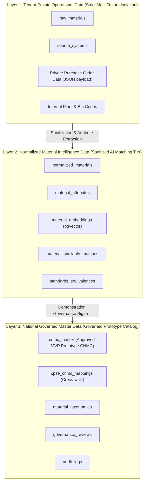

# Multi-Tier Data Classification & Layer Boundaries

**System:** AI-Powered National Unified Material Master Framework (SIH 2026)  
**Document Classification:** Security & Data Architecture (Phase 5)  
**Status:** `ACTIVE / AUDITED`

---

## 1. Overview of Data Tiers

To balance enterprise confidentiality across independent CPSEs with the national need for deduplication and procurement rationalization, all data in the platform strictly belongs to one of three architectural layers:

---

## 2. Detailed Layer Specifications

### Layer 1: Tenant-Private Operational Data
- **Scope & Tables:** `raw_materials`, `source_systems`, `source_payload` JSON.
- **Data Content:** Raw ERP text, original local item codes, contract purchase prices, proprietary supplier codes, warehouse bin locations.
- **Access Rule:** Accessible **ONLY** to authenticated users belonging to the originating CPSE.
- **Tenant Isolation:** Multi-tenant boundaries represented via `organization_id` foreign keys. PostgreSQL RLS enforcement remains a future implementation/verification step.
- **Cross-CPSE Policy:** Strictly 0% cross-CPSE visibility. Raw vendor and price details are never passed into similarity candidate diffs or AI matching prompts.

---

### Layer 2: Normalized Material Intelligence Data (Sanitized Tier)
- **Scope & Tables:** `normalized_materials`, `material_attributes`, `material_embeddings`, `material_similarity_matches`, `standards_equivalences`.
- **Data Content:** Canonical titles, standardized SI units, physical/chemical engineering attributes (Diameter, Length, Voltage, Pressure Rating), 384-dimensional dense vectors, pairwise similarity scores, specification diffs.
- **Sanitization Mechanism:** Commercial terms, internal vendor IDs, and unit prices are stripped during ingestion. Only physical, electrical, chemical, and engineering attributes are stored.
- **Access Rule:** AI similarity pipelines operate across all records in Layer 2. Technical domain reviewers can inspect cross-CPSE attribute diffs to evaluate functional interchangeability.

---

### Layer 3: National Governed Master Data (Governed Prototype Tier)
- **Scope & Tables:** `cnmc_master`, `cpse_cnmc_mappings`, `material_taxonomies`, `governance_reviews`, `audit_logs`.
- **Data Content:** MVP Prototype Common National Material Codes (CNMC reference format), standardized specification templates, cross-walk mapping table binding local codes to CNMCs, immutable governance logs.
- **Access Rule:** Accessible to National Administrators, CPSE Executives, Procurement Analysts, and Auditors.
- **Pricing Aggregation:** Future procurement analytics on Layer 3 render prices strictly as **anonymized statistical distributions** (Min, Max, Avg, Median) to reveal national cost variance without disclosing bilateral supplier contract details.

---

## 3. Verification & Current Implementation Status
- **PostgreSQL RLS Status:** Tenant boundaries are represented in the schema and application design (`organization_id` column scopes). PostgreSQL RLS policy activation and live database enforcement remain a future implementation/verification step.
- **CNMC Prototype Status:** All CNMC master records represent the **MVP Prototype Reference Format** approved within the SIH demonstration governance workflow, and do not imply official Government of India policy codification.
- **Match Data Status:** Seeded match scores represent **manually seeded demonstration values** to validate data structures and visualization diffs, not live AI inference output.
