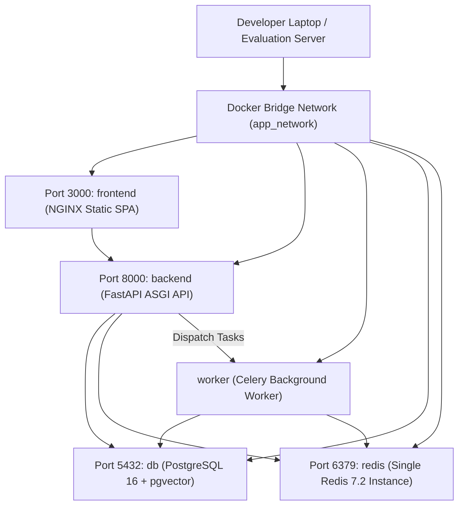
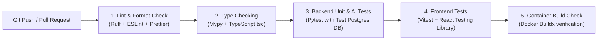

# DevOps, Containerization & CI/CD Architecture (ADR-009 & ADR-010 Approved)

**System:** AI-Powered National Unified Material Master Framework  
**Document Classification:** System Architecture (Phase 3)  
**Technology Decisions:** Multi-Service Docker Compose + GitHub Actions CI/CD  
**Status:** `APPROVED`

---

## 1. Decision Records (ADR-009 & ADR-010 Finalization)

### Selected DevOps Stack: Docker Compose + GitHub Actions
- **Containerization (ADR-009):** **Multi-Service Docker Compose** running 5 pre-configured containers:
  1. `frontend` (React 18+ Vite SPA served via NGINX Alpine).
  2. `backend` (FastAPI Python 3.11 ASGI API gateway).
  3. `worker` (Dedicated Celery worker process for batch ingestion, vector calculations, and similarity scanning).
  4. `db` (PostgreSQL 16 with `pgvector` extension pre-installed).
  5. `redis` (Single Redis 7.2 Alpine container for caching, rate limiting, and Celery broker).
- **CI/CD Pipeline (ADR-010):** **GitHub Actions** for automated quality gates (linting, type-checking, backend Pytest, frontend Vitest, and Docker build tests).

---

## 2. Docker Compose Multi-Container Orchestration



### Docker Compose Service Definition (MVP)
```yaml
version: '3.8'

services:
  frontend:
    build:
      context: ./frontend
      dockerfile: Dockerfile
    ports:
      - "3000:80"
    depends_on:
      - backend
    networks:
      - app_network

  backend:
    build:
      context: ./backend
      dockerfile: Dockerfile
    command: uvicorn app.main:app --host 0.0.0.0 --port 8000
    ports:
      - "8000:8000"
    environment:
      - DATABASE_URL=postgresql+asyncpg://postgres:postgres@db:5432/material_master
      - REDIS_URL=redis://redis:6379/0
      - JWT_SECRET_KEY=sih_2026_master_secret_key_change_in_prod
      - CSRF_SECRET_KEY=sih_2026_csrf_secret_key_change_in_prod
      - ENVIRONMENT=development
    depends_on:
      - db
      - redis
    networks:
      - app_network

  worker:
    build:
      context: ./backend
      dockerfile: Dockerfile
    command: celery -A app.core.celery_app worker --loglevel=info --concurrency=4
    environment:
      - DATABASE_URL=postgresql+asyncpg://postgres:postgres@db:5432/material_master
      - REDIS_URL=redis://redis:6379/0
      - ENVIRONMENT=development
    depends_on:
      - db
      - redis
    networks:
      - app_network

  db:
    image: pgvector/pgvector:pg16
    environment:
      - POSTGRES_USER=postgres
      - POSTGRES_PASSWORD=postgres
      - POSTGRES_DB=material_master
    ports:
      - "5432:5432"
    volumes:
      - pgdata:/var/lib/postgresql/data
    networks:
      - app_network

  redis:
    image: redis:7.2-alpine
    ports:
      - "6379:6379"
    volumes:
      - redisdata:/data
    networks:
      - app_network

volumes:
  pgdata:
  redisdata:

networks:
  app_network:
    driver: bridge
```

---

## 3. GitHub Actions CI/CD Pipeline


