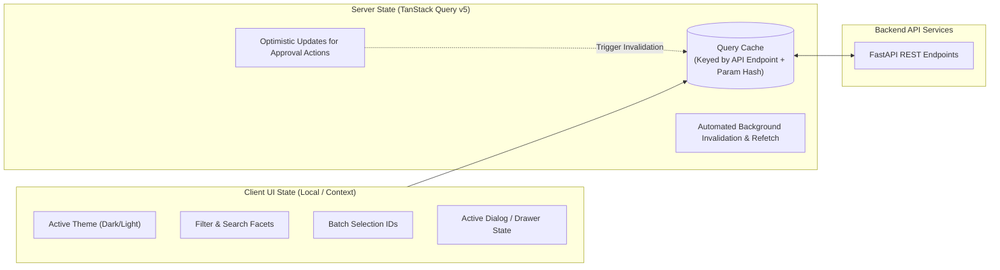

# Frontend Architecture Specification (ADR-001 Approved)

**System:** AI-Powered National Unified Material Master Framework  
**Document Classification:** System Architecture (Phase 3)  
**Technology Decision:** React 18+ (Vite) + TypeScript + Tailwind CSS  
**Status:** `APPROVED`

---

## 1. Decision Record (ADR-001 Finalization)

### Selected Framework: React 18+ SPA (Vite) + TypeScript
- **Selected Option:** React 18+ with Vite build tooling and TypeScript.
- **Alternatives Rejected:**
  1. *Next.js 14+ (App Router):* Rejected due to unnecessary Node.js server hosting dependencies in production, SSR complexity for private enterprise dashboards, and hydration overhead for high-frequency client-side table operations.
  2. *Angular / Vue.js:* Rejected due to smaller AI/data-visualization open-source component ecosystem and slower hackathon scaffolding velocity.
- **Why Selected:**
  - **Blazing Fast Development Velocity:** Instant Hot Module Replacement (HMR) and lightweight tooling.
  - **Static Packaging:** Builds to pure HTML/JS/CSS static bundles easily served by NGINX or static web servers without Node.js backend dependencies.
  - **Enterprise Data Table Ecosystem:** Native support for TanStack Table (headless virtualization supporting 100,000+ material rows without DOM lag) and TanStack Query.
  - **Type Safety:** Full TypeScript end-to-end typing matching backend Pydantic schemas.

---

## 2. Frontend Component Hierarchy & Directory Architecture

```text
frontend/
├── src/
│   ├── assets/              # Static icons, national logos, typography
│   ├── components/          # Reusable design system components
│   │   ├── common/          # Buttons, Modal, Badge, Tooltip, Input, Select, StatCard
│   │   ├── datagrid/        # Virtualized Material Data Table, Column Filter, Pagination
│   │   ├── diff/            # Side-by-Side Spec Diff Viewer, Attribute Comparison Badge
│   │   ├── explainability/  # AI Explainability Card, Confidence Breakdown Meter
│   │   ├── layout/          # Navbar, Sidebar, Breadcrumb, Header, Footer
│   │   └── charts/          # Price Variance Bar Chart, Category Treemap, Overlap Matrix
│   ├── context/             # AuthContext, ThemeContext, TenantContext
│   ├── hooks/               # useMaterials, useSimilarityMatch, useGovernance, useDebounce
│   ├── pages/               # Top-level screen views
│   │   ├── Dashboard/       # National Overview & CPSE Overview
│   │   ├── Explorer/        # Material Explorer & Semantic Search
│   │   ├── Ingestion/       # File Upload Wizard & Column Mapping Screen
│   │   ├── ReviewCenter/    # AI Match Review & Side-by-Side Comparison
│   │   ├── CNMCMaster/      # CNMC Catalog & Taxonomy Management
│   │   ├── CrossWalk/       # Mapping Center & ERP Export
│   │   ├── Analytics/       # Procurement Intelligence & Inventory Surplus Discovery
│   │   ├── Audit/           # Immutable Audit Trail Viewer
│   │   └── Admin/           # User Provisioning & Enterprise Configuration
│   ├── services/            # Axios / Fetch API client with interceptors
│   │   ├── api.ts           # Base Axios client with JWT refresh interceptors
│   │   ├── auth.ts          # Auth endpoints
│   │   ├── materials.ts     # Material catalog endpoints
│   │   ├── matching.ts      # AI similarity endpoints
│   │   └── governance.ts    # Approval and mapping endpoints
│   ├── types/               # TypeScript interfaces matching backend models
│   ├── utils/               # Formatting, unit conversion helpers, date utils
│   ├── App.tsx              # Application root with React Router v6
│   ├── main.tsx             # Entry point with QueryClientProvider
│   └── index.css            # Tailwind CSS design tokens & glassmorphic utilities
├── package.json
├── tsconfig.json
├── tailwind.config.js
└── vite.config.ts
```

---

## 3. State Management & Server Synchronization



1. **Server State (TanStack Query v5):**
   - All asynchronous data (material records, similarity clusters, governance queues) is managed via `useQuery` and `useMutation`.
   - Automatic background cache invalidation: Approving a match immediately invalidates the review queue cache and updates the pending count badge.
2. **Client UI State (React Context + Hooks):**
   - Lightweight UI state (active dark/light theme, user session credentials, table column visibility) managed via React Context.

---

## 4. UI/UX Design System & Virtualization Strategy

1. **Design Theme & Aesthetics:**
   - Premium Government Enterprise aesthetic: Deep Indigo (`#1e1b4b`), Slate (`#0f172a`), Emerald (`#059669`) for approvals, Amber (`#d97706`) for near-duplicates, and Crimson (`#dc2626`) for spec discrepancies.
   - Glassmorphic card styling, subtle micro-animations for hover states, and WCAG 2.1 AA high-contrast support.
2. **Table Virtualization for Large Datasets:**
   - Utilizes `@tanstack/react-virtual` inside the `MaterialDataGrid` component.
   - Only renders the ~20 visible DOM rows in the viewport, supporting seamless scrolling across 100,000+ cached items without memory leaks.
3. **Error Boundaries & Suspense:**
   - React Error Boundaries wrap each major route to isolate failures (e.g., a failure in the analytics chart does not crash the navigation or catalog view).
