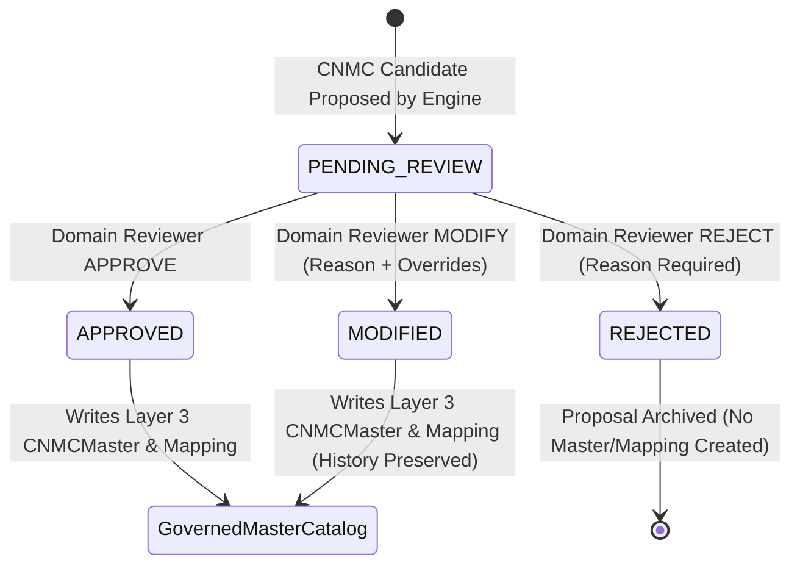

# Human Governance Workflow & Decision Protocol

**System:** AI-Powered National Unified Material Master Framework  
**Document Classification:** Governance Architecture (Phase 8 Reference)  
**Status:** `IMPLEMENTED & UNIT TESTED`  

---

## 1. Governance Workflow Principles

The core philosophy of the National Unified Material Master Framework is **Human-in-the-Loop Sovereignty**:
- **No Automatic Master Creation:** Algorithms only propose recommendations.
- **Mandatory Review Actions:** Authorized human reviewers must examine specifications before codification.
- **Audit Lineage & Immutability:** Every decision is permanently recorded in append-oriented audit logs.

---

## 2. Reviewer Actions & Validation Rules

### 2.1 Action: `APPROVE`
- **Description:** Reviewer accepts the recommended prototype CNMC and specifications without alterations.
- **Comments:** Optional approval comment.
- **Database Effects:**
  1. `CNMCCandidate.status` transitions from `PENDING_REVIEW` to `APPROVED`.
  2. Creates or updates `CNMCMaster` record with status `ACTIVE`.
  3. Creates `CPSECNMCMapping` binding the source material to the approved CNMC while preserving the original CPSE item code.
  4. Appends a `GovernanceReview` record and `AuditLog` entry.

### 2.2 Action: `REJECT`
- **Description:** Reviewer rejects the recommendation (e.g. incorrect taxonomy classification or non-standard specification).
- **Comments:** **Mandatory justification comment** ($\ge 5$ characters).
- **Database Effects:**
  1. `CNMCCandidate.status` transitions from `PENDING_REVIEW` to `REJECTED`.
  2. **Zero `CNMCMaster` or `CPSECNMCMapping` records are created.**
  3. Appends a `GovernanceReview` record and `AuditLog` entry.

### 2.3 Action: `MODIFY`
- **Description:** Reviewer modifies the proposed CNMC code, group title, or description.
- **Comments:** **Mandatory modification justification** ($\ge 5$ characters).
- **Preservation Rule:** The original AI/system recommendation is permanently preserved in `governance_metadata.original_recommendation_history` and `AuditLog.previous_state`.
- **Database Effects:**
  1. `CNMCCandidate.status` transitions to `MODIFIED`.
  2. Creates or updates `CNMCMaster` using the human reviewer overrides.
  3. Appends a `GovernanceReview` record and `AuditLog` entry.

---

## 3. Statutory Notice & Approval Boundaries

Every approved record in `CNMCMaster`, `GovernanceReview`, and `AuditLog` carries the statutory disclaimer:

> *"Approved within the SIH MVP demonstration governance workflow. Does not constitute Government of India, DPE, or statutory national policy approval."*
