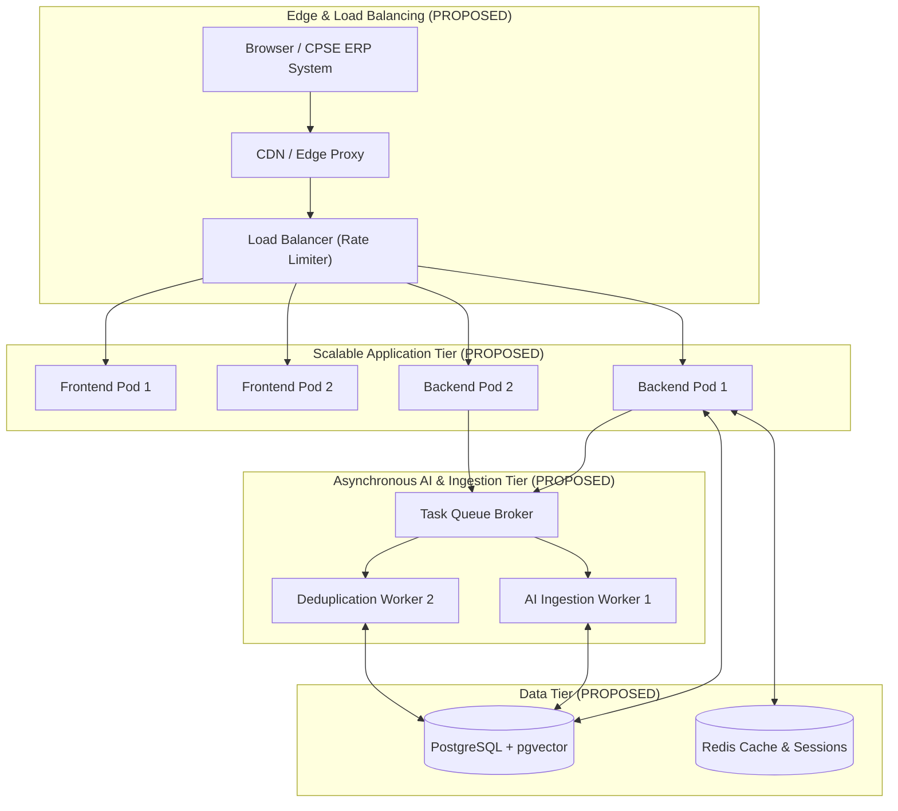

# Infrastructure, Scalability & DevOps Audit

**System:** AI-Powered National Unified Material Master Framework  
**Scope:** Hosting, Docker, CI/CD, Vector Scaling, Caching, Logging & Monitoring  
**Audit Classification:** Phase 1 — Discovery & Baseline Audit

---

## 1. Executive Summary

An audit of the infrastructure, containerization, deployment scripts, and cloud configurations in `c:\Users\User\Desktop\CSPES` was performed.

| Infrastructure Component | Physical Repository State | Classification | Architectural Status |
|---|---|---|---|
| **Git Repository** | Not initialized | **CONFIRMED NOT PRESENT** | **FUTURE PHASE DECISION REQUIRED** (Git repo initialization) |
| **Docker Configuration** | Absent (`Dockerfile`) | **CONFIRMED NOT PRESENT** | **FUTURE PHASE DECISION REQUIRED** (`ADR-009`: Dockerfile) |
| **Docker Compose** | Absent (`docker-compose.yml`) | **CONFIRMED NOT PRESENT** | **FUTURE PHASE DECISION REQUIRED** (`ADR-009`: Docker Compose) |
| **CI/CD Pipelines** | Absent (`.github/workflows`) | **CONFIRMED NOT PRESENT** | **FUTURE PHASE DECISION REQUIRED** (`ADR-010`: GitHub Actions) |
| **Cloud Hosting Setup** | Absent | **CONFIRMED NOT PRESENT** | **FUTURE PHASE DECISION REQUIRED** |
| **Caching Layer** | Absent | **CONFIRMED NOT PRESENT** | **FUTURE PHASE DECISION REQUIRED** (`ADR-008`: Redis Cache) |
| **CDN & Edge Optimization** | Absent | **CONFIRMED NOT PRESENT** | **RECOMMENDED FOR EVALUATION** |
| **Monitoring & Alerting** | Absent | **CONFIRMED NOT PRESENT** | **RECOMMENDED FOR EVALUATION** |
| **Log Aggregation** | Absent | **CONFIRMED NOT PRESENT** | **RECOMMENDED FOR EVALUATION** |
| **Documentation & ADR Reference** | Present in `/docs` | **CURRENTLY IMPLEMENTED** | Approved Baseline |

---

## 2. Multi-CPSE Scalability Proposals (PROPOSED — NOT YET APPROVED)

The following deployment topology is proposed for evaluation during architecture review:

---

## 3. Technology Decisions Pending

- **DevOps Orchestration:** **FUTURE PHASE DECISION REQUIRED** (`ADR-009`: Multi-service Docker Compose).
- **CI/CD Platform:** **FUTURE PHASE DECISION REQUIRED** (`ADR-010`: GitHub Actions).
- **Caching & Message Broker:** **FUTURE PHASE DECISION REQUIRED** (`ADR-008`: Redis vs. In-memory).
- **Observability Stack:** **RECOMMENDED FOR EVALUATION** (OpenTelemetry / Prometheus + Grafana).
