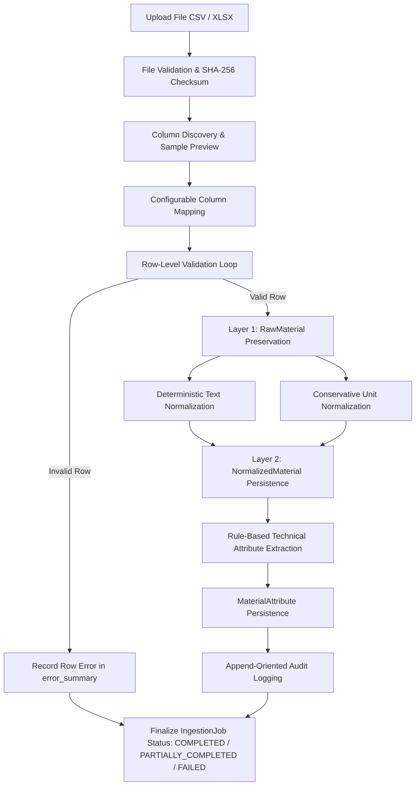
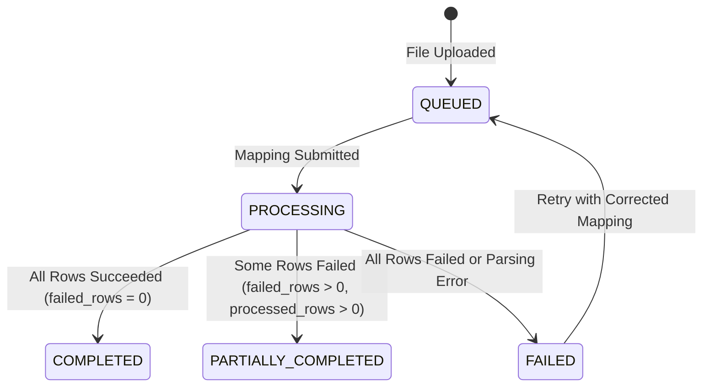

# Material Ingestion & Normalization Pipeline Architecture

**System:** AI-Powered National Unified Material Master Framework (SIH 2026)  
**Document Classification:** Pipeline Architecture & Data Engineering (Phase 6)  
**Status:** `ACTIVE / AUDITED`

---

## 1. Pipeline Overview

The Material Ingestion and Normalization Pipeline provides an enterprise-grade ETL (Extract, Transform, Load) mechanism for heterogeneous CPSE material master catalogs (CSV and OpenXML `.xlsx` formats). It enables Central Public Sector Enterprises to ingest large legacy catalogs without requiring manual pre-formatting, using flexible column discovery, configurable mapping, robust row-level error reporting, raw data preservation, and deterministic engineering normalization.

---

## 2. Key Processing Stages

### 2.1 File Validation & Duplicate Protection
- **Supported Formats:** Delimiter-separated CSV (with automatic delimiter sniffing for `,`, `;`, `\t`, `|`) and OpenXML Microsoft Excel workbooks (`.xlsx`). Legacy binary Excel (`.xls`) is explicitly rejected with `HTTP 422 Unprocessable Entity`.
- **File Size Limit:** 50 MB per batch.
- **Duplicate Upload Protection:** Uses SHA-256 file hashing (`file_hash`). If an identical file is uploaded for the same CPSE organization in an active/completed state, a `409 Conflict` error is returned to prevent duplicate ingestion jobs.
- **Storage Security:** Stored in a controlled directory (`data/uploads/`) with UUID-sanitized filenames to prevent directory traversal attacks.

### 2.2 Sensitive Procurement Data Boundary (Layer 1 Isolation)
- **Tenant-Private Layer 1:** Original CPSE material codes, unparsed descriptions, raw UOMs, and private purchase order details (`PO_PRICE_INR`, `PO_NUMBER`, `VENDOR_NAME`) are stored verbatim inside `raw_materials.source_payload`.
- **Sanitized Layer 2 Boundary:** Proprietary prices and supplier codes are **STRICTLY EXCLUDED** from `normalized_materials.canonical_description`, `material_attributes`, and future embedding/AI pipelines.

### 2.3 Synchronous Fallback Safety Limit
- **Threshold:** `MAX_SYNC_INGESTION_ROWS = 250`.
- Small development/test batches ($\le 250$ rows) can safely execute synchronously if the Celery worker is offline.
- Large files ($> 250$ rows) mandate asynchronous background Celery processing and will not block the web worker thread.

### 2.4 Column Discovery & Heuristic Mapping
- The discovery engine inspects raw headers without persisting records to the database.
- Evaluates estimated row count and extracts a 5-row sample preview.
- Applies heuristic pattern matching to suggest canonical field bindings (e.g., `MAT_CODE` $\rightarrow$ `material_code`, `ITEM_DESC` $\rightarrow$ `description`, `UOM` $\rightarrow$ `unit_of_measure`, `OEM_NAME` $\rightarrow$ `manufacturer`).

### 2.5 Row Validation & Error Isolation
- Required canonical fields: `material_code` and `description`.
- If a row is missing mandatory fields or contains corrupted data, the error is isolated with the exact row number and failure reason.
- **Partial Completion:** The batch continues processing remaining valid rows, setting the job status to `PARTIALLY_COMPLETED` rather than failing the entire file.

---

## 3. Job Status Lifecycle

