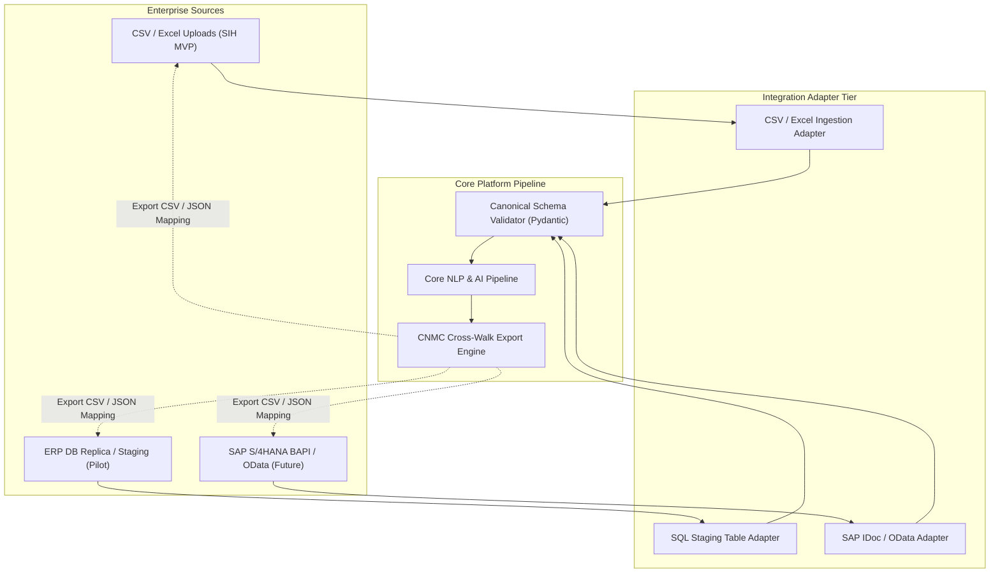

# ERP & External Integration Architecture

**System:** AI-Powered National Unified Material Master Framework  
**Document Classification:** System Architecture (Phase 3)  
**Integration Boundary:** Adapter-Based Ingestion & Synchronization Pipeline  
**Status:** `APPROVED`

---

## 1. Adapter-Based Integration Philosophy

To prevent vendor lock-in and avoid tightly coupling the core platform to proprietary ERP formats (e.g., SAP IDocs, Oracle EBS tables), all external data exchanges operate through an **Adapter Boundary Pattern**:



---

## 2. Canonical Ingestion Data Contract

Regardless of whether source data originates from an SAP BAPI dump, an Excel file, or an API webhook, every adapter transforms incoming raw records into the **Canonical Ingestion Schema**:

```json
{
  "source_tenant": "ONGC",
  "batch_id": "BATCH-2026-09-08-001",
  "records": [
    {
      "local_material_code": "MAT-OG-99210",
      "raw_description": "SS316 HEX BOLT M12X50 MM FULL THREAD IS 1364",
      "raw_uom": "EA",
      "unit_price": 45.50,
      "currency": "INR",
      "plant_location": "PLANT-HAZIRA-01",
      "legacy_category": "FASTENERS",
      "stock_status": "ACTIVE",
      "raw_attributes": {
        "po_number": "PO-883492",
        "oem_brand": "UNBRAKO"
      }
    }
  ]
}
```

---

## 3. SAP ERP Synchronization Export Model

Once a local material code is approved and mapped to a Common National Material Code (CNMC), the platform generates an exportable cross-walk mapping file formatted for automated or batch import into SAP Material Master tables (`MARA` / Custom Z-Tables):

### Sample Export CSV Mapping Format:
```csv
CPSE_ID,LOCAL_MATERIAL_CODE,CNMC_CODE,CANONICAL_DESCRIPTION,MAPPING_STATUS,EFFECTIVE_DATE,APPROVED_BY
ONGC,MAT-OG-99210,IN-IND-MECH-BLT-00492,"Hexagonal Head Bolt SS 316 M12x50",ACTIVE,2026-09-08,USER_ADMIN_01
BHEL,BHEL-FAST-0012,IN-IND-MECH-BLT-00492,"Hexagonal Head Bolt SS 316 M12x50",ACTIVE,2026-09-08,USER_ADMIN_01
```

*Note for Hackathon Evaluation: The SIH MVP demonstrates complete end-to-end integration via the CSV/Excel Ingestion and Export Adapters. SAP direct connectors are documented as architectural interface adapters for future production rollouts.*
