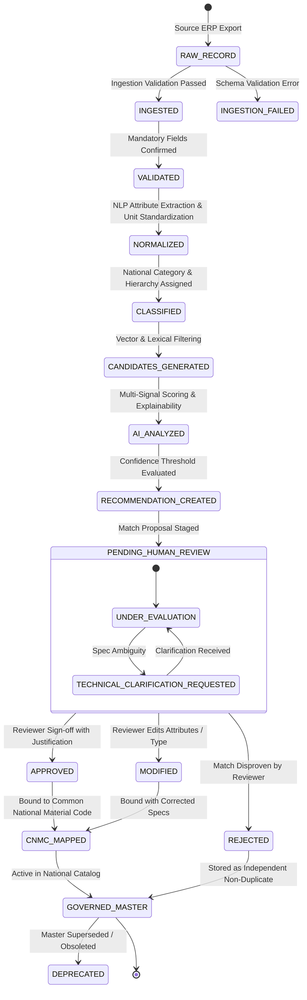
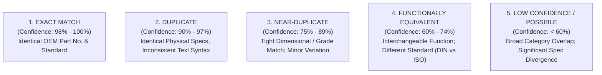

# Material Lifecycle & Match Taxonomy Design

**System:** AI-Powered National Unified Material Master Framework  
**Document Classification:** Product & System Design (Phase 2)  
**Status:** `PROPOSED — NOT YET APPROVED`

---

## 1. Complete Material Lifecycle State Machine

The material lifecycle tracks every record from raw ERP ingestion through NLP extraction, AI matching, human governance, CNMC binding, and historical archiving.

---

## 2. Detailed Lifecycle State Specifications

| State ID | State Name | Purpose | Entry Conditions | Exit Conditions | Allowed Transitions |
|---|---|---|---|---|---|
| `ST-01` | **RAW_RECORD** | Initial unparsed data payload received from CPSE ERP. | File uploaded via UI or API. | Schema check passes or fails. | $\rightarrow$ `INGESTED`, `INGESTION_FAILED` |
| `ST-02` | **INGESTED** | Stored in staging database with tenant isolation (`cpse_id`). | Structural headers & types valid. | Mandatory enterprise fields confirmed. | $\rightarrow$ `VALIDATED` |
| `ST-03` | **VALIDATED** | Verified completeness of raw description and identifiers. | Key fields present. | NLP cleaning pipeline triggered. | $\rightarrow$ `NORMALIZED` |
| `ST-04` | **NORMALIZED** | Free-text parsed into structured attributes (grade, size, UOM). | NLP NER & unit conversion complete. | National taxonomy assigned. | $\rightarrow$ `CLASSIFIED` |
| `ST-05` | **CLASSIFIED** | Material assigned to standard discipline & category tree. | Taxonomy rules evaluated. | Candidate vector indexing executed. | $\rightarrow$ `CANDIDATES_GENERATED` |
| `ST-06` | **CANDIDATES_GENERATED** | Top $N$ potential duplicate/equivalent candidates retrieved. | HNSW vector / lexical search finished. | Multi-tier scoring triggered. | $\rightarrow$ `AI_ANALYZED` |
| `ST-07` | **AI_ANALYZED** | Dense, lexical, and technical scores computed with diffs. | Signal scoring pipeline complete. | Match proposal compiled. | $\rightarrow$ `RECOMMENDATION_CREATED` |
| `ST-08` | **RECOMMENDATION_CREATED** | Match type categorized; explainability card generated. | Confidence score $>0.60$. | Queued for appropriate reviewer. | $\rightarrow$ `PENDING_HUMAN_REVIEW` |
| `ST-09` | **PENDING_HUMAN_REVIEW** | Staged in review queue awaiting domain specialist sign-off. | Proposal assigned to queue. | Expert submits decision with justification. | $\rightarrow$ `APPROVED`, `REJECTED`, `MODIFIED` |
| `ST-10` | **APPROVED** | Human reviewer verified exact, duplicate, or equivalent status. | Mandatory justification logged. | Cross-walk table binding triggered. | $\rightarrow$ `CNMC_MAPPED` |
| `ST-11` | **REJECTED** | Human reviewer confirmed items are not interchangeable. | Rejection reason logged. | Relationship unlinked; pair suppressed. | $\rightarrow$ `GOVERNED_MASTER` |
| `ST-12` | **MODIFIED** | Reviewer corrected attributes before approving mapping. | Corrected specs logged. | Updated specs stored; mapped to CNMC. | $\rightarrow$ `CNMC_MAPPED` |
| `ST-13` | **CNMC_MAPPED** | Local CPSE code bound to active Common National Material Code. | Valid CNMC assigned. | Synced to enterprise search & analytics. | $\rightarrow$ `GOVERNED_MASTER` |
| `ST-14` | **GOVERNED_MASTER** | Active, searchable national master record with full lineage. | Mapping active. | Obsoleted or superseded by new standard. | $\rightarrow$ `DEPRECATED` |

---

## 3. Formal Material Match Taxonomy

To prevent catastrophic engineering failures and ensure operational safety, materials are never treated with a simplistic binary "match vs. non-match" logic. Five rigorous categories are defined:

### Detailed Match Category Definitions

#### 1. EXACT MATCH
- **Meaning:** Materials are physically, chemically, and commercially identical. Produced under identical OEM part numbers or canonical standard specification hashes.
- **Example:**
  - *CPSE A:* "SKF Deep Groove Ball Bearing 6205-2RSH"
  - *CPSE B:* "Bearing, Ball, Deep Groove, SKF 6205 2RSH Rubber Sealed"
- **Matching Conditions:** Exact normalized OEM brand + part number match, or 100% exact match across all canonical technical attributes (Inside Dia, Outside Dia, Width, Seal Type).
- **Risks:** Extremely low risk.
- **Required Human Validation:** Fast-track approval; single-click sign-off by Material Master Manager.

#### 2. DUPLICATE
- **Meaning:** Materials have identical physical dimensions, metallurgical grades, and engineering tolerances, but differ in word ordering, abbreviations, or unit syntax.
- **Example:**
  - *CPSE A:* "SS 316 Hex Bolt M12x50mm Full Thread IS 1364"
  - *CPSE B:* "Bolt Hexagonal Stainless Steel Grade 316, Size 12x50mm, Fully Threaded"
- **Matching Conditions:** $>95\%$ semantic similarity, identical material composition (`SS 316`), identical diameter (`12 mm`), identical length (`50 mm`), identical thread pitch (`Full Thread`).
- **Risks:** Low risk; must verify standard grade equivalence.
- **Required Human Validation:** Standard review by Material Master Manager or Domain Reviewer.

#### 3. NEAR-DUPLICATE
- **Meaning:** Materials share primary specifications but have minor cosmetic, coating, packaging, or non-critical tolerance differences that may or may not affect plant use.
- **Example:**
  - *CPSE A:* "Carbon Steel Flange Class 150 2-Inch Raised Face ASTM A105"
  - *CPSE B:* "CS Flange 2 Inch CL150 Flat Face A105" *(Raised Face vs. Flat Face)*
- **Matching Conditions:** High semantic overlap ($>80\%$), matching pressure rating (`Class 150`), matching size (`2-inch`), matching material (`ASTM A105`), but with differing face type.
- **Risks:** Medium risk; face type discrepancy could cause gasket seal leakage if swapped indiscriminately.
- **Required Human Validation:** Mandatory review by Domain/Technical Reviewer with engineering justification.

#### 4. FUNCTIONALLY EQUIVALENT
- **Meaning:** Materials perform the exact same engineering function and can be safely substituted in plant operations, but originate from different manufacturing standards (e.g., DIN vs. ISO vs. IS) or equivalent alloy grades (e.g., AISI 304 vs. SUS 304 vs. X5CrNi18-10).
- **Example:**
  - *CPSE A (German standard design):* "DIN 933 Hex Screw M10x40 Grade 8.8 Galvanized"
  - *CPSE B (ISO standard design):* "ISO 4017 Hexagon Head Screw M10x40 Property Class 8.8 Zinc Plated"
- **Matching Conditions:** Compatible standards matrix lookup; identical functional dimensions and mechanical properties (tensile strength $>800\text{ MPa}$); compatible protective coating.
- **Risks:** High risk if applied in specialized high-pressure or nuclear/defense environments where specific statutory certifications are legally mandatory.
- **Required Human Validation:** Rigorous Technical Review with domain engineering sign-off. Must NOT be merged automatically.

#### 5. POSSIBLE MATCH / LOW CONFIDENCE
- **Meaning:** Materials belong to the same high-level category and share some vocabulary, but have significant dimensional or rating differences.
- **Example:**
  - *CPSE A:* "Centrifugal Water Pump 15 HP 2900 RPM"
  - *CPSE B:* "Centrifugal Slurry Pump 15 HP 1450 RPM"
- **Matching Conditions:** Low semantic/attribute similarity score ($<60\%$).
- **Risks:** Very high risk of incorrect substitution (e.g., clean water pump vs. heavy abrasive slurry pump).
- **Required Human Validation:** Flagged for information only; cannot be merged into a single CNMC without complete manual specification re-entry.
