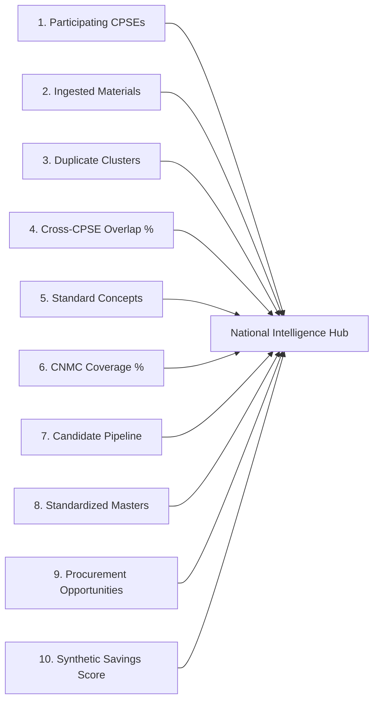

# National Material Intelligence & Macro KPIs

## 1. Executive Summary
The **National Material Intelligence Dashboard** provides a centralized, cross-enterprise vantage point for public sector materials management in India. It aggregates heterogeneous data across participating Central Public Sector Enterprises (CPSEs) to provide actionable insights into catalog redundancy, standardization progress, and synergy opportunities.

---

## 2. Core 10 National KPIs

### KPI Specifications

1. **Total Participating CPSEs (`total_participating_cpses`)**: Total active public sector enterprise entities registered and ingested into Layer 1 (e.g., IOCL, ONGC, NTPC, GAIL, BHEL).
2. **Total Ingested Materials (`total_ingested_materials`)**: Total line items ingested across all CPSE local ERP catalogs.
3. **Total Duplicate Clusters (`total_duplicate_clusters`)**: Multi-item equivalence groups identified by AI semantic, fuzzy, and rule-based matching.
4. **Cross-CPSE Overlap Percentage (`cross_cpse_overlap_percentage`)**: Percentage of total catalog items that appear in more than one CPSE catalog.
5. **Unique Standardized Concepts (`unique_standardized_concepts`)**: Unique normalized canonical material definitions representing deduplicated physical entities.
6. **CNMC Mapping Coverage Percentage (`cnmc_mapping_coverage_percentage`)**: Percentage of raw ingested line items mapped to an active governed CNMC Master code.
7. **Candidate Pipeline Counts (`cnmc_candidates_pending/approved/rejected`)**: Total volume of prototype candidate recommendations pending review, approved, or rejected.
8. **CNMC Master Codes Created (`cnmc_master_codes_created`)**: Governed Master prototype CNMC records published to Layer 3.
9. **Identified Procurement Opportunities (`identified_procurement_opportunities`)**: Volume of high- and medium-impact cross-enterprise synergy clusters.
10. **Synthetic Potential Savings Score (`synthetic_potential_savings_score`)**: Composite normalized score (0–100) indicating relative synergy opportunity across common material demands.

---

## 3. Governance Boundaries & Compliance Notice

> [!IMPORTANT]
> **Mandatory Disclaimer**: All macro metrics, overlap counts, and savings scores presented on the National Dashboard are generated from synthetic demonstration datasets for the Smart India Hackathon (SIH) 2026. They illustrate framework capability and do not represent verified Government of India audit numbers.
