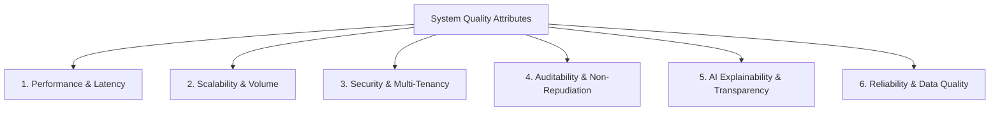

# Non-Functional Requirements Specification

**System:** AI-Powered National Unified Material Master Framework  
**Document Classification:** Product & System Design (Phase 2)  
**Status:** `PROPOSED — NOT YET APPROVED`

---

## 1. Overview & Quality Attributes

Non-functional requirements (NFRs) define the system's operational standards, security posture, performance baselines, and architectural resilience required for government-grade public sector deployment.

---

## 2. Detailed Non-Functional Requirements Matrix

### 1. Performance & Latency
- `NFR-P01 (Search Latency):` Faceted catalog queries and exact code lookups must return results in $< 500\text{ ms}$ for datasets up to 1,000,000 records.
- `NFR-P02 (Vector Similarity Latency):` Semantic vector similarity search across active material embeddings must complete in $< 1.0\text{ second}$ per query.
- `NFR-P03 (Bulk Ingestion Throughput):` Ingestion pipeline must process and structurally validate a 10,000-row CSV file in $< 60\text{ seconds}$ asynchronously.
- `NFR-P04 (UI Responsiveness):` Web client pages must achieve a First Contentful Paint (FCP) of $< 1.5\text{ seconds}$ on standard broadband.

### 2. Scalability & Multi-Tenancy
- `NFR-S01 (Dataset Capacity):` The architecture must be capable of supporting up to 100+ CPSE enterprises and 10,000,000+ total material master records.
- `NFR-S02 (Tenant Isolation):` Enterprise data must be logically segregated such that zero data leakage occurs between CPSE tenants during normal querying and processing.
- `NFR-S03 (Horizontal Scaling):` Stateless application and AI inference tiers must be architected to scale horizontally without architectural refactoring.

### 3. Security & Access Control
- `NFR-SEC01 (Transport Encryption):` All data in transit must be encrypted using TLS 1.3 encryption across all public and internal service boundaries.
- `NFR-SEC02 (Data at Rest Encryption):` Database storage, vector indexes, and file caches must be encrypted using AES-256 standards.
- `NFR-SEC03 (Authentication & Session Security):` User authentication must utilize cryptographically signed tokens with secure expiration and anti-CSRF protections.
- `NFR-SEC04 (Role-Based Authorization):` System must enforce fine-grained RBAC on every API endpoint and UI action based on validated user claims.
- `NFR-SEC05 (Input Sanitization):` 100% of user inputs, file payloads, and search strings must undergo strict schema validation and sanitization to prevent injection vulnerabilities (SQLi, XSS).

### 4. Auditability & Non-Repudiation
- `NFR-AUD01 (Immutable Logging):` All governance decisions (Approvals, Rejections, Modifying Attributes, Assigning CNMC) must be permanently written to an append-only audit log.
- `NFR-AUD02 (Audit Detail Fidelity):` Every audit entry must record Actor ID, CPSE ID, Timestamp (UTC), Action Verb, Target Entity ID, Before/After State Snapshot (JSON), and Mandatory Justification Text.
- `NFR-AUD03 (Tamper Detection):` Audit records must be cryptographically hashed or sequential to prevent retro-active modification or deletion.

### 5. Explainability & AI Transparency
- `NFR-EXP01 (No Black-Box Scoring):` Every AI recommendation must expose its composite confidence score deconstructed into individual signal weights (Lexical, Semantic, Attribute Overlap, Standards Match).
- `NFR-EXP02 (Visual Difference Highlighting):` The UI must visually highlight matching, differing, and missing attributes between compared material items in distinct color codes.

### 6. Reliability, Availability & Fault Tolerance
- `NFR-REL01 (System Availability):` The target platform availability for production shall be $\ge 99.9\%$ uptime during business hours.
- `NFR-REL02 (Graceful Degradation):` If the vector similarity engine or AI embedding service experiences downtime, the core catalog search, exact-match lookups, and manual governance review queues must continue functioning without interruption.
- `NFR-REL03 (Data Consistency):` All code mappings, state changes, and audit logs must adhere to ACID transactional consistency.

### 7. Data Quality & Integrity
- `NFR-DQ01 (Deduplication Precision):` AI exact-match detection must maintain a precision of $\ge 98\%$ on validated benchmark datasets.
- `NFR-DQ02 (Unit Normalization Accuracy):` Automatic unit conversion (Imperial $\rightarrow$ Metric SI) must maintain 100% mathematical accuracy without rounding drift.

### 8. Accessibility & Standards Compliance
- `NFR-ACC01 (Accessibility):` Web interface must comply with WCAG 2.1 Level AA accessibility standards, supporting screen readers, keyboard navigation, and high-contrast view modes.
