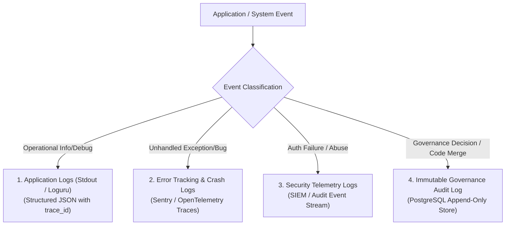

# Observability, Logging & Audit Architecture

**System:** AI-Powered National Unified Material Master Framework  
**Document Classification:** System Architecture (Phase 3)  
**Standard:** Structured JSON Logging + Immutable Governance Audit  
**Status:** `APPROVED`

---

## 1. Log Domain Separation Architecture

To ensure operational clarity and compliance with government audit standards, four distinct logging streams are maintained:



---

## 2. Detailed Log Stream Specifications

### 2.1 Stream 1: Application Runtime Logs
- **Destination:** Standard Output / Structured JSON via `Loguru` or Python `logging`.
- **Schema:**
  ```json
  {
    "timestamp": "2026-09-08T00:23:00.104Z",
    "level": "INFO",
    "trace_id": "c61b2e88-4f11-4a99-b50a-8488e1a90d99",
    "module": "matching_service",
    "message": "Generated 14 candidate proposals for batch BATCH-001",
    "duration_ms": 142.5
  }
  ```

### 2.2 Stream 2: Error Tracking & Exception Monitoring
- **Scope:** Captures unhandled 500 errors, vector index connection drops, and failed ingestion file parsing.
- **Payload:** Includes stack trace, HTTP method, URL endpoint, authenticated user ID, and request payload metadata (sanitized of passwords).

### 2.3 Stream 3: Security & Access Telemetry
- **Scope:** Tracks brute-force login attempts, unauthorized tenant access attempts, CSRF token mismatches, and CORS rejection spikes.
- **Retention:** Stored in dedicated security logs for threat detection.

### 2.4 Stream 4: Immutable Governance Audit Log (Statutory Audit)
- **Scope:** Non-repudiable ledger of every material mapping, match approval, match rejection, attribute modification, and CNMC assignment.
- **Storage:** Dedicated `audit_log` table with database triggers preventing modification or deletion.
- **Attributes Captured:**
  - `actor_id` (User who executed the action)
  - `cpse_id` (Enterprise affiliation)
  - `action_type` (`APPROVE_MATCH`, `REJECT_MATCH`, `MODIFY_SPECS`, `MAP_CNMC`)
  - `entity_type` & `entity_id`
  - `before_state` & `after_state` (Full JSON snapshot of modified records)
  - `justification` (Mandatory written engineering rationale)
  - `timestamp` (UTC)

---

## 3. System Health Checks & Prometheus Metrics

The backend exposes standard health probe endpoints for container orchestrators:
- `GET /health/live`: Basic liveness check returning HTTP 200 OK.
- `GET /health/ready`: Readiness check verifying PostgreSQL database connection, `pgvector` extension status, and Redis cache availability.

### Key Metrics Monitored:
1. `http_request_duration_seconds` (API endpoint latency histogram).
2. `ai_embedding_duration_seconds` (Latency of local transformer embedding generation).
3. `vector_search_duration_seconds` (HNSW query execution time in `pgvector`).
4. `ingestion_rows_processed_total` (Throughput counter for batch material ingestion).
5. `redis_cache_hit_ratio` (Efficiency of query and session cache).
