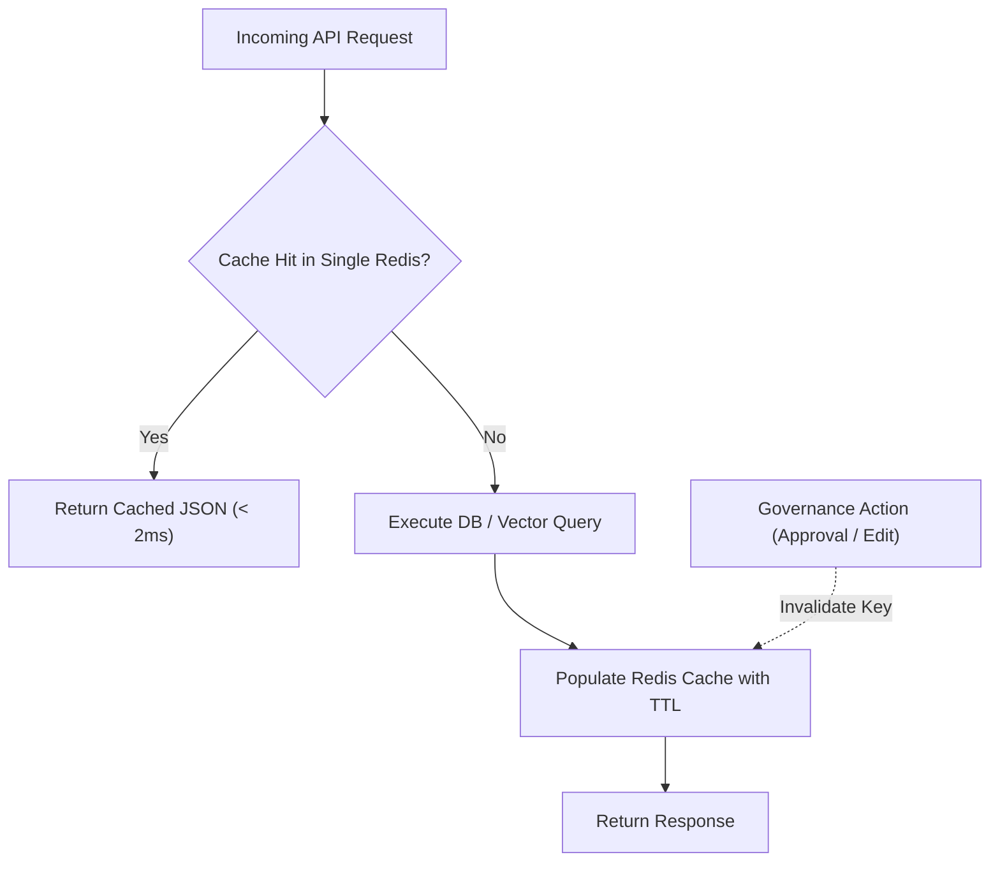

# Performance, Caching & Rate Limiting Architecture (ADR-006 & ADR-008 Approved)

**System:** AI-Powered National Unified Material Master Framework  
**Document Classification:** System Architecture (Phase 3)  
**Technology Decision:** Single Redis Instance (MVP) / Redis Cluster (Future) + Celery Workers + Rate Limiting  
**Status:** `APPROVED`

---

## 1. Decision Records (ADR-006 & ADR-008 Finalization)

### Selected Caching & Task Architecture: Single Redis Instance + Celery Worker
- **Caching Layer (ADR-008):** **Single Redis 7.2 Instance** (`redis:7.2-alpine`) for the SIH MVP to handle query caching, active user session storage, token blacklisting, and task queuing.
  - *Future Scale Architecture:* Seamless evolution to Redis Cluster / Redis Sentinel when scaling beyond 5,000 concurrent CPSE users.
- **Asynchronous Task Framework (ADR-006):** **Celery Task Worker Framework with Redis Broker** for non-blocking bulk file parsing, batch embedding generation, and multi-CPSE duplicate scans.

---

## 2. Comprehensive Caching Policy & Invalidation

### Cache Key Partitioning:
| Cache Domain | Target Key Structure | TTL | Invalidation Trigger |
|---|---|---|---|
| **CNMC Master Taxonomies** | `cache:taxonomy:tree` | 24 Hours | CNMC Created / Category Modified |
| **National Overview KPIs** | `cache:analytics:national_overview` | 15 Minutes | Match Approved / Batch Ingested |
| **Price Variance Statistics** | `cache:analytics:price_var:{cnmc_code}` | 1 Hour | New Material Mapped to CNMC |
| **Vector Search Results** | `cache:vector_search:{query_hash}` | 30 Minutes | Category Batch Re-indexed |
| **Layer 1 Tenant Private Data** | **DO NOT CACHE** | N/A | Strictly Queried via RLS |
| **Pending Approval Queues** | **DO NOT CACHE** | N/A | Live transactional state required |

---

## 3. Rate Limiting Policy

| Endpoint Domain | Rate Limit Threshold | Action on Exceeded |
|---|---|---|
| **Authentication (`/api/v1/auth/login`)** | 5 requests / minute per IP | HTTP 429 + 15-Minute Temporary Lockout |
| **Catalog Search (`/api/v1/materials`)** | 60 requests / minute per User | HTTP 429 Too Many Requests |
| **AI Vector Search (`/api/v1/matching/*`)** | 30 requests / minute per User | HTTP 429 (Protects CPU/GPU inference) |
| **Bulk Ingestion (`/api/v1/ingest/upload`)** | 5 uploads / 10 minutes per CPSE | HTTP 429 + Ingestion Queue Throttling |

---

## 4. Performance Targets & Benchmark Validation Notice

*Performance Governance Rule:* All performance metrics listed below are **illustrative engineering targets** for system design. Actual runtime performance is subject to formal benchmark validation across variable CPU/GPU hardware, dataset volumes, index build configurations, and concurrency loads:
- **Indexed Catalog Search:** Target $\le 500\text{ ms}$ for paginated table queries.
- **HNSW Vector Search:** Target $\le 100\text{ ms}$ for candidate vector similarity queries.
- **Bulk CSV Ingestion:** Target $\le 60\text{ seconds}$ per 10,000 rows via asynchronous Celery worker.
