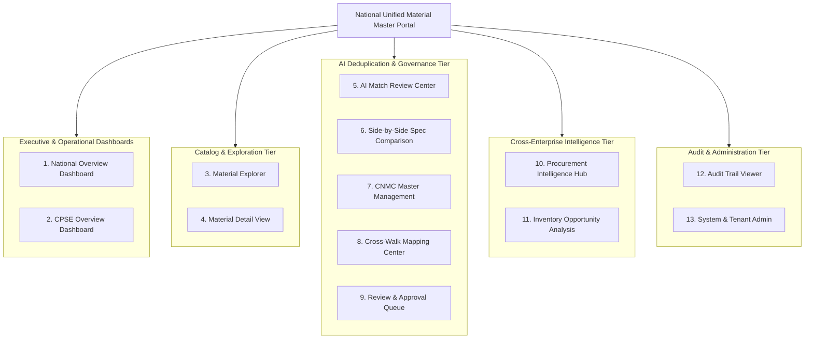

# Product Modules & Screen Specifications

**System:** AI-Powered National Unified Material Master Framework  
**Document Classification:** Product & System Design (Phase 2)  
**Status:** `PROPOSED — NOT YET APPROVED`

---

## 1. Module Hierarchy & Navigation Architecture

The platform interface is organized into functional modules designed for specific user roles and operational workflows:

---

## 2. Detailed Product Module Specifications

### Module 1: National Overview Dashboard
- **Primary Users:** National Platform Administrator, Ministry / DPE Executives, Compliance Auditors.
- **Purpose:** Macro-level monitoring of national material master harmonization, cross-CPSE deduplication progress, and public sector rationalization KPIs.
- **Important Information Shown:** Total materials ingested across CPSEs; Duplicate rationalization rate (%); Total active CNMC master codes; Cross-CPSE material overlap matrix; Top duplicated material categories.
- **Primary Actions:** Filter by CPSE or Sector; export national executive summary report; drill down into specific material categories.
- **Inputs:** Date range, sector filter, CPSE selector.
- **Outputs:** Executive KPI cards, interactive charts, downloadable national summary report.

### Module 2: CPSE Overview Dashboard
- **Primary Users:** CPSE Administrators, Material Master Managers.
- **Purpose:** Single-enterprise visibility into internal catalog health, pending harmonization tasks, and cross-CPSE collaboration metrics.
- **Important Information Shown:** Local CPSE total SKU count; Harmonization progress bar (Raw vs. Normalized vs. CNMC Mapped); Ingestion batch history; Pending review queue count; Internal duplicate count.
- **Primary Actions:** Trigger new catalog upload; view pending review tasks; export enterprise cross-walk file.
- **Inputs:** Local CPSE context.
- **Outputs:** Tenant health metrics, pending task alerts, quick action shortcuts.

### Module 3: Material Explorer
- **Primary Users:** Material Master Managers, Reviewers, Procurement Analysts, Inventory Analysts.
- **Purpose:** Comprehensive data grid for searching, filtering, and discovering materials across national and enterprise catalogs.
- **Important Information Shown:** Local Material Code, CNMC Code, Description, Extracted Specs (Grade, Dimensions, Rating), Harmonization Status, CPSE Owner, Unit of Measurement.
- **Primary Actions:** Global search; faceted filtering (by Discipline, Category, Grade, Status, CPSE); multi-row selection for batch processing; column sorting.
- **Inputs:** Search keyword, facet filters, page number, sort column.
- **Outputs:** High-performance paginated table with real-time query responses.

### Module 4: Material Detail View
- **Primary Users:** Material Master Managers, Domain Reviewers, Technical Engineers.
- **Purpose:** Deep-dive inspection of a single material record, its raw source lineage, extracted specifications, AI similarity candidates, and historical mappings.
- **Important Information Shown:** Raw source description vs. Normalized canonical description; Structured attribute table (Grade, Dimensions, Tolerances, Standards); Current CNMC binding; Lifecycle state timeline; Match candidate list with confidence meters.
- **Primary Actions:** Edit extracted attributes; manually trigger candidate similarity search; view full change history.
- **Inputs:** Material ID.
- **Outputs:** Comprehensive 360-degree material profile.

### Module 5: AI Match Review Center
- **Primary Users:** Domain / Technical Reviewers, Material Master Managers.
- **Purpose:** Centralized operational hub for inspecting AI-detected duplicate and functionally equivalent material clusters.
- **Important Information Shown:** Match proposal cards grouped by category and confidence; Confidence breakdown score (%); Match Type badge (Exact, Duplicate, Near-Duplicate, Functional Equivalent); Source vs. Target preview.
- **Primary Actions:** Open Side-by-Side comparison; quick-approve exact matches; filter by confidence threshold.
- **Inputs:** Reviewer discipline/category scope, minimum confidence filter.
- **Outputs:** Prioritized queue of actionable similarity recommendations.

### Module 6: Side-by-Side Material Comparison
- **Primary Users:** Domain / Technical Reviewers, Engineering Specialists.
- **Purpose:** Visual, fine-grained specification diffing between two or more candidate materials to verify engineering compatibility and safety.
- **Important Information Shown:** Side-by-side attribute comparison table (Green for identical, Amber for minor variance, Red for conflict); AI Explainability Card; Standard compliance mapping (e.g., IS vs. DIN vs. ISO); Embedded OEM part numbers.
- **Primary Actions:** Approve Match (with mandatory justification); Reject Match (with rejection reason category); Edit specifications; Request technical clarification.
- **Inputs:** Match Proposal ID.
- **Outputs:** Recorded governance decision with justification note.

### Module 7: CNMC Master Management
- **Primary Users:** National Platform Administrators, Governance Authorities.
- **Purpose:** Administration of the National Master Catalog of Common National Material Codes and standard technical templates.
- **Important Information Shown:** CNMC Code, Canonical Title, Standard Spec Schema, Associated Category, Number of Mapped CPSE Codes, Creation Date.
- **Primary Actions:** Create new CNMC code family; edit standard specification templates; obsolete/deprecate legacy CNMC codes.
- **Inputs:** Category tree node, canonical specifications.
- **Outputs:** Updated National CNMC Master Catalog.

### Module 8: Cross-Walk Mapping Center
- **Primary Users:** Material Master Managers, ERP Administrators.
- **Purpose:** Manage, search, and export the bi-directional mappings between local enterprise material codes and national CNMCs.
- **Important Information Shown:** Local CPSE Code, CPSE Name, Target CNMC Code, Mapping Status (Active / Deprecated), Effective Start Date, Approver Name.
- **Primary Actions:** Search cross-walk by local code; reassign mapping; export mapping dataset in CSV/JSON format for SAP upload.
- **Inputs:** Search filters, export format selector.
- **Outputs:** Downloadable ERP-ready mapping cross-walk file.

### Module 9: Review & Approval Queue
- **Primary Users:** Domain Reviewers, Approvers.
- **Purpose:** Workflow queue tracking pending, in-review, and escalated material harmonization proposals.
- **Important Information Shown:** Proposal ID, Submission Date, Urgency Flag, Material Category, Source CPSEs, Assigned Reviewer.
- **Primary Actions:** Claim proposal, assign to colleague, batch-process low-risk items.
- **Inputs:** Queue filter (Assigned to Me, Unassigned, Escalated).
- **Outputs:** Updated workflow state.

### Module 10: Procurement Intelligence Hub
- **Primary Users:** Procurement Analysts, Sourcing Directors.
- **Purpose:** Analyze cross-CPSE procurement patterns, identify price variances for identical CNMCs, and flag joint tendering opportunities.
- **Important Information Shown:** Cross-CPSE Price Variance chart; Unit price distribution (Min, Max, Avg across CPSEs for the same CNMC); Annual procurement volume estimates.
- **Primary Actions:** Filter by high price variance items ($>20\%$ delta); generate Joint Procurement Opportunity Report.
- **Inputs:** Category, CNMC code, minimum price delta threshold.
- **Outputs:** Sourcing intelligence reports and demand aggregation matrices.

### Module 11: Inventory Opportunity Analysis
- **Primary Users:** Inventory Analysts, Warehouse Managers.
- **Purpose:** Identify slow-moving / surplus inventory in one CPSE that matches active material demand or out-of-stock items in another CPSE.
- **Important Information Shown:** Surplus Material List; Stock quantity; Plant location; Matching active requirement in peer CPSE; Estimated lead time savings.
- **Primary Actions:** Flag item as "Surplus for Redeployment"; initiate inter-CPSE stock transfer inquiry.
- **Inputs:** Plant filter, material category, surplus flag.
- **Outputs:** Inter-CPSE surplus redeployment notifications.

### Module 12: Audit Trail Viewer
- **Primary Users:** Compliance & Statutory Auditors, National Administrators.
- **Purpose:** Complete inspection of immutable governance records to verify regulatory compliance, human justifications, and historical data lineage.
- **Important Information Shown:** Log Entry ID, Timestamp, Actor Name & Role, CPSE ID, Action Verb, Entity ID, Before/After State Diff (JSON), Justification Text.
- **Primary Actions:** Search by Entity ID / User ID / Date Range; export certified audit dossier (PDF/JSON).
- **Inputs:** Search parameters, date filters.
- **Outputs:** Cryptographically traceable audit report.

### Module 13: System & Tenant Administration
- **Primary Users:** National Platform Administrators, CPSE Administrators.
- **Purpose:** User account management, enterprise profile configuration, and system parameters.
- **Important Information Shown:** User accounts list, RBAC role assignments, Ingestion job logs, System health metrics.
- **Primary Actions:** Provision user; assign role; update CPSE profile; configure similarity threshold parameters.
- **Inputs:** User metadata, role selections.
- **Outputs:** Updated access permissions and system configurations.
