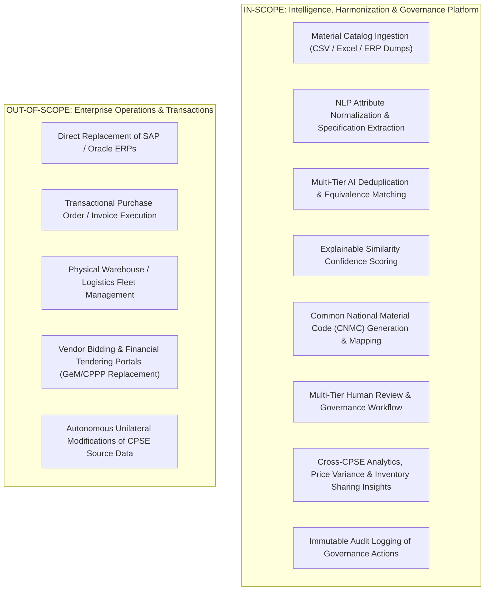

# Product Requirements & Problem Definition

**Project Name:** AI-Powered National Unified Material Master Framework  
**Initiative:** Smart India Hackathon (SIH) 2026  
**Vision Statement:** *"One Nation – One Common Material Code"*  
**Document Classification:** Product & System Design (Phase 2)  
**Status:** `PROPOSED — NOT YET APPROVED`

---

## 1. Problem Definition & Context

### 1.1 The Current Situation in Indian CPSEs
Across hundreds of Central Public Sector Enterprises (CPSEs) operating under various Ministries of the Government of India (e.g., Oil & Gas, Power, Steel, Heavy Engineering, Defense, Mining, Railways), massive inventories of industrial materials, equipment, and spare parts are managed in disparate, isolated ERP instances (such as SAP ECC, SAP S/4HANA, Oracle ERP, and bespoke legacy databases).

Each CPSE maintains independent, historical material master records created over decades. As a result:
- **Identical materials** from the same OEM with the same standard specifications receive completely different proprietary internal part numbers in different CPSEs.
- **Inconsistent descriptive syntax:** One CPSE catalogs an item as *"SS316 HEX BOLT M12X50"*, another as *"BOLT, HEXAGONAL, STAINLESS STEEL 316, 12MM DIA X 50MM LG"*, and a third as *"FASTENER BOLT HEX SS-316 M12*50MM"*.
- **Disparate classification standards:** Organizations inconsistently utilize UNSPSC, NATO codification, MESC, or non-standard internal departmental codes.
- **Missing or unstructured technical specifications:** Crucial dimensions, pressure ratings, temperature limits, and metallurgical grades are trapped in free-text description fields rather than structured attribute tables.

### 1.2 The Root Cause
1. **Historical Decentralization:** Autonomous procurement systems without a centralized national codification authority or interoperability protocol.
2. **Free-Text Entry & Human Variance:** Inconsistent data entry by storekeepers, engineers, and vendors over 30+ years without real-time NLP validation.
3. **ERP Isolation:** Legacy ERP architectures lack semantic understanding or cross-organizational federated visibility.
4. **Vocabulary & Standard Disparities:** Mixed usage of metric vs. imperial units, ISO vs. IS vs. DIN vs. ASTM standards, and domain-specific acronyms.

### 1.3 The Consequences
- **Duplicate Material Masters:** High internal duplication rates within single CPSEs and massive duplication across different CPSEs.
- **Fragmented Procurement & Lost Economies of Scale:** Inability to aggregate national demand across CPSEs purchasing identical items, resulting in fragmented tenders, higher unit costs, and redundant vendor onboarding.
- **Severe Inventory Opacity & Capital Lock-In:** Millions of dollars in capital tied up in slow-moving or surplus inventory in one CPSE while a neighboring CPSE issues emergency procurement tenders with long lead times for the exact same spare parts.
- **Supply Chain Vulnerability & Extended Downtime:** Inability to identify functionally equivalent substitute parts during equipment breakdowns.

### 1.4 The Proposed Product Value
The **AI-Powered National Unified Material Master Framework** acts as an intelligent data standardization, semantic understanding, deduplication, mapping, and governance platform operating above enterprise ERPs to deliver:
1. **Unified National Codification:** Establishing the **Common National Material Code (CNMC)** as a single reference taxonomy for all public sector industrial items.
2. **AI-Driven Deduplication & Equivalence Discovery:** Multi-signal semantic and specification matching to uncover identical, duplicate, near-duplicate, and functionally equivalent materials.
3. **Cross-CPSE Inventory & Demand Intelligence:** Transparent visibility into inter-CPSE surplus availability, duplicate pricing variances, and joint procurement opportunities.
4. **Human-Governed Integrity:** Transparent, explainable AI recommendations verified through a multi-tier human-in-the-loop review workflow with immutable audit trails.

---

## 2. Product Boundaries: In-Scope vs. Out-of-Scope

### 2.1 Explicitly In-Scope (`PROPOSED — NOT YET APPROVED`)
- Multi-CPSE material data ingestion and validation.
- Industrial NLP tokenization, engineering attribute extraction, and unit standardization (Metric/Imperial, IS/DIN/ASTM).
- Automated candidate matching across 5 distinct match types (Exact, Duplicate, Near-Duplicate, Functionally Equivalent, Low Confidence).
- Transparent, explainable matching breakdown (lexical, semantic, and technical attribute diffs).
- Hierarchical CNMC recommendation and legacy-to-national cross-walk mapping.
- Collaborative multi-tenant review queue with role-based governance.
- High-level procurement intelligence, price variance analysis, and surplus redeployment discovery.
- Read-only export endpoints for ERP consumption (e.g., CSV/JSON mapping tables for SAP integration).

### 2.2 Explicitly Out-of-Scope (`CONFIRMED NOT IN PRODUCT BOUNDARY`)
- Replacing transactional ERP functions (General Ledger, Materials Management PO creation, Accounts Payable).
- Replacing Government e-Marketplace (GeM) or Central Public Procurement Portal (CPPP) bidding and commercial negotiation workflows.
- Real-time direct write-back into live production SAP databases without manual CPSE gatekeeping.
- Physical supply chain tracking (RFID warehouse tracking, transport fleet dispatch).
- Autonomous AI execution without human validation for critical code mappings.
