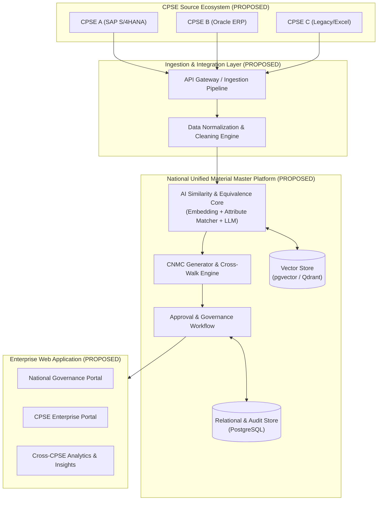

# Project Overview — AI-Powered National Unified Material Master Framework

**Project Name:** AI-Powered National Unified Material Master Framework  
**Initiative / Hackathon:** Smart India Hackathon (SIH) 2026  
**Vision Statement:** *"One Nation – One Common Material Code"*  
**Target Entities:** Central Public Sector Enterprises (CPSEs) under Government of India  
**Document Classification:** Architectural & Discovery Foundation (Phase 1)

---

## 1. Executive Summary & Problem Context

In the Indian public sector ecosystem, hundreds of Central Public Sector Enterprises (CPSEs) across sectors (Energy, Defense, Railways, Heavy Industries, Mining, Oil & Gas, Steel, etc.) independently procure, catalog, and inventory millions of industrial materials, spare parts, and capital equipment.

Currently, each CPSE utilizes disparate ERP systems (e.g., SAP ECC, S/4HANA, Oracle ERP, custom legacy software) with unstandardized, proprietary material codification taxonomies (such as varying MESC, UNSPSC, or in-house alphanumeric codes). This creates severe operational silos:
- Identical materials are described differently across enterprises (e.g., *"SS 316 Hex Bolt M12x50"* vs. *"Bolt, Hexagonal, Stainless Steel Grade 316, 12mm Dia x 50mm Length"*).
- Cross-CPSE visibility into surplus inventory, dead stock, and collective bargaining power is virtually zero.
- High procurement redundancies, stock hoarding, and extended lead times persist.

The **AI-Powered National Unified Material Master Framework** is conceived as an intelligent, centralized, and interoperable SaaS platform to automatically identify identical, duplicate, near-duplicate, and functionally equivalent materials across CPSEs, rationalizing legacy catalogs into a single **Common National Material Code (CNMC)**.

---

## 2. Proposed Core Functional Pillars (PROPOSED — NOT YET APPROVED)

1. **Multi-Source Material Ingestion & Harmonization (`PROPOSED — NOT YET APPROVED`)**
   - Ingestion of heterogeneous material catalogs from diverse ERPs (SAP IDocs/BAPIs, CSV, Excel, REST APIs).
   - Attribute extraction and normalization (dimensions, units of measurement, metallurgical grades, standard tolerances).

2. **AI/NLP Material Understanding & Specification Extraction (`PROPOSED — NOT YET APPROVED`)**
   - Natural Language Processing (NLP) models tuned on industrial engineering vocabularies.
   - Named Entity Recognition (NER) for extracting key technical attributes from unstructured descriptions.

3. **Multi-Tier Similarity & Equivalence Engine (`PROPOSED — NOT YET APPROVED`)**
   - **Tier 1 (Exact Match):** Standardized part numbers, OEM numbers, and canonical attribute hashing.
   - **Tier 2 (Near-Duplicate / Semantic Similarity):** Dense vector embeddings and cosine similarity on standardized attribute strings.
   - **Tier 3 (Functional Equivalence):** Rule-based and knowledge-graph-driven evaluation of interchangeable specifications (e.g., equivalent ISO/DIN/IS standards, cross-compatible pressure ratings).

4. **Common National Material Code (CNMC) Recommendation & Generation (`PROPOSED — NOT YET APPROVED`)**
   - Automated recommendation of hierarchical, unified national classification codes.
   - Bi-directional cross-walk mapping between local CPSE material codes and the assigned CNMC.

5. **Human-in-the-Loop Validation & Governance Workflow (`PROPOSED — NOT YET APPROVED`)**
   - Multi-level review mechanism for domain experts, CPSE material managers, and national committee approvers.
   - Audit trail capturing rationale, confidence scores, and sign-offs for all code mappings and merges.

6. **Material Analytics & Inter-CPSE Inventory Optimization Dashboard (`PROPOSED — NOT YET APPROVED`)**
   - Real-time visibility into cross-enterprise duplicate materials, potential inventory sharing, surplus redeployment, and price variance analysis.

---

## 3. High-Level Target Architecture (PROPOSED — NOT YET APPROVED)

---

## 4. Current Discovery Status (Phase 1 Baseline)

- **Physical Workspace State:** Greenfield / Fresh initialization directory (`c:\Users\User\Desktop\CSPES`) — **CONFIRMED NOT PRESENT** (no application code).
- **Documentation Foundation:** Established under `/docs` — **CURRENTLY IMPLEMENTED**.
- **Implementation Governance:** Zero application runtime logic or functional code was modified. All future technological selections require formal design and approval in **Phase 2 — Product & System Design**.
