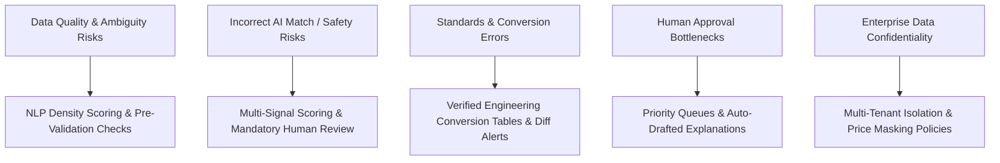

# Risks, Limitations & Measurable Success Metrics

**System:** AI-Powered National Unified Material Master Framework  
**Document Classification:** Product & System Design (Phase 2)  
**Status:** `PROPOSED — NOT YET APPROVED`

---

## 1. Enterprise Risk Matrix & Mitigation Strategies

---

## 2. Detailed Risk Register

| Risk ID | Risk Description | Potential Impact | Severity | Mitigation Strategy |
|---|---|---|---|---|
| `RSK-01` | **Poor Source Data Quality & Short Descriptions** (e.g., *"MISC BOLT 12MM"* lacking grade or standards). | AI cannot reliably extract complete specs; risk of inaccurate duplicate matching. | **High** | Implement *Information Density Pre-Check*. Flag low-density items for manual attribute entry before triggering AI matching. |
| `RSK-02` | **False Functional Equivalence Merges** (e.g., merging materials that seem similar but fail high-temperature or pressure tolerances). | Critical industrial equipment failure or plant safety hazard if non-interchangeable parts are swapped. | **Critical** | Enforce that all Tier 2 (Near-Duplicate) and Tier 3 (Functional Equivalence) matches **strictly require human domain specialist sign-off** with mandatory justification. |
| `RSK-03` | **Incompatible Industrial Standards** (Disparities across IS, DIN, ASTM, BS, ISO). | Mismatched physical tolerances or chemical metallurgy. | **High** | Build a dedicated, verified *Standards Cross-Reference Matrix* validating equivalent grades and mechanical properties. |
| `RSK-04` | **Unit Conversion & Rounding Errors** (Imperial Inches to Metric MM). | Thread pitch or dimensional misalignment ($1/2\text{ inch} = 12.7\text{ mm} \ne 12\text{ mm}$). | **High** | Implement deterministic fractional-to-metric conversion with exact tolerance bounds ($12.7\text{ mm}$ never rounded to $12\text{ mm}$ for threads). |
| `RSK-05` | **CPSE-Specific Abbreviations & Acronym Jargon** (Unstandardized abbreviations). | Extraction failures in standard NLP models. | **Medium** | Maintain an expandable *Industrial Engineering Synonym & Abbreviation Lexicon* customizable per CPSE sector. |
| `RSK-06` | **Human Reviewer Bottleneck** (Large backlogs of pending match proposals). | Slower national harmonization progress. | **Medium** | Auto-generate Explainability Diff Cards so reviewers can evaluate proposals in $< 30\text{ seconds}$; allow batch-approval for Tier 1 exact matches. |
| `RSK-07` | **Confidential Enterprise Pricing Exposure** (CPSEs unwilling to share negotiated vendor prices). | Enterprise resistance to platform adoption. | **High** | Enforce strict multi-tenant data policies: raw vendor identities remain masked; pricing analytics rendered only as aggregated price ranges/averages. |
| `RSK-08` | **Legacy ERP Ingestion Format Inconsistencies** (Corrupted CSVs, mixed encodings). | Ingestion job failures and data corruption. | **Medium** | Provide a visual column-mapping wizard, character encoding detection (UTF-8/ASCII), and row-by-row validation error reports. |

---

## 3. Measurable Success Metrics

To evaluate platform effectiveness, metrics are strictly divided between **SIH MVP Demo Metrics** and **Future Real-World Enterprise Impact Metrics**:

### 3.1 SIH MVP Demonstration Metrics
- **Deduplication Precision Rate:** $\ge 95\%$ precision on sample benchmark datasets.
- **Spec Extraction Accuracy:** $\ge 90\%$ accuracy in extracting key engineering attributes (dimensions, grade, standards) from unstructured test strings.
- **Reviewer Time Efficiency:** Reduction of average manual match evaluation time to $< 45\text{ seconds}$ per pair using side-by-side diffing.
- **End-to-End Latency:** $< 3\text{ seconds}$ from file ingestion to AI candidate proposal generation for sample batches.
- **Zero Opaque Predictions:** 100% of generated recommendations must include a readable Explainability Card with individual signal weights.

### 3.2 Future Real-World Enterprise Impact Metrics (Long-Term Vision)
- **SKU Rationalization Rate:** Percentage reduction in redundant active material master records across participating CPSEs.
- **Collaborative Procurement Savings:** Potential cost optimization achieved through demand aggregation on common CNMCs.
- **Surplus Inventory Redeployment:** Value of dead/surplus stock successfully transferred between CPSEs rather than re-procured.
- **Procurement Lead Time Reduction:** Time saved by sourcing emergency spares from peer CPSE surplus rather than waiting for long OEM manufacturing lead times.
