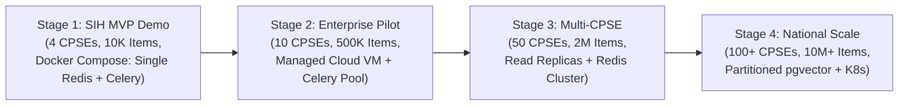

# Progressive Scalability & Growth Strategy

**System:** AI-Powered National Unified Material Master Framework  
**Document Classification:** System Architecture (Phase 3)  
**Standard:** 4-Tier Progressive Scale Architecture  
**Status:** `APPROVED`

---

## 1. Progressive Scaling Roadmap

To avoid premature overengineering while ensuring architectural readiness for pan-India deployment, the platform follows a **4-Stage Progressive Growth Model**:

---

## 2. Detailed Stage Specifications

| Dimension | Stage 1: SIH MVP Demo | Stage 2: Enterprise Pilot | Stage 3: Multi-CPSE | Stage 4: Pan-India National Scale |
|---|---|---|---|---|
| **CPSE Tenants** | 4 Pre-configured CPSEs | 10 Pilot CPSEs | 50 CPSEs | 100+ National CPSEs |
| **Material Master SKUs** | ~10,000 items | ~500,000 items | ~2,000,000 items | 10,000,000+ items |
| **Concurrent Users** | 10 - 25 users | 100 - 250 users | 1,000 users | 5,000+ active users |
| **Deployment Topology** | Multi-container Docker Compose | Single Managed Cloud VM (8 vCPU, 32GB RAM) | API Cluster + Managed DB with 2 Read Replicas | Kubernetes (EKS/GKE) with Horizontal Pod Autoscaling (HPA) |
| **Vector Storage** | `pgvector` Single Table with HNSW | `pgvector` with Category Indexing | Partitioned `pgvector` by Category | Distributed `pgvector` / Dedicated Vector Nodes |
| **Background Processing** | Celery Worker (Single Process) + Single Redis | Celery Worker Pool (2 Workers) + Redis Sentinel | Celery Worker Auto-Scaling Pool (8 Workers) | Distributed Kubernetes Worker Deployments |
| **Caching Infrastructure** | Single Redis 7.2 Container | Single Redis 7.2 Container | Redis Sentinel / Multi-Node Replication | Redis Cluster / Managed ElastiCache |
| **Database Architecture** | Single PostgreSQL 16 Instance | Primary + Automated Daily Backups | Primary + Read Replica for Analytics Queries | Multi-AZ Primary + Dedicated Read Replicas + Connection Pooling |

---

## 3. Benchmark Validation Requirement

*Notice:* Throughput and capacity estimates are design targets. Prior to each stage transition, formal benchmark stress testing (using Locust / k6) must be conducted to measure actual P95/P99 latencies, CPU/GPU utilization, and memory consumption under realistic enterprise workload distributions.
