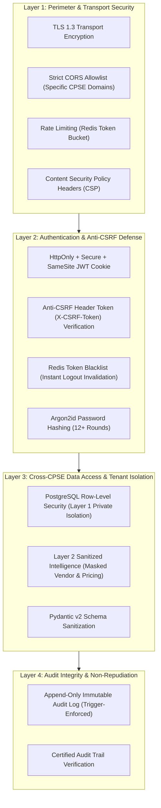

# Security, Identity & Data Access Architecture (ADR-007 Approved)

**System:** AI-Powered National Unified Material Master Framework  
**Document Classification:** System Architecture (Phase 3)  
**Security Standard:** Government Public Sector Enterprise Baseline  
**Status:** `APPROVED`

---

## 1. Decision Record (ADR-007 Finalization)

### Selected Auth Strategy: Stateless JWT in HttpOnly SameSite Cookies + Anti-CSRF Defense
- **Selected Option:** Cryptographically signed JSON Web Tokens (JWT) stored in `HttpOnly`, `Secure`, `SameSite=Lax/Strict` cookies combined with a **Double Submit Anti-CSRF Token** header defense.
- **Security Posture Clarification:** *HttpOnly cookies significantly reduce direct JavaScript access to authentication credentials, mitigating token exfiltration via basic XSS. However, HttpOnly cookies do not eliminate all XSS-related attack vectors (such as unauthorized client-side request dispatch or UI redressing). A defense-in-depth model incorporating Content Security Policy (CSP), Pydantic input sanitization, React JSX contextual output encoding, and Anti-CSRF headers is strictly enforced.*

---

## 2. Multi-Layer Defense Architecture

---

## 3. Anti-CSRF Defense & Cookie Security Specifications

1. **CSRF Mitigation Architecture:**
   - Cookie-based authentication introduces vulnerability to Cross-Site Request Forgery (CSRF). To completely eliminate this risk, the backend implements the **Double Submit Anti-CSRF Pattern**:
     - Upon login, the server issues a cryptographically random, unguessable CSRF token in a non-HttpOnly cookie (`csrf_token`).
     - Every state-mutating HTTP request (`POST`, `PUT`, `PATCH`, `DELETE`) from the React client must read this token and attach it as a custom request header: `X-CSRF-Token`.
     - The FastAPI API gateway validates that the header matches the cookie token before processing the request.
2. **Session Lifespan & Token Invalidation:**
   - **Access Token TTL:** 15 minutes (short-lived).
   - **Refresh Token TTL:** 7 days (stored in a separate HttpOnly cookie with single-use rotation).
   - **Logout Invalidation:** When a user logs out, the access token signature is immediately written to Redis with a TTL matching the remaining token lifespan, blocking any subsequent reuse.

---

## 4. Cross-CPSE Data Protection & Tenant Isolation

As specified in [CROSS_CPSE_DATA_ACCESS_MODEL.md](file:///c:/Users/User/Desktop/CSPES/docs/CROSS_CPSE_DATA_ACCESS_MODEL.md):
- **Layer 1 (Private Operational Data):** Raw ERP records and negotiated purchase order prices are isolated per CPSE via database-level Row-Level Security (RLS).
- **Layer 2 (Sanitized Intelligence):** AI deduplication processes only normalized technical specifications (dimensions, metallurgy, standards); proprietary vendor identities and contract prices are stripped prior to similarity matching.
- **Layer 3 (National Governed Master):** Public national CNMC catalog and anonymized statistical price distributions.
