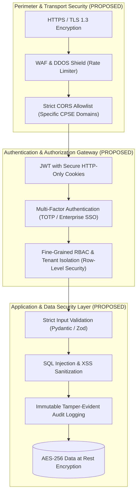

# Security & Compliance Audit

**System:** AI-Powered National Unified Material Master Framework  
**Scope:** Security Posture, Authentication, RBAC, Data Protection & Secrets Handling  
**Audit Classification:** Phase 1 — Discovery & Baseline Audit

---

## 1. Executive Summary

A comprehensive security inspection of the codebase in `c:\Users\User\Desktop\CSPES` was conducted.

| Security Dimension | Current Observed State | Classification | Risk Level |
|---|---|---|---|
| **Hardcoded Secrets / API Keys** | None found in repository | **CONFIRMED NOT PRESENT** | Clean / None |
| **Exposed `.env` or Private Keys** | None present in repository | **CONFIRMED NOT PRESENT** | Clean / None |
| **Authentication Logic** | Not implemented yet | **CONFIRMED NOT PRESENT** | N/A (Greenfield) |
| **Role-Based Access Control (RBAC)** | Not implemented yet | **CONFIRMED NOT PRESENT** | N/A (Greenfield) |
| **CORS Configuration** | Not implemented yet | **CONFIRMED NOT PRESENT** | N/A (Greenfield) |
| **Rate Limiting Protection** | Not implemented yet | **CONFIRMED NOT PRESENT** | N/A (Greenfield) |
| **Input Validation Layer** | Not implemented yet | **CONFIRMED NOT PRESENT** | N/A (Greenfield) |
| **Documentation & ADR Reference** | Present in `/docs` | **CURRENTLY IMPLEMENTED** | Clean |

---

## 2. Security Architecture Proposals (PROPOSED — NOT YET APPROVED)

The following multi-layer security architecture is proposed for review in **Phase 2 — Product & System Design**:

---

## 3. Technology Decisions Pending

- **Authentication Architecture:** **FUTURE PHASE DECISION REQUIRED** (`ADR-007`: HttpOnly Cookie JWT with short expiration vs. Session store).
- **Password Hashing Standard:** **FUTURE PHASE DECISION REQUIRED** (Argon2id vs. bcrypt).
- **Input Validation Library:** **RECOMMENDED FOR EVALUATION** (Pydantic for Python / Zod for TypeScript).
