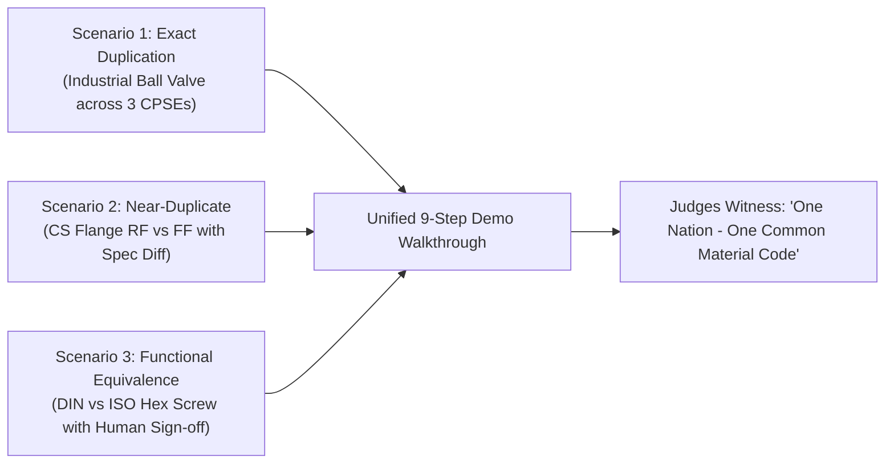

# SIH 2026 Live Demonstration Scenarios

**System:** AI-Powered National Unified Material Master Framework  
**Document Classification:** Product & System Design (Phase 2)  
**Status:** `PROPOSED — NOT YET APPROVED`

---

## 1. Demonstration Strategy for Judges

The live hackathon demonstration is structured to prove technical depth, domain accuracy, and real-world applicability across three realistic industrial scenarios representing **Exact Duplication**, **Near-Duplicate Variance**, and **Complex Functional Equivalence**.

---

## 2. Detailed Demonstration Scenarios

### Scenario 1: Exact Duplicate Detection Across 3 CPSEs (Valves & Piping)
- **Context:** Three major CPSEs independently procure standard industrial ball valves with different internal codes, disparate wordings, and mixed unit systems.
- **Sample Datasets:**
  - **CPSE A (ONGC):** `OG-VAL-00491` $\rightarrow$ *"SS Ball Valve 2 Inch Class 150 Flanged End CF8M"*
  - **CPSE B (IOCL):** `IOC-MECH-9921` $\rightarrow$ *"Stainless Steel Ball Valve 50mm CL150 Flanged Body SS316/CF8M"*
  - **CPSE C (GAIL):** `GAIL-PLNT-554` $\rightarrow$ *"Ball Valve SS 2\" ANSI 150# Flange Ends CF8M Body"*
- **Demonstration Flow:**
  1. **Ingestion:** Upload sample batch file containing these three lines.
  2. **Normalization:** The system standardizes imperial `2 Inch` and `2\"` to metric `50 mm`, expands `SS` to `Stainless Steel`, standardizes `Class 150 / ANSI 150# / CL150` to `Class 150`.
  3. **AI Similarity Scoring:** AI generates a composite confidence score of **97.8% (DUPLICATE)**.
  4. **Side-by-Side Review:** Reviewer opens comparison view. All core attributes (Diameter: 50mm, Pressure: Class 150, Metallurgy: CF8M/SS316, End: Flanged) display in **Green (100% Match)**.
  5. **Explainability Card:** Explains that descriptions differ syntactically but represent identical physical equipment.
  6. **Approval & Mapping:** Reviewer clicks *"Approve Match"*, enters note *"Verified identical specifications"*, and the system binds all 3 codes to `IN-IND-MECH-VAL-00108`.
  7. **Analytics Impact:** Price variance chart instantly reveals CPSE A paid ₹14,200/unit, CPSE B paid ₹16,800/unit, and CPSE C paid ₹18,100/unit for the identical valve.

---

### Scenario 2: Near-Duplicate Detection with Specification Variance (Flanges)
- **Context:** Two CPSEs catalog carbon steel pipe flanges that look identical at first glance, but possess a critical sealing face difference.
- **Sample Datasets:**
  - **CPSE A (BHEL):** `BHEL-FLG-102` $\rightarrow$ *"Carbon Steel Flange 4 Inch Class 300 Raised Face ASTM A105"*
  - **CPSE B (NTPC):** `NTPC-PIP-884` $\rightarrow$ *"CS Flange 100mm CL300 Flat Face A105"*
- **Demonstration Flow:**
  1. **AI Similarity Scoring:** AI scores the pair at **84.5% (NEAR-DUPLICATE)**.
  2. **Visual Diff Inspection:**
     - Matching attributes (Diameter: 100mm, Material: ASTM A105, Pressure: Class 300) display in **Green**.
     - Divergent attribute (*Raised Face (RF)* vs. *Flat Face (FF)*) is flagged in **Amber/Red Warning**.
  3. **Explainability Card:** Alerts the reviewer: *"Warning: Raised Face vs. Flat Face variance detected. Gasket sealing compatibility check required."*
  4. **Engineering Decision:** The Domain Reviewer determines that RF and FF flanges are not directly interchangeable in high-pressure steam lines.
  5. **Action:** Reviewer clicks *"Reject Merge"*, enters justification: *"Sealing face variance incompatible for steam piping"*. The materials remain distinct master items.

---

### Scenario 3: Functional Equivalence Requiring Domain Validation (Fasteners)
- **Context:** Two CPSEs use fasteners designed under European (DIN) vs. International (ISO) standards that perform identical mechanical functions.
- **Sample Datasets:**
  - **CPSE A (SAIL):** `SAIL-FST-441` $\rightarrow$ *"DIN 933 Hex Screw M10x40 Grade 8.8 Galvanized"*
  - **CPSE B (Coal India):** `CIL-BOLT-092` $\rightarrow$ *"ISO 4017 Hexagon Head Screw M10x40 Property Class 8.8 Zinc Plated"*
- **Demonstration Flow:**
  1. **AI Similarity Scoring:** AI detects standards cross-reference match: `DIN 933` is functionally equivalent to `ISO 4017`. Composite score: **72.4% (FUNCTIONALLY EQUIVALENT)**.
  2. **Technical Review:** Staged in the Technical Review Queue.
  3. **Diff Analysis:**
     - Tensile Strength: Identical ($\ge 800\text{ MPa}$).
     - Dimensions: Thread pitch, head width across flats, and shank length are 100% compatible.
     - Coating: Galvanized vs. Zinc Plated evaluated as equivalent atmospheric corrosion protection.
  4. **Engineering Sign-off:** Mechanical Engineer validates equivalence and signs off with mandatory engineering authorization.
  5. **Mapping:** Both codes are mapped to CNMC `IN-IND-MECH-FST-00812` as equivalent functional substitutes.
  6. **Surplus Discovery:** Inventory Dashboard highlights that Coal India holds 5,000 surplus units available to fulfill an urgent requisition from SAIL.
