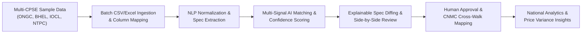

# SIH 2026 MVP Scope & Demonstration Boundary

**System:** AI-Powered National Unified Material Master Framework  
**Document Classification:** Product & System Design (Phase 2)  
**Status:** `PROPOSED — NOT YET APPROVED`

---

## 1. Executive MVP Strategy

The complete vision of a pan-India National Unified Material Master Framework spans hundreds of enterprise ERP instances, complex government procurement portals, and millions of inventory items.

For the **Smart India Hackathon (SIH) 2026**, the MVP scope is engineered to showcase the **strongest core innovations** with complete end-to-end functionality, high visual impact, and rigorous architectural integrity—**without making false claims of direct live production SAP database write-backs or fictional government API integrations**.

---

## 2. Scope Categorization Matrix

### 2.1 MVP MUST HAVE (Core Hackathon Deliverables)
1. **Multi-CPSE Multi-Tenant Structure:** Pre-configured realistic enterprise tenants (e.g., *ONGC, BHEL, IOCL, NTPC*) with isolated catalog data.
2. **Material Data Ingestion Hub:** Functional drag-and-drop CSV / Excel bulk upload with column mapping and schema validation.
3. **NLP Attribute Normalization:** Automated cleaning, abbreviation expansion, unit conversion (Inches $\rightarrow$ Millimeters), and engineering attribute extraction.
4. **AI Similarity Matching Engine:** Working vector embedding generation, cosine similarity search, exact part-number hashing, and multi-signal confidence scoring ($0\% - 100\%$).
5. **Categorized Match Proposals:** Detection of Exact Matches, Duplicates, Near-Duplicates, and Functionally Equivalent items.
6. **Explainable AI Diff Viewer:** Side-by-side spec comparison view with color-coded attribute diffs (Green/Amber/Red) and human-readable explanation cards.
7. **Human-in-the-Loop Governance Workflow:** Interactive approval queue where a reviewer approves or rejects proposals with mandatory justification notes.
8. **CNMC Generation & Cross-Walk Mapping:** Assignment of Common National Material Codes and bi-directional cross-walk lookup table.
9. **National Overview & Price Variance Dashboard:** Interactive executive analytics visualizing duplicate rationalization rates, cross-CPSE material overlap, and price disparities for identical CNMCs.
10. **Immutable Audit Trail Viewer:** Searchable timeline of all governance decisions with non-repudiable logs.

---

### 2.2 MVP SHOULD HAVE (High-Impact Additions)
1. **Natural Language Semantic Search:** Instant query bar allowing users to search the national catalog using colloquial or informal descriptions.
2. **Surplus-to-Demand Matching:** Basic demonstration of matching slow-moving surplus inventory in one CPSE against active demand in another.
3. **ERP Cross-Walk Export:** Functional export button generating downloadable CSV/JSON mapping files formatted for SAP master data update.

---

### 2.3 MVP NICE TO HAVE (If Time Permits in Subsequent Phases)
1. **Dark / Light Mode Toggle:** Sleek visual theme switching for high-contrast presentation.
2. **Interactive Hierarchy Tree Viewer:** Visual taxonomy tree of national material disciplines and categories.

---

### 2.4 NOT REQUIRED FOR SIH MVP (Explicitly Deferred to Future Phases)
- Real-time live bi-directional direct socket connections into proprietary SAP S/4HANA production servers.
- Automated commercial purchase order generation or integration with payment gateways.
- Full GeM (Government e-Marketplace) bidding and tendering module.
- Physical warehouse RFID scanner integration.
