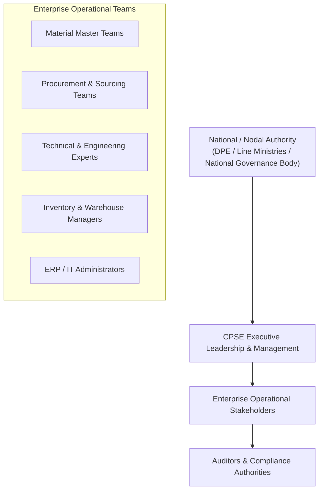

# Stakeholder Analysis & User Personas

**System:** AI-Powered National Unified Material Master Framework  
**Document Classification:** Product & System Design (Phase 2)  
**Status:** `PROPOSED — NOT YET APPROVED`

---

## 1. Stakeholder Ecosystem

The platform operates across multiple tiers of governance, enterprise management, and operational execution within the Government of India public enterprise structure.

---

## 2. Detailed Stakeholder Matrix

### 2.1 National / Nodal Authority (Department of Public Enterprises / Line Ministries)
- **Objective:** Establish national procurement efficiency, eliminate cross-enterprise redundancies, enforce standard codification, and track public sector capital utilization.
- **Pain Points:** Zero centralized visibility across CPSE inventories; duplicate procurement driving up public expenditure; lack of standardized material classifications.
- **Value Gained:** Macro-level visibility into national material masters, cross-enterprise rationalization metrics, demand aggregation opportunities, and standardized governance.
- **Interaction with System:** Review national analytics dashboards, define national codification standards (CNMC taxonomy rules), and oversee national audit logs.

### 2.2 Participating CPSE Organizations (Executive Management)
- **Objective:** Optimize working capital, reduce inventory carrying costs, accelerate maintenance turnaround times, and leverage collective purchasing.
- **Pain Points:** High inventory holding costs, prolonged procurement lead times for long-lead spares, internal duplicate masters causing stock confusion.
- **Value Gained:** Instant identification of surplus stock across peer CPSEs, visibility into benchmark prices, and reduction in redundant SKU creation.
- **Interaction with System:** Executive dashboard review, approval of enterprise-level participation, and cross-CPSE collaboration agreements.

### 2.3 Material Master Data Management (MDM) Teams
- **Objective:** Maintain high data hygiene, eliminate internal duplicate material codes, and ensure consistent descriptive syntax.
- **Pain Points:** Overwhelming manual workload reviewing thousands of free-text line items; lack of automated attribute extraction tools; frequent accidental creation of duplicate SKUs.
- **Value Gained:** Automated NLP normalization, pre-calculated similarity recommendations, side-by-side spec comparison, and automated mapping to CNMC.
- **Interaction with System:** Daily operational use — uploading raw catalogs, reviewing duplicate clusters, verifying extracted specs, and submitting CNMC proposals.

### 2.4 Technical & Domain Engineering Experts (Mechanical / Electrical / Chemical / Civil)
- **Objective:** Ensure that material substitutions and duplicate merges do not compromise plant safety, operational tolerances, or statutory compliance.
- **Pain Points:** Risk of non-interchangeable materials being erroneously merged due to superficial description similarities; complex standards differences (ISO vs. DIN vs. IS).
- **Value Gained:** Fine-grained specification diffing engine highlighting exact dimension, metallurgical grade, and pressure rating discrepancies.
- **Interaction with System:** Reviewing Tier 3 (Functional Equivalence) and Tier 2 (Near-Duplicate) proposals in the Technical Review Queue; providing technical approval or rejection with engineering justifications.

### 2.5 Procurement & Sourcing Teams
- **Objective:** Aggregate demand across projects/plants/CPSEs, identify reliable alternative vendor part numbers, and negotiate volume discounts.
- **Pain Points:** Unaware that other departments or peer CPSEs are issuing tenders for identical items; paying disparate prices for the same physical goods.
- **Value Gained:** Cross-CPSE price variance insights, joint tendering demand aggregation reports, and OEM part cross-referencing.
- **Interaction with System:** Exploring common materials via Material Explorer, reviewing price variance reports, and flagging items for collaborative sourcing.

### 2.6 Inventory & Warehouse Management Teams
- **Objective:** Minimize stock-outs of critical spares while liquidating dead/surplus stock.
- **Pain Points:** Holding non-moving inventory that another plant or CPSE urgently needs; high carrying costs.
- **Value Gained:** Surplus-matching engine that matches non-moving stock in one CPSE against active procurement demands in another.
- **Interaction with System:** Viewing surplus-to-demand matching opportunities; initiating inter-CPSE stock transfer requests.

### 2.7 ERP / IT Administrators
- **Objective:** Maintain reliable, secure data ingestion and export pipelines without disrupting live SAP/ERP systems.
- **Pain Points:** Legacy system integration complexity; risk of data corruption or unauthorized changes to core ERP masters.
- **Value Gained:** Structured, read-only data extraction and standardized export files (CSV/JSON/IDoc formats) with strict API rate-limiting and validation.
- **Interaction with System:** Scheduling bulk catalog exports, monitoring ingestion job health, and managing API credentials.

### 2.8 Statutory & Government Auditors (CAG / CVC / Internal Audit)
- **Objective:** Ensure full transparency, non-repudiation, and regulatory compliance in all material master changes, code mergers, and procurement decisions.
- **Pain Points:** Unclear rationale for legacy code rationalization; missing historical tracking of who approved material substitutions.
- **Value Gained:** Immutable, tamper-evident audit trail capturing user identities, timestamps, AI confidence scores, previous states, and mandatory human justifications.
- **Interaction with System:** Searching and exporting audit logs; inspecting historical change timelines for specific material codes.
