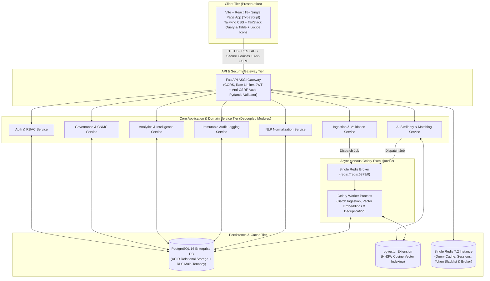

# Top-Level System Architecture Specification

**System:** AI-Powered National Unified Material Master Framework  
**Document Classification:** System Architecture (Phase 3)  
**Architectural Style:** Clean Layered Modular Monolith with Asynchronous Celery Workers  
**Status:** `APPROVED`

---

## 1. Architectural Style Selection & Justification

### Selected Style: Clean Layered Modular Monolith
For the **SIH 2026 MVP and enterprise pilot phase**, the system adopts a **Clean Layered Modular Monolith** architecture with strictly decoupled domain modules, asynchronous Celery task workers, and shared vector-relational persistence.

---

## 2. Cross-CPSE Data Segregation & Intelligence Boundaries

To prevent accidental leaks of confidential enterprise information (such as negotiated purchase prices, vendor codes, or purchase orders), the system strictly separates data into 3 layers:

1. **Layer 1: Tenant-Private Operational Data** (Strictly isolated per CPSE via PostgreSQL Row-Level Security).
2. **Layer 2: Normalized Material Intelligence Data** (Sanitized engineering specs, dimensions, grades, vector embeddings accessible by AI matching and reviewers).
3. **Layer 3: National Governed Master Data** (Approved CNMC master catalog, active cross-walk mappings, anonymized price distributions, immutable audit logs).

---

## 3. High-Level Subsystem Breakdown

### 3.1 Presentation Tier (Frontend SPA)
- Built with **React 18+ (Vite) + TypeScript**.
- Pure client-side routing, virtualized high-performance data grids (TanStack Table), responsive glassmorphic theme with Tailwind CSS, and asynchronous server-state caching via TanStack Query.
- Static assets deployable to any web server (e.g., NGINX) with zero Node.js backend runtime dependency.

### 3.2 Application & API Tier (FastAPI Backend)
- High-performance asynchronous Python ASGI runtime.
- Native Pydantic v2 data validation for strict schema compliance on all incoming ERP datasets.
- Clean separation of concerns: `Routers` $\rightarrow$ `Services` $\rightarrow$ `Repositories` $\rightarrow$ `Database Models`.
- Anti-CSRF token verification and HttpOnly cookie authentication.

### 3.3 Asynchronous Execution Tier (Celery + Single Redis Instance)
- **Producer:** FastAPI endpoints dispatch heavy, non-blocking background jobs (bulk file parsing, batch embedding generation, cross-CPSE similarity matrix scans).
- **Broker:** Single Redis 7.2 instance (`redis://redis:6379/0`) for SIH MVP.
- **Consumer:** Dedicated Celery worker process with persistent task state logging in PostgreSQL (`ingestion_job` table).
- **FastAPI BackgroundTasks:** Reserved strictly for non-critical, in-process tasks (e.g., flushing audit log buffers).

### 3.4 Data & Storage Tier
- **PostgreSQL 16+** acting as the unified database engine.
- **`pgvector` extension** storing material embeddings with HNSW indexing for approximate nearest neighbor search.
- Multi-tenancy enforced through `cpse_id` foreign keys and PostgreSQL Row-Level Security (RLS) policies.
- **Single Redis 7.2 Container** serving query caching, Celery task queuing, and rate-limiting token buckets.

---

## 4. Performance Targets & Benchmark Governance

*Performance Note:* All latency metrics are **illustrative engineering targets** for system design. Actual runtime performance is subject to formal benchmark validation across variable CPU/GPU hardware, dataset volumes, index build configurations, and concurrency loads:
- **Catalog Query Target:** $\le 500\text{ ms}$ for indexed searches.
- **Vector Candidate Search Target:** Sub-second response on HNSW cosine index.
- **Embedding Generation Target:** Lightweight batch processing on local CPU.
