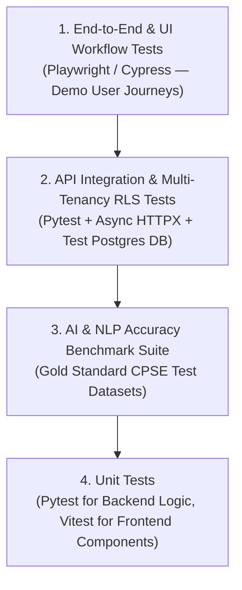

# Quality Assurance & Testing Strategy

**System:** AI-Powered National Unified Material Master Framework  
**Document Classification:** System Architecture (Phase 3)  
**Standard:** Multi-Tier Testing Pyramid + AI Accuracy Benchmark Suite  
**Status:** `APPROVED`

---

## 1. Testing Pyramid & Verification Architecture

---

## 2. Test Suite Breakdown

### 2.1 Unit Tests (Pytest & Vitest)
- **Backend (Pytest):** Testing string normalization, abbreviation expansion, unit conversion functions (Inches $\rightarrow$ Millimeters), regex attribute parsers, and CNMC code format validators.
- **Frontend (Vitest + React Testing Library):** Testing design system components, Explainability Card rendering, and diff color badge logic (Green/Amber/Red).

### 2.2 AI & NLP Accuracy Benchmark Suite (Gold Standard Evaluation)
- A dedicated test runner evaluates the AI similarity engine against a **Curated Ground-Truth Industrial Dataset** containing 100+ annotated material pairs:
  - **Category A (Exact Matches):** Ball valves, bearings with identical OEM codes. Expected precision: $\ge 98\%$.
  - **Category B (Duplicates with Syntax Variation):** Fasteners, flanges with disparate word ordering. Expected precision: $\ge 95\%$.
  - **Category C (Near-Duplicates with Discrepancies):** Raised face vs. flat face flanges. Expected: Correct amber warning diff generation.
  - **Category D (Functional Equivalents):** DIN vs. ISO fasteners. Expected: Correct standards cross-reference match.
  - **Category E (Hard Negatives):** Similar wording but incompatible specs (e.g., Class 150 vs Class 600). Expected: Rejection/low score.

### 2.3 Database & Multi-Tenancy RLS Verification
- Automated integration tests verify that executing a raw catalog query as a user from `ONGC` returns **0 rows** belonging to `BHEL` or `IOCL`.

### 2.4 API Integration Tests (FastAPI TestClient + Asyncpg)
- Tests complete HTTP request/response lifecycles:
  - File upload $\rightarrow$ parsing $\rightarrow$ normalization $\rightarrow$ candidate generation $\rightarrow$ approval $\rightarrow$ cross-walk verification.
  - Verification of standard success and error envelope structures.

### 2.5 Security & Injection Vulnerability Testing
- Fuzz testing search inputs with SQL injection (`' OR 1=1 --`) and XSS script payloads to verify Pydantic and ORM sanitization.
