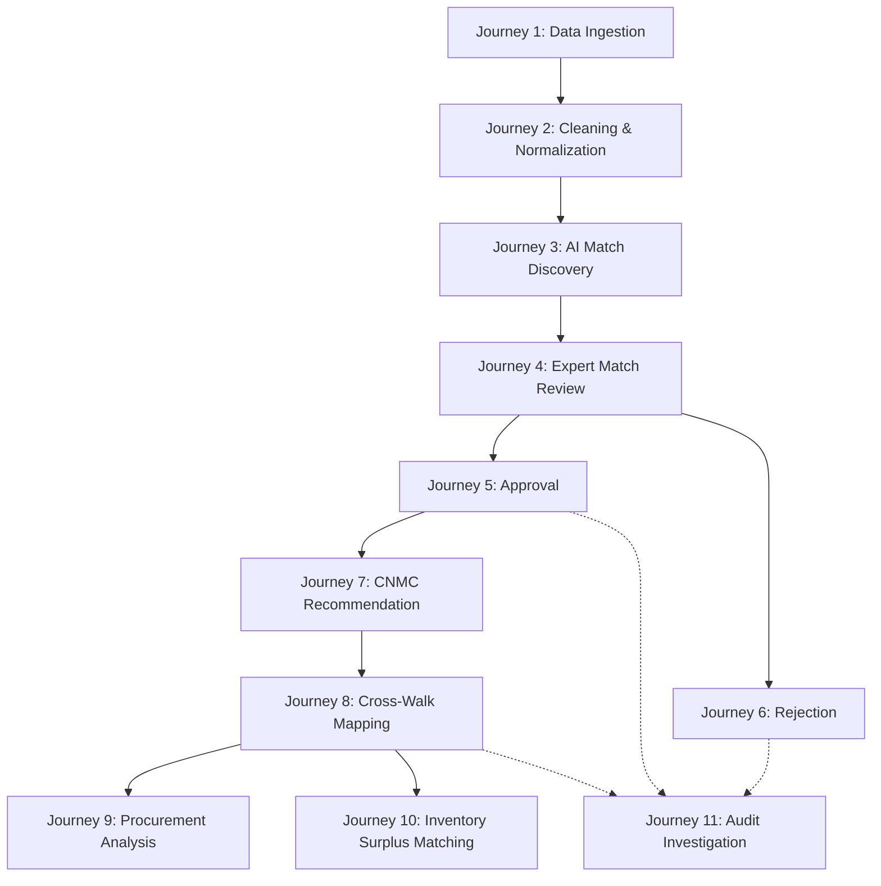

# Core User Journeys

**System:** AI-Powered National Unified Material Master Framework  
**Document Classification:** Product & System Design (Phase 2)  
**Status:** `PROPOSED — NOT YET APPROVED`

---

## 1. Overview

This document details the 11 primary end-to-end user journeys encompassing ingestion, normalization, AI matching, human validation, national codification, analytics, and audit governance.

---

## 2. Detailed Journey Specifications

### Journey 1: CPSE Material Data Enters the Platform
- **Trigger:** Material Master Manager needs to harmonize a batch of legacy material records from their enterprise ERP.
- **Actor:** Material Master Manager (CPSE).
- **Input:** CSV / Excel spreadsheet / JSON payload containing raw CPSE material data (Local Code, Description, UOM, Plant, Legacy Category, Unit Cost).
- **System Action:** Ingests file, runs structural validation, verifies column headers, creates an asynchronous ingestion job, and stores raw records with tenant `cpse_id`.
- **AI Action:** None (Pre-AI staging).
- **Human Action:** Uploads file via Ingestion Hub and maps source columns to system template.
- **Output:** Ingestion batch created with status `INGESTED`; summary of valid and malformed rows displayed.
- **Audit Event:** `MATERIAL_INGESTION_COMPLETED` (Logged with User ID, Batch ID, Row Count, SHA-256 File Hash).
- **Failure Scenario:** Malformed file or missing mandatory fields (e.g., missing Local Material Code); system halts parsing, provides row-by-row error report, and flags batch as `INGESTION_FAILED`.

---

### Journey 2: Cleaning & Normalization of Material Information
- **Trigger:** Automatic trigger upon successful ingestion or manual trigger by Material Master Manager.
- **Actor:** System / Material Master Manager.
- **Input:** Raw unstandardized text descriptions (e.g., *"SS316 HEX BOLT M12X50 MM"*).
- **System Action:** Removes noise characters, expands domain abbreviations (e.g., *"SS"* $\rightarrow$ *"Stainless Steel"*), standardizes units of measurement to SI (e.g., *"2 INCH"* $\rightarrow$ *"50 mm"*).
- **AI Action:** NLP Named Entity Recognition (NER) extracts key technical attributes: Category (*Fastener*), Item (*Bolt*), Sub-type (*Hexagonal*), Material Grade (*SS 316*), Diameter (*12 mm*), Length (*50 mm*).
- **Human Action:** Reviews extracted attributes; corrects any misclassified parameters if needed.
- **Output:** Normalized material record populated in structured JSON schema with status `NORMALIZED`.
- **Audit Event:** `MATERIAL_NORMALIZATION_APPLIED` (Logged with Extraction Confidence Score and Attribute Changes).
- **Failure Scenario:** Highly ambiguous or corrupted description (e.g., *"SPARE PART 01"*); system flags record as `LOW_INFORMATION_DENSITY` for manual attribute entry.

---

### Journey 3: AI Identifies Potential Duplicate / Equivalent Materials
- **Trigger:** Successful normalization of materials.
- **Actor:** System (Automated AI Engine).
- **Input:** Normalized material records and extracted technical vectors.
- **System Action:** Executes hierarchical candidate generation; filters candidates by material category; queries vector index for semantic neighbors; calculates exact attribute diffs.
- **AI Action:** Generates dense embeddings; calculates multi-signal similarity scores (Lexical Cosine, Dense Vector Cosine, Technical Spec Overlap, Dimension Tolerance Match); assigns candidate match type (Exact, Duplicate, Near-Duplicate, Functional Equivalent, Low Confidence).
- **Human Action:** None (Background computation).
- **Output:** Similarity match proposals generated in database with status `PROPOSED`; match confidence scores and detailed reason breakdown attached.
- **Audit Event:** `SIMILARITY_MATCHES_GENERATED` (Logged with Source ID, Target Candidate IDs, Similarity Scores).
- **Failure Scenario:** Vector index unavailable or high compute latency; batch automatically throttles, alerts system monitor, and retries via exponential backoff.

---

### Journey 4: Material Expert Reviews an AI Recommendation
- **Trigger:** Reviewer logs into the AI Match Review Center to process pending proposals.
- **Actor:** Domain / Technical Reviewer.
- **Input:** Match Proposal ID.
- **System Action:** Displays side-by-side comparison screen showing Source CPSE Material vs. Target CPSE Material, visual spec diffing (highlighting identical vs. differing specs in green/amber/red), and AI Explainability Card (why this match was suggested).
- **AI Action:** Provides structured explanation breakdown (e.g., *"98% Semantic Similarity, Identical Material Grade SS316, Diameter match 12mm, Length match 50mm, Standards match IS 1364 / DIN 933"*).
- **Human Action:** Inspects engineering attributes, verifies interchangeability, and evaluates operational safety.
- **Output:** Reviewer decision formulated (Proceed to Approve, Reject, or Request Additional Info).
- **Audit Event:** `MATCH_PROPOSAL_VIEWED` (Logged with User ID, Timestamp).
- **Failure Scenario:** Missing technical drawing or ambiguous spec; Reviewer clicks *"Request Data Clarification"* from originating CPSE.

---

### Journey 5: A Recommendation is Approved
- **Trigger:** Reviewer confirms that two materials are identical, duplicates, or functionally equivalent.
- **Actor:** Domain / Technical Reviewer (or Material Master Manager for internal exact matches).
- **Input:** Proposal ID, Approval Action, Reviewer Justification Note.
- **System Action:** Updates Match Proposal status to `APPROVED`; links both material records to the corresponding Common National Material Code (CNMC) cluster; increments CPSE rationalization score.
- **AI Action:** Logs user acceptance signal to feedback loop for continuous model calibration.
- **Human Action:** Selects *"Approve Match"*, enters mandatory engineering justification comment, and confirms sign-off.
- **Output:** Material records marked as `HARMONIZED`; bi-directional mapping established between local CPSE codes and CNMC.
- **Audit Event:** `MATCH_PROPOSAL_APPROVED` (Immutable log with Approver ID, Justification Text, Timestamp, Previous State, New State).
- **Failure Scenario:** Concurrency conflict (another reviewer already acted on the proposal); system prevents double approval, refreshes UI, and displays current state.

---

### Journey 6: A Recommendation is Rejected
- **Trigger:** Reviewer determines that materials are NOT interchangeable despite superficial text similarity.
- **Actor:** Domain / Technical Reviewer.
- **Input:** Proposal ID, Rejection Action, Rejection Reason Category (e.g., *"Pressure Rating Incompatible"*, *"Material Grade Variance"*, *"Non-Interchangeable OEM"*), Detailed Justification.
- **System Action:** Updates Match Proposal status to `REJECTED`; unlinks candidate relationship; ensures the AI suppresses this specific pair in future automatic batch proposals.
- **AI Action:** Negative reinforcement logged in evaluation telemetry.
- **Human Action:** Selects *"Reject Match"*, selects rejection category from dropdown, types justification, and submits.
- **Output:** Match marked as `REJECTED`; materials remain independent master records.
- **Audit Event:** `MATCH_PROPOSAL_REJECTED` (Immutable log with User ID, Rejection Reason, Explanation).
- **Failure Scenario:** Missing mandatory justification note; system enforces validation and blocks rejection submission until explanation is provided.

---

### Journey 7: A Common National Material Code (CNMC) is Assigned or Recommended
- **Trigger:** A newly harmonized material cluster does not have an existing CNMC assigned.
- **Actor:** System / National Platform Administrator.
- **Input:** Harmonized canonical specifications and category taxonomy.
- **System Action:** Evaluates national taxonomy tree; recommends a structured CNMC code representing Sector, Discipline, Category, Item Type, and Sequential Variant.
- **AI Action:** Recommends canonical standardized description and taxonomy placement.
- **Human Action:** National Admin (or authorized automated rule for exact matches) validates and authorizes new CNMC creation.
- **Output:** New CNMC record registered in National CNMC Master Catalog.
- **Audit Event:** `CNMC_CODE_CREATED` (Logged with CNMC Code, Canonical Name, Standard Spec Template).
- **Failure Scenario:** Duplicate CNMC collision; taxonomy engine generates next sequential variant number.

---

### Journey 8: Existing CPSE Material Codes are Mapped to the National Code
- **Trigger:** Approved CNMC assignment.
- **Actor:** System.
- **Input:** Local CPSE Material Code + Target CNMC Code.
- **System Action:** Creates an active record in the Cross-Walk Mapping Table linking `(CPSE_ID, Local_Material_Code)` $\leftrightarrow$ `CNMC_Code`.
- **AI Action:** None.
- **Human Action:** None (Automated post-approval binding).
- **Output:** Active cross-walk mapping available for export back to CPSE ERP systems.
- **Audit Event:** `CROSS_WALK_MAPPING_BOUND` (Logged with CPSE Code, Local Material Code, CNMC Code, Effective Date).
- **Failure Scenario:** Historical mapping already exists; system archives previous mapping as `DEPRECATED` and establishes new active mapping with full lineage.

---

### Journey 9: A Procurement Analyst Identifies Common Demand
- **Trigger:** Procurement team preparing a multi-crore tender for plant maintenance spares.
- **Actor:** Procurement Analyst.
- **Input:** Search query by CNMC Code, Category, or Material Name.
- **System Action:** Aggregates all CPSE materials mapped to that CNMC; calculates total active procurement volume, historical unit price variance across CPSEs, and vendor distribution.
- **AI Action:** Identifies price outliers and potential volume discount tiers.
- **Human Action:** Reviews Cross-CPSE Price Variance chart; identifies that CPSE A bought the item at ₹450/unit while CPSE B bought at ₹620/unit; flags item for collaborative tendering.
- **Output:** Joint Sourcing Opportunity Report exported.
- **Audit Event:** `PROCUREMENT_INTELLIGENCE_ACCESSED` (Logged with User ID, CNMC Code).
- **Failure Scenario:** Zero peer CPSEs mapped to that CNMC; system displays single-enterprise baseline with benchmark market norms.

---

### Journey 10: An Inventory Analyst Identifies Possible Equivalent / Surplus Materials
- **Trigger:** Urgent plant breakdown requiring an out-of-stock valve with a 16-week OEM lead time.
- **Actor:** Inventory Analyst.
- **Input:** Out-of-stock local material code.
- **System Action:** Resolves local code to CNMC; queries all peer CPSE inventories for matching or functionally equivalent items flagged as `SURPLUS` or `AVAILABLE`.
- **AI Action:** Ranks available surplus items across peer CPSEs by specification compatibility and geographical proximity.
- **Human Action:** Discovers that a neighboring CPSE power plant holds 4 surplus units of an equivalent valve; initiates inter-CPSE stock transfer communication.
- **Output:** Surplus Match Notification and Inter-CPSE Transfer Request generated.
- **Audit Event:** `SURPLUS_EQUIVALENCE_INQUIRY_CREATED` (Logged with Requesting CPSE, Supplying CPSE, Material IDs).
- **Failure Scenario:** No surplus items available; system displays active upcoming procurement schedules across CPSEs for joint order inclusion.

---

### Journey 11: An Auditor Investigates a Historical Material Mapping Decision
- **Trigger:** Statutory audit inquiry regarding why a local CPSE material code was merged into a national master.
- **Actor:** Statutory & Compliance Auditor.
- **Input:** Material Code, CNMC Code, or Date Range.
- **System Action:** Fetches the complete immutable timeline: Ingestion record $\rightarrow$ Extracted Specs $\rightarrow$ AI Similarity Score $\rightarrow$ Reviewer Identity $\rightarrow$ Written Justification $\rightarrow$ Approval Timestamp $\rightarrow$ Cross-Walk Mapping binding.
- **AI Action:** None (Strict historical record retrieval).
- **Human Action:** Reviews non-repudiable timeline; exports cryptographic audit package.
- **Output:** Comprehensive Audit Dossier (PDF/JSON) generated with complete decision lineage.
- **Audit Event:** `AUDIT_DOSSIER_GENERATED` (Logged with Auditor ID, Target Material ID, Timestamp).
- **Failure Scenario:** None (Audit logs are append-only and tamper-evident).
