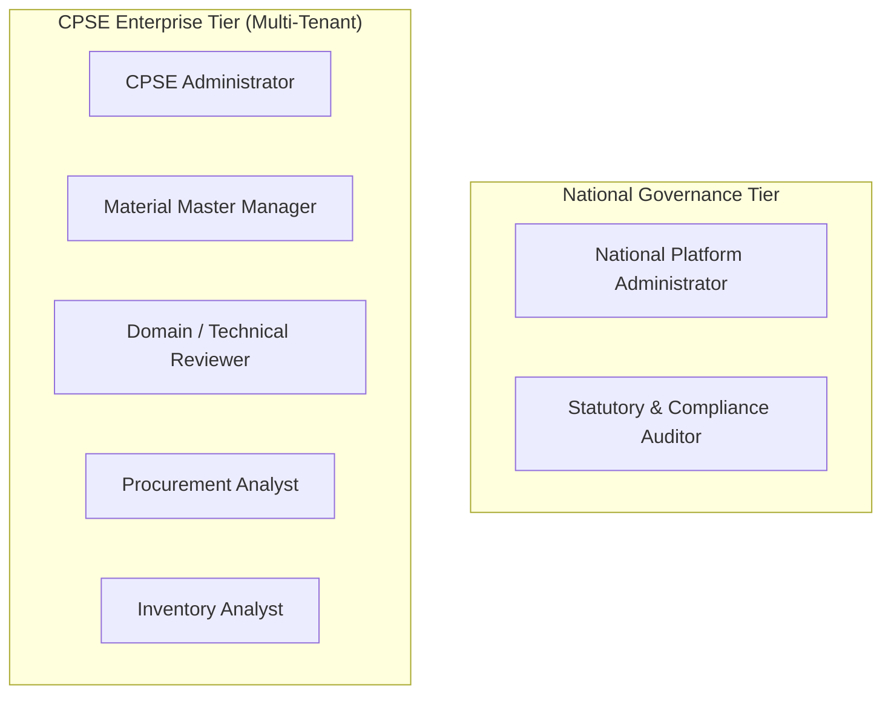

# User Roles & Conceptual Permissions Framework

**System:** AI-Powered National Unified Material Master Framework  
**Document Classification:** Product & System Design (Phase 2)  
**Status:** `PROPOSED — NOT YET APPROVED`

---

## 1. Role-Based Access Control (RBAC) Architecture

To maintain multi-tenant data confidentiality, administrative separation, and audit integrity, the platform defines seven distinct conceptual user roles across two organizational tiers: **National Tier** and **CPSE Enterprise Tier**.

---

## 2. Detailed Role Specifications

### 2.1 National Platform Administrator
- **Scope:** Cross-CPSE / National Platform Level
- **Responsibilities:** Overall platform configuration, taxonomy governance, onboarding CPSE tenants, and managing national codification rules.
- **Can View:** All national material catalogs, cross-CPSE aggregate analytics, system health metrics, all user accounts, and national audit logs.
- **Can Create:** New CPSE tenants, National Material Categories, standard CNMC taxonomies, platform-level parameters.
- **Can Modify:** CNMC taxonomy definitions, global similarity thresholds, tenant metadata.
- **Can Approve:** Final creation of new standard CNMC codification families; exceptional cross-CPSE dispute escalations.
- **Must NOT Be Allowed To:** Directly alter raw material records belonging to an individual CPSE; bypass mandatory technical review on high-risk material merges.

### 2.2 CPSE Administrator
- **Scope:** Single CPSE Tenant Level (e.g., ONGC only or BHEL only)
- **Responsibilities:** Managing enterprise users, configuring CPSE-specific ERP ingestion connectors, and overseeing organization-wide material harmonization.
- **Can View:** All material records, duplicate clusters, and user activities belonging exclusively to their own CPSE.
- **Can Create:** Local CPSE user accounts (Managers, Reviewers, Analysts), ingestion job configurations.
- **Can Modify:** CPSE enterprise profile, ingestion mappings, local plant/department tags.
- **Can Approve:** Internal user provisioning and enterprise data synchronization settings.
- **Must NOT Be Allowed To:** Access unmasked confidential pricing/vendor data of peer CPSEs; modify national CNMC taxonomies.

### 2.3 Material Master Manager
- **Scope:** Single CPSE Operational Level
- **Responsibilities:** Day-to-day material catalog data hygiene, uploading ERP catalog dumps, triggering NLP normalization, and initiating deduplication proposals.
- **Can View:** Local material catalogs, extracted attributes, AI similarity match proposals, and local harmonization status.
- **Can Create:** Bulk ingestion jobs, normalization requests, mapping proposals binding local CPSE codes to recommended CNMCs.
- **Can Modify:** Cleaned/normalized attributes of local materials (with audit tracking).
- **Can Approve:** Internal exact duplicate merges within their own CPSE catalog.
- **Must NOT Be Allowed To:** Unilaterally approve cross-CPSE functional equivalence merges without Domain/Technical Reviewer sign-off; delete historical material records.

### 2.4 Domain / Technical Reviewer (Engineering Specialist)
- **Scope:** Specific Material Categories (e.g., Mechanical Fasteners, Electrical Switchgear, Valves & Piping, Lubricants)
- **Responsibilities:** Engineering validation of AI-proposed near-duplicates and functional equivalents to ensure operational safety and interchangeability.
- **Can View:** Technical specifications, engineering drawings/metadata, side-by-side spec comparison diffs, standard compliance tags (ISO/DIN/IS).
- **Can Create:** Technical review evaluations, engineering notes, spec discrepancy flags.
- **Can Modify:** Engineering attribute corrections (e.g., correcting pitch diameter, yield strength).
- **Can Approve:** Technical equivalence proposals (Tier 2 and Tier 3 matches) authorizing mapping to a common CNMC.
- **Must NOT Be Allowed To:** Modify user roles, bypass audit logging, or initiate bulk raw data imports.

### 2.5 Procurement Analyst
- **Scope:** CPSE / Cross-CPSE Procurement Scope (Masked / Aggregated)
- **Responsibilities:** Analyzing cross-CPSE duplicate materials, identifying demand aggregation opportunities, and evaluating benchmark pricing trends.
- **Can View:** Standardized material catalogs, CNMC clusters, common demand volumes, and price variance ranges (subject to enterprise confidentiality rules).
- **Can Create:** Joint procurement inquiry flags, demand aggregation reports.
- **Can Modify:** Sourcing tags and procurement category classifications.
- **Can Approve:** Collaborative sourcing interest flags.
- **Must NOT Be Allowed To:** Modify master material specifications, approve technical equivalence, or change CNMC mappings.

### 2.6 Inventory Analyst
- **Scope:** CPSE / Cross-CPSE Inventory Scope
- **Responsibilities:** Identifying non-moving/surplus stock that matches active procurement requirements across CPSEs to optimize working capital.
- **Can View:** Stock status flags (Active, Slow-Moving, Surplus), standard specifications, cross-CPSE substitute material availability.
- **Can Create:** Surplus redeployment proposals, inter-CPSE material transfer inquiries.
- **Can Modify:** Local stock classification tags (e.g., tagging a lot as "Surplus for Redeployment").
- **Can Approve:** Surplus availability declarations.
- **Must NOT Be Allowed To:** Alter core engineering specifications or approve CNMC structural changes.

### 2.7 Statutory & Compliance Auditor
- **Scope:** Read-Only Audit Scope (National & CPSE Level)
- **Responsibilities:** Reviewing compliance of all code mergers, verifying human approval justifications, and ensuring non-repudiation.
- **Can View:** Complete immutable audit logs, historical material state timelines, AI confidence scores, reviewer sign-offs, and compliance reports.
- **Can Create:** Audit export reports.
- **Can Modify:** **NONE** (Strict read-only access).
- **Can Approve:** **NONE** (Independent oversight role).
- **Must NOT Be Allowed To:** Modify, delete, or alter any record, mapping, or audit entry in the system.

---

## 3. Conceptual Permission Matrix

| Capability / Action | Nat. Admin | CPSE Admin | MM Manager | Tech Reviewer | Proc. Analyst | Inv. Analyst | Auditor |
|---|---|---|---|---|---|---|---|
| Ingest Raw ERP Material Data | ❌ | ❌ | ✅ | ❌ | ❌ | ❌ | ❌ |
| Edit Local Material Attributes | ❌ | ❌ | ✅ | ✅ | ❌ | ❌ | ❌ |
| View Cross-CPSE Material Catalog | ✅ | ✅ (Masked) | ✅ (Masked) | ✅ | ✅ (Aggregated) | ✅ (Aggregated) | ✅ |
| Approve Internal Exact Duplicate | ❌ | ❌ | ✅ | ✅ | ❌ | ❌ | ❌ |
| Approve Functional Equivalence | ❌ | ❌ | ❌ | ✅ | ❌ | ❌ | ❌ |
| Create/Define New CNMC Taxonomy | ✅ | ❌ | ❌ | ❌ | ❌ | ❌ | ❌ |
| View Price Variance & Analytics | ✅ | ✅ | ❌ | ❌ | ✅ | ✅ | ✅ |
| Access Immutable Audit Trail | ✅ | ✅ (Local) | ✅ (Local) | ✅ (Local) | ❌ | ❌ | ✅ (Full) |
| Manage User Accounts | ✅ (All) | ✅ (Tenant) | ❌ | ❌ | ❌ | ❌ | ❌ |
